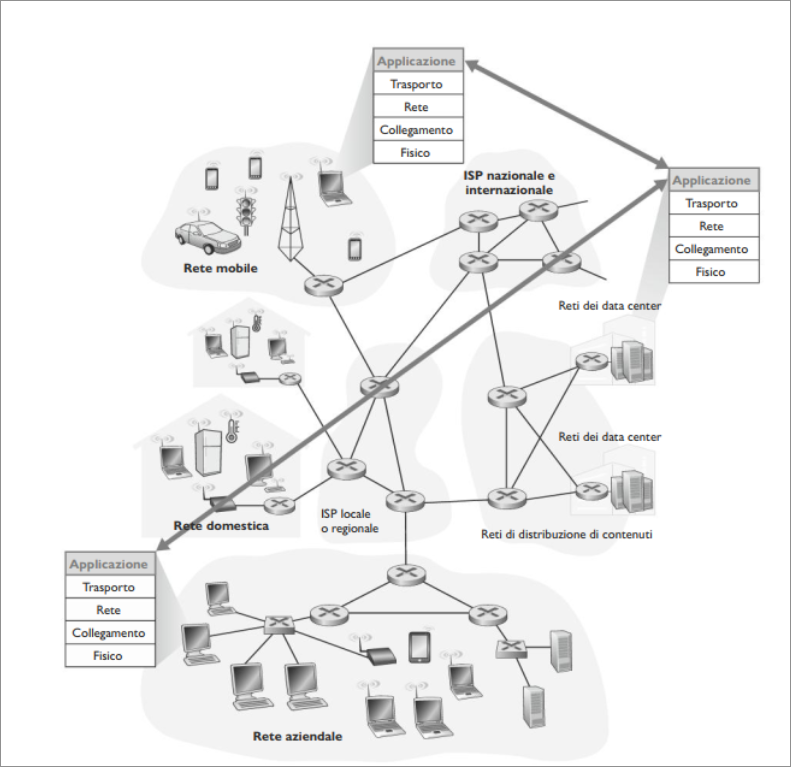
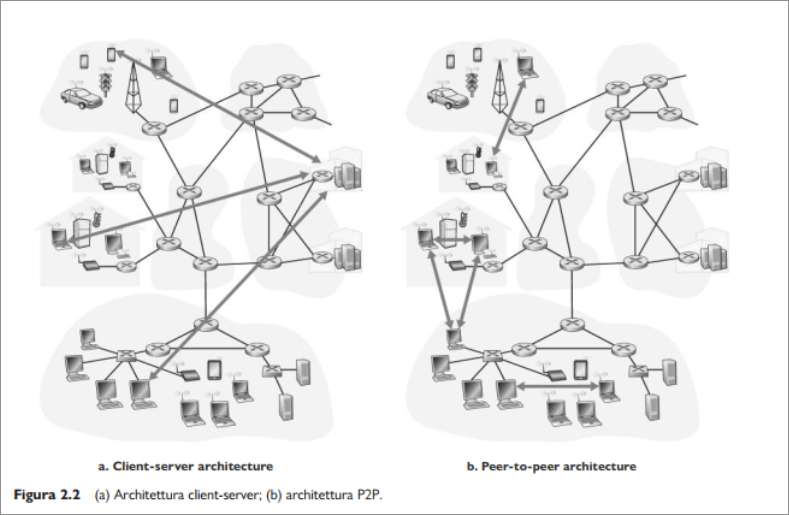
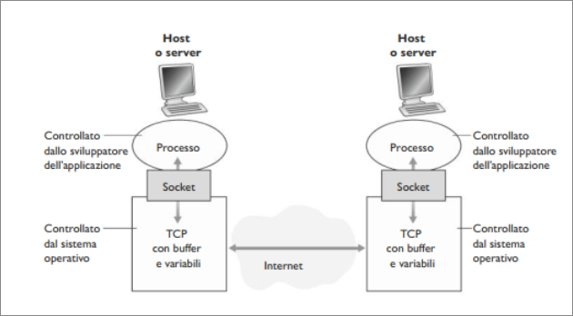
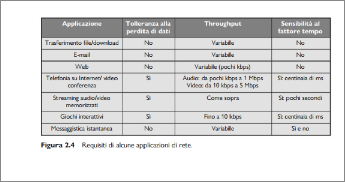
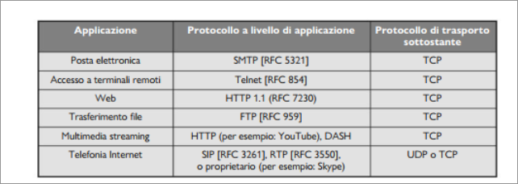
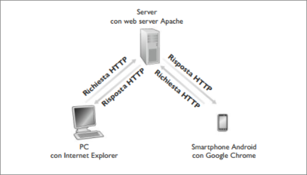

# Livello di Applicazione  
## Princìpi delle applicazioni di rete  
Il cuore dello sviluppo delle applicazioni di rete è costituito dalla creazione dei programmi che sono eseguiti dagli host e che comunicano tra loro via rete.  
Per esempio nelle applicazioni web esistono due diversi programmi che comunicano tra loro: il browser, che viene eseguito dall'host dell'utente (pc,tablet,smartphone) e il web server che si trova nell'host solitamente anch'esso chiamato web server.  

Un altro esempio è rappresentato dalle applicazioni di Video on Demand come Netflix, in cui c'è un programma fornito da Netflix che viene eseguito sullo smartphone dell'utente e un programma server in esecuzione su un host server di Netflix.  

Spesso, i server sono ospitati in data center:  

  

Nello sviluppo di applicazioni, bisogna scrivere software in grado di funzionare su più macchine.  
Questo può essere scritto in Java, C, o Python e non occorre predisporre programmi per i dispositivi del nucleo di rete (router o commutatori) a livello di collegamento.  

### Architetture delle applicazioni di rete  
Per lo sviluppatore di applicazioni, l'architettura di rete è fissata e fornisce alle applicazioni uno specifico insieme di servizi; il suo compito è progettare l'**architettura dell'applicazione** e stabilire la sua organizzazione sui vari host, basandosi su una delle due principali architetture di rete attualmente usate: client-server, peer_to_peer (P2P).  

  

Nell'**architettura client-server** vi è un host sempre attivo, chiamato *server*, che risponde alle richieste di servizio di molti altri host, detti *client*.  
Un esempio classico è rappresentato dall'applicazione web, in cui un web server, sempre attivo, risponde alle richieste dei browser in funzione sui client.  Il server quando riceve richiesta di un oggetto da parte di un client, risponde inviandolo.  Si noti che nell'architettura client-server, i client non comunicano tra loro: i browser, ad esempio, non interagiscono tra di loro.  
Inoltre il server dispone di un indirizzo fisso e noto, detto Indirizzo IP. Il client può contattare il server quando vuole, inviandogli un pacchetto.  
Spesso, in un'applicazione client-server, un singolo host che esegue un server non è in grado di rispondere a tutte le richieste dei suoi client. Per questo motivo nelle architetture client-server si usano spesso **data center** che ospitando molti host, creano un grande server virtuale.  

In un'**architettura P2P** l'infrastruttura di server in data center è minima o del tutto assente; si sfrutta invece, la comunicazione diretta tra coppie di host, chiamate *peer*, collegate in modo intermittente.  
I peer non appartengono a un fornitore di servizi, ma sono computer fissi e portatili, controllati dagli utenti, che per lo più si trovano nelle abitazioni, università, uffici. Dato che i peer comunicano senza passare attraverso un server specializzato, l'architettura *peer_to_peer*. Molte applicazioni che usano questo tipo di architettura includono la condivisione di File, come l'applicazione BitTorrent.  

Uno dei punti di forza del P2P è la sua **scalabilità**. In un'applicazione di condivisione dei file P2P, ogni peer, sebbene generi carico di lavoro richiedendo dei file, aggiunge anche capacità di servizio al sistema, rispondendo alle richieste di altri peer.  

### Processi comunicanti  

Come comunicano tra loro i programmi in diversi host? Nel gergo dei sistemi operativi, non si parla di programmi ma di processi comunicanti.  
Processi in esecuzione sullo stesso sistema comunicano attraverso IPC. Le regole di questo tipo di comunicazione sono governate dal sistema operativo della macchina in questione. Ma come comunicano i processi in esecuzione su sistemi *diversi*, con sistemi operativi anche diversi?  
I processi su due host diversi comunicano attraverso lo scambio di **messaggi**  attraverso la rete.  

**Processi client e server**  

Le applicazioni di rete sono costituite da una coppia di processi che si scambiano messaggi su una rete. Per esempio nelle applicazioni Web, un browser (processo client) scambia messaggi con un web server (processo server).  
In un sistema P2P, i file sono trasferiti dal processo di un peer al processo di un altro peer. Per ciascuna coppia di processi comunicanti, generalmente ne etichettiamo uno come client e l'altro come server.  
Nella condivisione P2P il peer che scarica il file viene detto client, quello che lo invia server.  
In alcune applicazioni come quelle di condivisione dei file mediante P2P, un processo può essere sia client che server, in quanto può inviare quanto ricevere file.  

> [!NOTE]  
> Nel contesto di una sessione di comunicazione tra una coppia di processi, quello che avvia la comunicazione è indicato come **client**, mentre quello che attende di essere contattao per iniziare la sessione viene detto **server**.  

**L'interfaccia tra il processo e la rete**  

La maggior parte delle applicazioni consiste di coppie di processi comunicanti che si scambiano messaggi. Ogni messaggio inviato da un processo deve passare attraverso la rete sottostante. Un processo invia messaggi nella rete e riceve messaggi dalla rete attraverso un interfaccia detta **socket**.  

  

La figura mostra la comunicazione tra le socket di due processi che comunicano via Internet.  
Come mostrato, una socket è l'interfaccia tra il livello di applicazione e di trasporto all'interno di un host. Si parla anche di **API** (*Application Programming Interface*) tra l'applicazione e la rete, dato che la socket rappresenta l'interfaccia di programmazione con cui le applicazioni di rete vengono costruite.  

**Indirizzamento**  

Come nella posta tradizionale, affinché la consegna possa essere effettuata, il destinatario deve avere un indirizzo. Anche in Internet i processi riceventi devono averne uno.  
Per identificare il processo ricevente, è necessario specificare due informazioni:  
1. L'indirizzo dell'host  
2. Un identificatore del processo ricevente sull'host di destinazione.  

In Internet, gli host vengono identificati attraverso i loro **indirizzi IP**. Un indirizzo IP è un numero a 32 bit che identifica univocamente l'host.Oltre a conoscere l'indirizzo dell'host cui è destinato il messaggio, il mittente deve anche identificare il processo destinatario, la socket che deve ricevere il dato, poiché sull'host potrebbero essere in esecuzione molte applicazioni di rete.  
Un **numero di porta di destinazione** assolve questo compito. Alle applicazioni più note, sono assegnate numeri di porta specifici. Per esempio i web server sono identificati dal numero di porta 80.  

### Serivizi di trasporto disponibili per le applicazioni  

Ricordiamo che una socket è l'interfaccia tra un processo applicativo e il protocollo a livello di trasporto.  
L'applicazione lato mittente spinge fuori i messaggi tramite la socket; dall'altra parte, lato ricevente, il protocollo a livello di trasporto ha la responsabilità di consegnare i messaggi alla socket del processo ricevente.  
Molte reti, Internet inclusa, mettono a disposizione vari protocolli di trasporto. Nel progetto di un applicazione occorre scegliere il protocollo a livello di trasporto. Ma come? In base ai servizi che può offrire:  

**Trasferimento dati affidabile**  

I pacchetti di dati possono andare perduti. Dunque occorre , per alcune applicazioni (messaggistica istanteanea, posta elettronica, ecc..), garantire che i dati siano consegnati corretti e completi.  
Se un protocollo fornisce un servizio di consegna garantita, si dice che fornisce un **trasferimento dati affidabile**.  
Quando un protocollo a livello di trasporto non fornisce trasferimento affidabile, i dati inviati dal processo potrebbero andar persi. Ciò potrebbe essere accettabile per le **applicazioni che tollerano perdite** (ad esempio app multimediali audio/video, con audio difettoso.).

**Throughput**  

Il Throughput è la velocità al quale il processo mittente può inviare i bit al processo ricevente. Dato che altre sessioni condivideranno la banda sul percorso di rete e poiché queste sessioni verranno istituite e rilasciate dinamicamente, il throughput disponibile può fluttuare nel tempo.  
Un ulteriore servizio che un protocollo di trasporto può fornire è un throughput garantito.  
Le applicazioni che hanno requisiti di throughput vengono dette **applicazioni sensibili alla banda**.  
Mentre vengono dette **applicazioni elastiche** quelle che possono far uso di tanto o di poco throughput, a seconda di quanto ce ne sia disponibile.  

**Temporizzazione**  

Un protocollo a livello di trasporto può anche fornire garanzie di temporizzazione, che possono assumere varie forme.  
Per esempio, la garanzia potrebbe essere che ogni bit che il mittente invia sulla socket venga ricevuto dalla socket di destino non più di 100 ms più tardi.  

**Sicurezza**  

Infine un protocollo di trasporto può fornire a un'applicazione uno o più servizi di sicurezza. Un protcollo di trasporto, in un host mittente, potrebbe cifrare i dati trasmessi, e nell'host destinatario il protocollo può decifrarli.  

### Servizi di trasporto offerti da Internet  

Internet (come ogni rete TCP/IP, mette a disposizione delle applicazioni due protocolli di trasporto UDP, TCP.  

  

**Servizi TCP**  

TCP prevede un servizio orientato alla connessione e il trasporto affidabile dei dati.  

+ *Servizio orientato alla connessione*: TCP fa in modo che client e server si scambiano informazioni di controllo a livello di trasporto prima che i messaggi a livello di applicazione cominciano a fluire.  
Questa procedura detta *handshaking*, mette in allerta i client e server preparandoli alla partenza.  
Dopo questa fase si dice che esiste una **Connessione TCP** tra le socket dei due processi. Questo tipo di connessione è detta full-duplex, nel senso che i due processi possono scambiarsi contemporaneamente messaggi.  
+ *Servizio di trasferimento dati affidabile*: I processi comunicanti possono contare su TCP per trasportare i dati senza errori e nel giusto ordine.  

TCP include anche un servzio di controllo della congestione. Questo meccanismo di controllo esegue una "strozzatura" del processo d'invio quando il traffico in rete appare eccessivo.  

**Servizi UDP**  

UDP è un potocollo di trasporto leggero, minimalista. UDP è senza connessione, e fornisce un servizio di trasferimento dati non affidabile. I messaggi potrebbero giungere a destinazione non in ordine.  
UDP non include inoltre un meccanismo di controllo della congestione.  
  

### Protocolli a livello di applicazione  

I processi di rete comunicano tra loro inviando messaggi tra socket. Ma come sono strutturati questi messaggi, come vengono inviati? Queste domande ci conducono al campo dei protocolli di applicazione.  

**Un protocollo a livello di applicazione** definisce come i processi di un'applicazione, in esecuzione su host diversi, si scambiano i messaggi.  In particolare un protcollo a livello di applicazione definisce:  
+ i tipi di messaggi scambiati (richiesta/risposta)  
+ la sintassi dei vari tipi di messaggio (campi nel messaggio)  
+ la semantica dei campi, ossia il significato delle informazioni  
+ le regole per determinare quando e come un processo invia e risponde ai messaggi.  

Il protocollo a livello di applicazione del web è HTTP (*HyperText Transfer Protocol*).  
La differenza cruciale tra protocollo di applicazione e applicazione di rete è che un protcollo a livello di applicazione è solo una parte di un'applicazione di rete.  

Prendiamo come esempio il WEB, un applicazione client-server. Essa consiste di molte componenti, tra cui uno standard per i formati di documento (HTML), un browser (Chrome), un web server (Apache).  

## Web e HTTP  

## Panoramica di HTTP  

**HTTP**, protcollo a livello di applicazione del Web, costituisce il cuore del Web. Questo protocollo è implementato in due programmi client-server in esecuzione su due host diversi che comunicano tra loro, attraverso lo scambio di messaggi HTTP.  
Il protcollo definisce il formato dei messaggi e le modalità con cui client e server comunicano.  
Una **pagina web**, detta anche documento, è costituita da oggetti.  
Un **oggetto** è un file (HTML,immagine JPG, un file JS, un file CSS,...) indirizzabile tramite un URL. La maggioranza delle pagine web consiste di un **file HTML principale** e diversi oggetti referenziati da esso.  
Ogni URL ha due componenti: il nome dell'host del server, e il percorso dell'oggetto.  

```
  http://www.SomeSchool.edu/SomeDepartment/picture.gif
```

Un **browser web** implementa il lato client di HTTP. Un **web server**, che implementa il lato server di HTTP, ospita oggetti web, indirizzabili tramite URL.  
HTTP definisce in che modo i client web richiedono le pagine web server e come questi ultimi le trasferiscono ai client.  

  

Quando l'utente richiede una pagina web, il browser invia al server messaggi di richiesta HTTP per gli oggetti nella pagina. Il server riceve le richieste e risponde con messaggi di risposta HTTP contenente gli oggetti.  
HTTP utilizza TCP. Il client HTTP inizia per prima cosa, una connessione TCP con il server. Una volta stabilita la connessione, i processi client e server accedono a TCP attraverso le proprie socket (porta tra un processo e la connessione TCP).  
Il client invia richieste- e riceve risposte HTTP tramite la propria interfaccia socket, analogamente il server riceve richieste e invia messaggi di risposta attraverso la propria socket.  
Quando il client ha mandato un messaggio alla sua interfaccia socket, questo non è più in suo possesso ma del TCP.  

E' importante notare che il server invia i file richiesti ai client senza memorizzare alcuna informazione di stato a proposito del client. Per cui in caso di ulteriore richiesta dello stesso oggetto da parte dello stesso client,  il server procederà nuovamente all'invio, non avendo mantenuto traccia di quello precedentemente effettuato.  

HTTP, per questo motivo, è classificato come **protocollo senza memoria di stato**.


