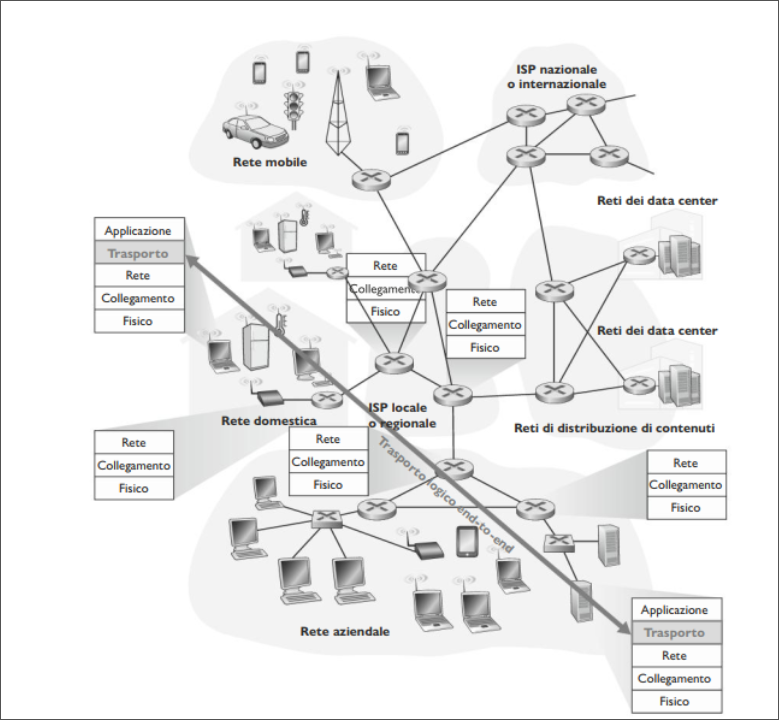

# Livello Trasporto 
## Introduzione e servizi a livello di Trasporto
Un protocollo a livello di trasporto mette a disposizione una **comunicazione logica** tra processi applicativi di host differenti.  
Per comunicazione logica si intende, dal punto di vista dell'applicazione, che tutto proceda come se gli host si possono trovare agli antipodi del pianeta, connessi da numerosi router e da svariati tipi di collegamenti. I processi applicativi usano la comunicazione logica fornita dal livello di trasporto per scambiare messaggi, senza preoccuparsi dei dettagli dell'infrastruttura fisica utilizzata per trasportarli.  

  

Come si vede in figura, i protocolli a livello di trasporto sono implementati nei sistemi periferici, ma non nei router della rete. Lato mittente, il livello di trasporto converte i messaggi che riceve da un processo applicativo in pacchetti a livello di trasporto noti come **segmenti**.  
Questo avviene spezzando i messaggi applicativi in parti più piccole ad aggiungendo ad esse un'intestazione di trasporto per creare un segmento.  
Il livello di trasporto quindi passa il segmento a livello di rete, dove viene incapsulato all'interno di un pacchetto a livello di rete (datagramma) e inviato a destinazione.  
Lato ricevente , il livello di rete estrae il segmento <!--puttana pisello cacca culo pisello mamma mia !--> dal datagramma e lo passa al livello superiore, quello di trasporto. Quest'ultimo elabora il segmento ricevuto, rendendo disponibili all'applicazione destinataria i dati del segmento.  

>[!NOTE]
>Mentre un protocollo di trasporto fornisce una comunicazione logica tra processi che vengono eseguiti su host diversi, un protocollo di rete fornisce comunicazione logica tra host.  

### Panoramica del livello di trasporto di Internet  
Internet, e una rete TCP/IP, mette a disposizione del livello di applicazione due diversi protocolli. Uno è **UDP** (*User Datagram Protocol*), che fornisce alle applicazioni un servizio non affidabile e non orientato alla connessione, l'altro è **TCP** (*Transmission Control Protocol*), che offre un servizio affidabile e orientato alla connessione.  
Il protocollo a livello di rete di Internet ha un nome: IP, che fornisce comunicazione logica tra host.  
Il suo modello di servizio prende il nome di **best-effort**: questo significa che IP fa il meglio per consegnare i segmenti tra host ma non offre *garanzie*. Per questo motivo si dice che IP offra un **servizio non affidabile**.  
Il passaggio da consegna *host-to-host* a consegna *process-to-process* viene detto **multiplexing e demultiplexing a livello di trasporto**.  
UDP e TCP forniscono, inoltre, un controllo di integrità includendo campi per il riconoscimento di errori nelle intestazioni dei propri segmenti.  
UDP come IP non garantisce un servizio affidabile. D'altra parte TCP offre alle applicazioni diversi servizi aggiuntivi come un **trasferimento dati affidabile**. Fornisce anche il **controllo di congestione**, evita che le connessioni TCP intasino i collegamenti e i router tra gli host comunicanti con un'eccessiva quantità di traffico.  

## Multiplexing e demultiplexing  
Analizziamo il multiplexing e il demultiplexing, ovvero come il servizio di trasporto da host a host fornito dal livello di rete possa diventare un servizio di trasporto da processo a processo per le applicazioni in esecuzione sugli host.   
Nell'host destinatario il livello di trasporto riceve segmenti a livello di rete immediatamente sottostante. Il livello di trasporto ha il compito di consegnare i dati di questi segmenti al processo applicativo appropriato nell'host.   

Usiamo un esempio. Supponiamo di star scaricando pagine web mentre sono in esecuzione FTP e due sessioni di Telnet. Abbiamo dunque attivi 4 processi, FTP,HTTP e due Telnet. Il livello di trasporto nel calcolatore, quando riceve i dati deve indirizzarli a uno di questi 4 processi:  
Innazitutto ricordiamo che un processo può gestire una o più **socket** attraverso le quali i dati fluiscono dalla rete al processo e viceversa.  
Di conseguenza il livello di trasporto nell'host di ricezione non trasferisce i dati direttamente a un processo, ma piuttosto a una socket che fa da intermediario. Siccome, a ogni dato istante, può esserci più di una socket nell'host di ricezione, ciascuna avrà un identificatore univoco il cui formato dipende dal fatto che si tratti di socket UDP o TCP.  

Consideriamo ora come l'host in ricezione indirizzi verso la socket appropriata il segmento a livello di trasporto in arrivo.  
Ciascun segmento a livello di trasporto ha vari campi deputati allo scopo. Lato ricevente, il livello di trasporto esamina questi campi per identificare la socket di ricezione e quindi 
