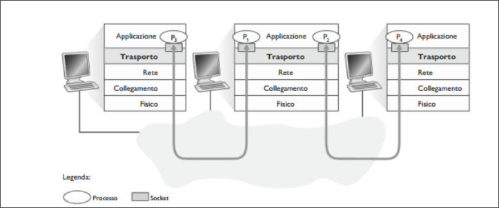
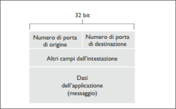
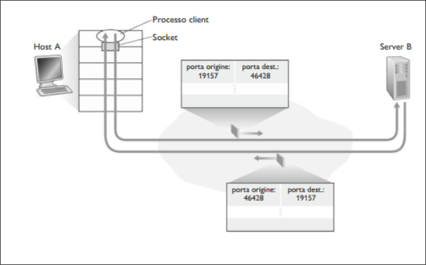

# Livello Trasporto 
## Introduzione e servizi a livello di Trasporto
Un protocollo a livello di trasporto mette a disposizione una **comunicazione logica** tra processi applicativi di host differenti.  
Per comunicazione logica si intende, dal punto di vista dell'applicazione, che tutto proceda come se gli host si possono trovare agli antipodi del pianeta, connessi da numerosi router e da svariati tipi di collegamenti. I processi applicativi usano la comunicazione logica fornita dal livello di trasporto per scambiare messaggi, senza preoccuparsi dei dettagli dell'infrastruttura fisica utilizzata per trasportarli.  

  

Come si vede in figura, i protocolli a livello di trasporto sono implementati nei sistemi periferici, ma non nei router della rete. Lato mittente, il livello di trasporto converte i messaggi che riceve da un processo applicativo in pacchetti a livello di trasporto noti come **segmenti**.  
Questo avviene spezzando i messaggi applicativi in parti più piccole ad aggiungendo ad esse un'intestazione di trasporto per creare un segmento.  
Il livello di trasporto quindi passa il segmento a livello di rete, dove viene incapsulato all'interno di un pacchetto a livello di rete (datagramma) e inviato a destinazione.  
Lato ricevente , il livello di rete estrae il segmento <!--puttana pisello cacca culo pisello mamma mia !--> dal datagramma e lo passa al livello superiore, quello di trasporto. Quest'ultimo elabora il segmento ricevuto, rendendo disponibili all'applicazione destinataria i dati del segmento.  

>[!NOTE]  
>Mentre un protocollo di trasporto fornisce una comunicazione logica tra processi che vengono eseguiti su host diversi, un protocollo di rete fornisce comunicazione logica tra host.  

### Panoramica del livello di trasporto di Internet  
Internet, e una rete TCP/IP, mette a disposizione del livello di applicazione due diversi protocolli. Uno è **UDP** (*User Datagram Protocol*), che fornisce alle applicazioni un servizio non affidabile e non orientato alla connessione, l'altro è **TCP** (*Transmission Control Protocol*), che offre un servizio affidabile e orientato alla connessione.  
Il protocollo a livello di rete di Internet ha un nome: IP, che fornisce comunicazione logica tra host.  
Il suo modello di servizio prende il nome di **best-effort**: questo significa che IP fa il meglio per consegnare i segmenti tra host ma non offre *garanzie*. Per questo motivo si dice che IP offra un **servizio non affidabile**.  
Il passaggio da consegna *host-to-host* a consegna *process-to-process* viene detto **multiplexing e demultiplexing a livello di trasporto**.  
UDP e TCP forniscono, inoltre, un controllo di integrità includendo campi per il riconoscimento di errori nelle intestazioni dei propri segmenti.  
UDP come IP non garantisce un servizio affidabile. D'altra parte TCP offre alle applicazioni diversi servizi aggiuntivi come un **trasferimento dati affidabile**. Fornisce anche il **controllo di congestione**, evita che le connessioni TCP intasino i collegamenti e i router tra gli host comunicanti con un'eccessiva quantità di traffico.  


## Multiplexing e demultiplexing  
Analizziamo il multiplexing e il demultiplexing, ovvero come il servizio di trasporto da host a host fornito dal livello di rete possa diventare un servizio di trasporto da processo a processo per le applicazioni in esecuzione sugli host.   
Nell'host destinatario il livello di trasporto riceve segmenti a livello di rete immediatamente sottostante. Il livello di trasporto ha il compito di consegnare i dati di questi segmenti al processo applicativo appropriato nell'host.   

Usiamo un esempio. Supponiamo di star scaricando pagine web mentre sono in esecuzione FTP e due sessioni di Telnet. Abbiamo dunque attivi 4 processi, FTP,HTTP e due Telnet. Il livello di trasporto nel calcolatore, quando riceve i dati deve indirizzarli a uno di questi 4 processi:  
Innazitutto ricordiamo che un processo può gestire una o più **socket** attraverso le quali i dati fluiscono dalla rete al processo e viceversa.  
Di conseguenza il livello di trasporto nell'host di ricezione non trasferisce i dati direttamente a un processo, ma piuttosto a una socket che fa da intermediario. Siccome, a ogni dato istante, può esserci più di una socket nell'host di ricezione, ciascuna avrà un identificatore univoco il cui formato dipende dal fatto che si tratti di socket UDP o TCP.  

Consideriamo ora come l'host in ricezione indirizzi verso la socket appropriata il segmento a livello di trasporto in arrivo.  
Ciascun segmento a livello di trasporto ha vari campi deputati allo scopo. Lato ricevente, il livello di trasporto esamina questi campi per identificare la socket di ricezione e quindi vi dirige il segmento.  
Il compito di trasportare i dati dei segmenti a livello di trasporto verso la giusta socket viene detto **demultiplexing**. Il compito di radunare frammenti di dati da diverse socket e passarli a livello di rete, viene detto **multiplexing**.  

  

Si osservi che il livello di trasporto nell'host centrale in figura deve effettuare il demultiplexing dal livello di rete dei segmenti che possono arrivare sia per il processo $P_1$ che processo $P_2$; ciò avviene indirizzando i dati del segmento in ingresso alla giusta socket. Il livello di trasporto nell'host centrale deve, inoltre, raccogliere i dati in uscita dalle socket dei due processi, creare segmenti a livello di trasporto e passarli a livello di rete.  
In una analogia, Anna effettua un'operazione di multiplexing quando raccoglie le lettere dai mittenti e le imbuca. Nel momento in cui Andrea riceve le lettere dal postino, effettua un'operazione di demultiplexing, consegnando ciascuna missiva al rispettivo destinatario.  
Esaminiamo ora come vengono realizzati negli host il multiplexing e demultiplexing.  
Il multiplexing richiede (1) che le socket abbiano identificatori unici e (2) che ciascun segmento presenti campi che indichino la socket a cui va consegnato il segmento.  



Quelli in figura sono il **campo del numero di porta di origine** e il **campo del numero di porta di destinazione** (I segmenti UDP e TCP presentano ulteriori campi).  
I numeri di porta sono di 16 bit e vanno da 0 a 65535, quelli che vanno da 0 a 1023 sono chiamati **numeri di porta noti** e sono riservati per essere usati da protocolli applicativi come HTTP o FTP.  
Quando si sviluppa un'applicazione bisogna assegnargli un numero di porta.  

#### Multiplexing e demultiplexing non orientati alla connessione  

Programmi python possono creare una socket UDP con il seguente frammento di codice:  

```python
clientSocket=socket(AF_INET,SOCK_DGRAM)
```  
Quando una socket UDP viene definita in tale modo, il livello di trasporto le assegna automaticamente un numero di porta compreso tra 1024 e 65535 che non sia ancora stato utilizzato. Altrimenti un programma python potrebbe creare una socket UDP associata a una specifica porta col seguente codice:  

```python  
client.socket(('',19157))
```
Ora che le porte sono state assegnate, descriviamo nello specifico il multiplexing e demultiplexing UDP.  
Supponiamo che un processo host $A$, con porta UDP 19157, voglia inviare un blocco di dati applicativi a un processo con porta UPD 46428 nell'host B. Il livello di trasporto di A crea un collegamento che include i dati applicativi, i numeri di porta di origine (19157) e di destinazione (46428) e due altri valori.  
Il livello di trasporto passa, quindi, il segmento risultante al livello di rete, che lo incapsula in un datagramma IP, ed effettua un tentativo best-effort di consegna del segmento all'host in ricezione. Se il segmento arriva all'Host B, il suo livello di trasporto esamina il numero di porta di destinazione del segmento (46428) e lo consegna alla propria socket identificata da 46428.  
Osserviamo che l'host B potrebbe avere in esecuzione più processi, ciascuno con la propria socket e relativo numero di porta.  
Quando i segmenti UDP giungono dalla rete, l'Host B dirige ciascun segmento (ne esegue il demultiplexing) alla socket appropriata esaminando il numero di porta di destinazione del segmento.  

>[!NOTE]  
> Una socket UDP viene identificata completamente da una coppia che consiste di un indirizzo IP e numero di porta di destinazione. Di conseguenza due segmenti UDP che presentano diversi indirizzi IP e/o diversi numeri di porta di origine ma hanno stesso indirizzo IP e stesso numero di porta di destinazione, vengono diretti allo stesso processo di destinazione tramite la medesima socket.  

  

Per quanto riguarda il numero di porta di origine osserviamo la figura: Nel segmento che va da A verso B il numero di porta di origine serve come parte di un "indirizzo di ritorno": quando B vuole restituire il segmento ad A, la porta di destinazione del segmento verso B da A assumerà il valore della porta di origine del segmento da A verso B. L'indirizzo di ritorno completo è costituito dall'indirizzo IP di A più il numero di porta di origine.  

#### Multiplexing e demultiplexing orientati alla connessione  

Una sottile differenza tra socket TCP e socket UDP risiede nel fatto che la prima è identificata da quattro parametri: indirizzo IP di origine, numero di porta di origine, indirizzo IP di destinazione, numero di porta di destinazione. Pertanto quando un segmento TCP giunge dalla rete in un host , quest'ultimo utilizza i quattro valori per dirigere (fare demultiplexing) il segmento verso la socket appropriata. In particolare, e al contrario di UDP, due segmenti TCP in arrivo aventi diversi Indirizzi IP o numero di porta di origine, vengono diretti a due socket diverse , anche a fronte di indirizzi IP e porta di destinazione uguali, con l'eccezione dei segmenti TCP che trasportano la richiesta per stabilire la connessione.  

Usiamo un esempio:  

+ L'applicazione server TCP presenta una "socket di benvenuto" che si pone in attesa di richieste di connessione da parte dei client TCP sulla porta numero 12000.  
+ Il client TCP crea una socket e genera un segmento per stabilire la connessione: 
```python  
clientSocket=socket(AF_INET,SOCK_STREAM)  
clientSocket.connect((serverName,12000))
```
+ Una richiesta di conessione non è nient'altro che un segmento TCP con un numero di porta di destinazione 12000 e uno speciale bit di richiesta di connessione posto a 1 nell'intestazione. Il segmento include anche un numero di porta di origine, scelto dal client.  
+ Il sistema operativo dell'host che esegue il processo server, quando riceve il segmento con la richiesta di connessione con porta di destinazione 12000, localizza il processo server in attesa di accettare connessioni sulla porta 12000. Il processo server crea quindi una nuova connessione:  
```python 
connectionSocket, addr=serverSocket.accept()
```  
+ Inoltre il livello di trasporto sul server prende nota dei seguenti valori nel segmento con la richiesta di connessione: (1) numero di porta di origine nel segmento, (2) indirizzo IP dell'host di origine, (3) numero di porta di destinazione nel segmento e (4) il proprio indirizzo IP. La socket di connessione appena creata viene identificata da questi quattro valori. Tutti i segmenti successivi la cui porta di origine, indirizzo IP di origine, porta di destinazione e indirizzo IP di destinazione coincidono con tali valori, verranno diretti verso questa socket.  

L'host server può ospitare più socket TCP contemporanee collegate a processi diversi , ogniuna identificata da una specifica quaterna di valori. Quando il segmento TCP arriva all'host, i quattro campi citati prima vengono utilizzati per dirigere (demultiplexing) il segmento verso la socket appropriata.  

#### Web server e TCP  

Consideriamo un host che stia eseguendo un web server , supponiamo Apache, sulla porta 80. Quando i client (browser) inviano segmenti al server, *tutti* i segmenti hanno porta di destinazione 80. In particolare , sia i segmenti per stabilire la connessione iniziale sia quelli che trasportano messaggi di richiesta HTTP hanno porta di destinazione 80.  

