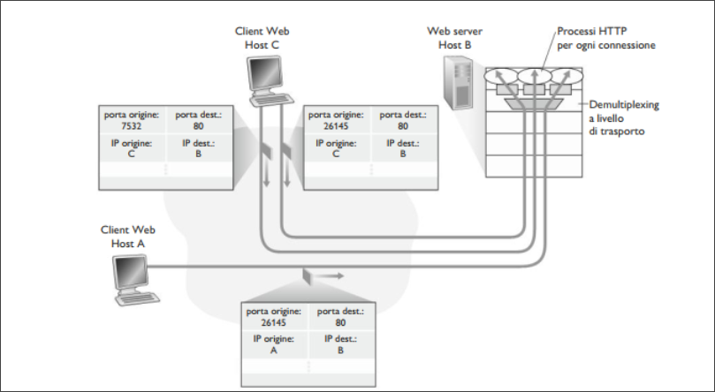
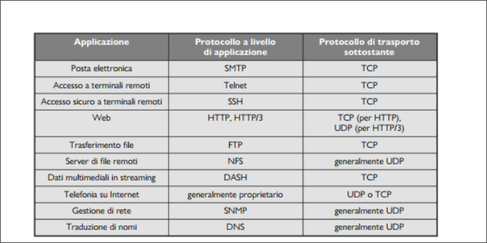
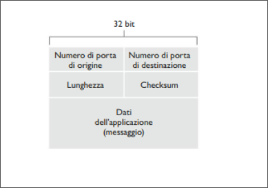
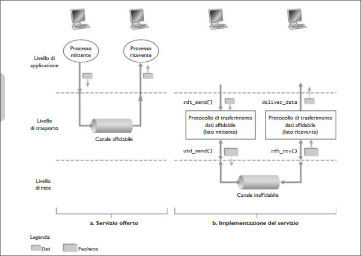
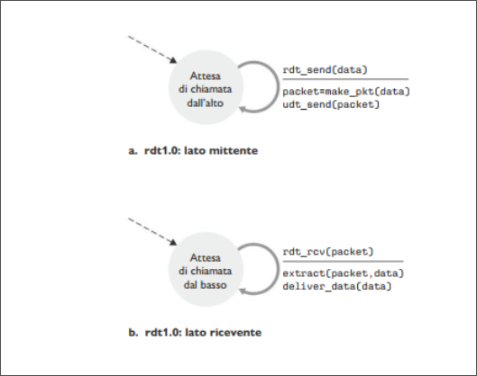
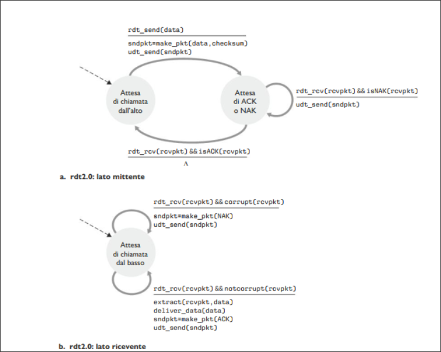
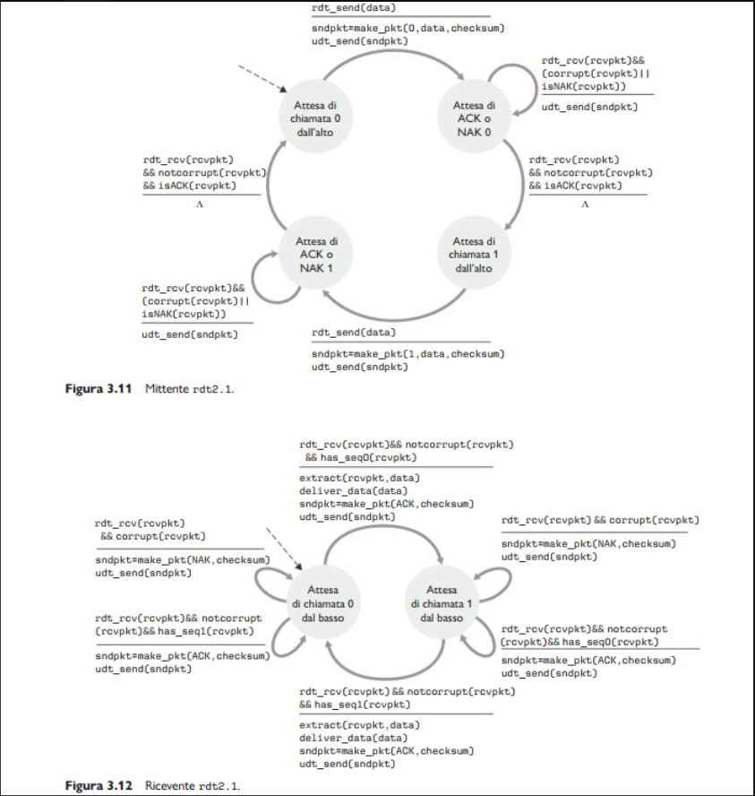
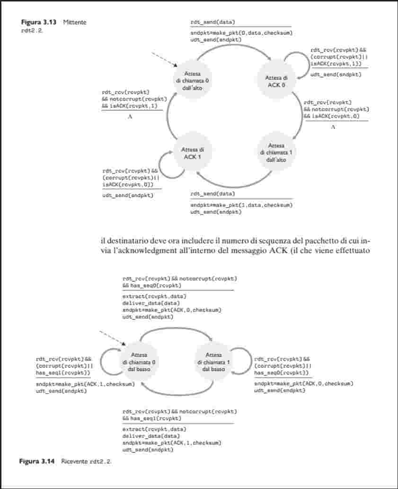

# Livello Trasporto 
## Introduzione e servizi a livello di Trasporto
Un protocollo a livello di trasporto mette a disposizione una **comunicazione logica** tra processi applicativi di host differenti.  
Per comunicazione logica si intende, dal punto di vista dell'applicazione, che tutto proceda come se gli host si possono trovare agli antipodi del pianeta, connessi da numerosi router e da svariati tipi di collegamenti. I processi applicativi usano la comunicazione logica fornita dal livello di trasporto per scambiare messaggi, senza preoccuparsi dei dettagli dell'infrastruttura fisica utilizzata per trasportarli.  

  

Come si vede in figura, i protocolli a livello di trasporto sono implementati nei sistemi periferici, ma non nei router della rete. Lato mittente, il livello di trasporto converte i messaggi che riceve da un processo applicativo in pacchetti a livello di trasporto noti come **segmenti**.  
Questo avviene spezzando i messaggi applicativi in parti più piccole ad aggiungendo ad esse un'intestazione di trasporto per creare un segmento.  
Il livello di trasporto quindi passa il segmento a livello di rete, dove viene incapsulato all'interno di un pacchetto a livello di rete (datagramma) e inviato a destinazione.  
Lato ricevente , il livello di rete estrae il segmento <!--puttana pisello cacca culo pisello mamma mia !--> dal datagramma e lo passa al livello superiore, quello di trasporto. Quest'ultimo elabora il segmento ricevuto, rendendo disponibili all'applicazione destinataria i dati del segmento.  

>[!NOTE]  
>Mentre un protocollo di trasporto fornisce una comunicazione logica tra processi che vengono eseguiti su host diversi, un protocollo di rete fornisce comunicazione logica tra host.  

### Panoramica del livello di trasporto di Internet  
Internet, e una rete TCP/IP, mette a disposizione del livello di applicazione due diversi protocolli. Uno è **UDP** (*User Datagram Protocol*), che fornisce alle applicazioni un servizio non affidabile e non orientato alla connessione, l'altro è **TCP** (*Transmission Control Protocol*), che offre un servizio affidabile e orientato alla connessione.  
Il protocollo a livello di rete di Internet ha un nome: IP, che fornisce comunicazione logica tra host.  
Il suo modello di servizio prende il nome di **best-effort**: questo significa che IP fa il meglio per consegnare i segmenti tra host ma non offre *garanzie*. Per questo motivo si dice che IP offra un **servizio non affidabile**.  
Il passaggio da consegna *host-to-host* a consegna *process-to-process* viene detto **multiplexing e demultiplexing a livello di trasporto**.  
UDP e TCP forniscono, inoltre, un controllo di integrità includendo campi per il riconoscimento di errori nelle intestazioni dei propri segmenti.  
UDP come IP non garantisce un servizio affidabile. D'altra parte TCP offre alle applicazioni diversi servizi aggiuntivi come un **trasferimento dati affidabile**. Fornisce anche il **controllo di congestione**, evita che le connessioni TCP intasino i collegamenti e i router tra gli host comunicanti con un'eccessiva quantità di traffico.  


## Multiplexing e demultiplexing  
Analizziamo il multiplexing e il demultiplexing, ovvero come il servizio di trasporto da host a host fornito dal livello di rete possa diventare un servizio di trasporto da processo a processo per le applicazioni in esecuzione sugli host.   
Nell'host destinatario il livello di trasporto riceve segmenti a livello di rete immediatamente sottostante. Il livello di trasporto ha il compito di consegnare i dati di questi segmenti al processo applicativo appropriato nell'host.   

Usiamo un esempio. Supponiamo di star scaricando pagine web mentre sono in esecuzione FTP e due sessioni di Telnet. Abbiamo dunque attivi 4 processi, FTP,HTTP e due Telnet. Il livello di trasporto nel calcolatore, quando riceve i dati deve indirizzarli a uno di questi 4 processi:  
Innazitutto ricordiamo che un processo può gestire una o più **socket** attraverso le quali i dati fluiscono dalla rete al processo e viceversa.  
Di conseguenza il livello di trasporto nell'host di ricezione non trasferisce i dati direttamente a un processo, ma piuttosto a una socket che fa da intermediario. Siccome, a ogni dato istante, può esserci più di una socket nell'host di ricezione, ciascuna avrà un identificatore univoco il cui formato dipende dal fatto che si tratti di socket UDP o TCP.  

Consideriamo ora come l'host in ricezione indirizzi verso la socket appropriata il segmento a livello di trasporto in arrivo.  
Ciascun segmento a livello di trasporto ha vari campi deputati allo scopo. Lato ricevente, il livello di trasporto esamina questi campi per identificare la socket di ricezione e quindi vi dirige il segmento.  
Il compito di trasportare i dati dei segmenti a livello di trasporto verso la giusta socket viene detto **demultiplexing**. Il compito di radunare frammenti di dati da diverse socket e passarli a livello di rete, viene detto **multiplexing**.  

  

Si osservi che il livello di trasporto nell'host centrale in figura deve effettuare il demultiplexing dal livello di rete dei segmenti che possono arrivare sia per il processo $P_1$ che processo $P_2$; ciò avviene indirizzando i dati del segmento in ingresso alla giusta socket. Il livello di trasporto nell'host centrale deve, inoltre, raccogliere i dati in uscita dalle socket dei due processi, creare segmenti a livello di trasporto e passarli a livello di rete.  
In una analogia, Anna effettua un'operazione di multiplexing quando raccoglie le lettere dai mittenti e le imbuca. Nel momento in cui Andrea riceve le lettere dal postino, effettua un'operazione di demultiplexing, consegnando ciascuna missiva al rispettivo destinatario.  
Esaminiamo ora come vengono realizzati negli host il multiplexing e demultiplexing.  
Il multiplexing richiede (1) che le socket abbiano identificatori unici e (2) che ciascun segmento presenti campi che indichino la socket a cui va consegnato il segmento.  


Quelli in figura sono il **campo del numero di porta di origine** e il **campo del numero di porta di destinazione** (I segmenti UDP e TCP presentano ulteriori campi).  
I numeri di porta sono di 16 bit e vanno da 0 a 65535, quelli che vanno da 0 a 1023 sono chiamati **numeri di porta noti** e sono riservati per essere usati da protocolli applicativi come HTTP o FTP.  
Quando si sviluppa un'applicazione bisogna assegnargli un numero di porta.  

#### Multiplexing e demultiplexing non orientati alla connessione  

Programmi python possono creare una socket UDP con il seguente frammento di codice:  

```python
clientSocket=socket(AF_INET,SOCK_DGRAM)
```  
Quando una socket UDP viene definita in tale modo, il livello di trasporto le assegna automaticamente un numero di porta compreso tra 1024 e 65535 che non sia ancora stato utilizzato. Altrimenti un programma python potrebbe creare una socket UDP associata a una specifica porta col seguente codice:  

```python  
client.socket(('',19157))
```
Ora che le porte sono state assegnate, descriviamo nello specifico il multiplexing e demultiplexing UDP.  
Supponiamo che un processo host $A$, con porta UDP 19157, voglia inviare un blocco di dati applicativi a un processo con porta UPD 46428 nell'host B. Il livello di trasporto di A crea un collegamento che include i dati applicativi, i numeri di porta di origine (19157) e di destinazione (46428) e due altri valori.  
Il livello di trasporto passa, quindi, il segmento risultante al livello di rete, che lo incapsula in un datagramma IP, ed effettua un tentativo best-effort di consegna del segmento all'host in ricezione. Se il segmento arriva all'Host B, il suo livello di trasporto esamina il numero di porta di destinazione del segmento (46428) e lo consegna alla propria socket identificata da 46428.  
Osserviamo che l'host B potrebbe avere in esecuzione più processi, ciascuno con la propria socket e relativo numero di porta.  
Quando i segmenti UDP giungono dalla rete, l'Host B dirige ciascun segmento (ne esegue il demultiplexing) alla socket appropriata esaminando il numero di porta di destinazione del segmento.  

>[!NOTE]  
> Una socket UDP viene identificata completamente da una coppia che consiste di un indirizzo IP e numero di porta di destinazione. Di conseguenza due segmenti UDP che presentano diversi indirizzi IP e/o diversi numeri di porta di origine ma hanno stesso indirizzo IP e stesso numero di porta di destinazione, vengono diretti allo stesso processo di destinazione tramite la medesima socket.  

  

Per quanto riguarda il numero di porta di origine osserviamo la figura: Nel segmento che va da A verso B il numero di porta di origine serve come parte di un "indirizzo di ritorno": quando B vuole restituire il segmento ad A, la porta di destinazione del segmento verso B da A assumerà il valore della porta di origine del segmento da A verso B. L'indirizzo di ritorno completo è costituito dall'indirizzo IP di A più il numero di porta di origine.  

#### Multiplexing e demultiplexing orientati alla connessione  

Una sottile differenza tra socket TCP e socket UDP risiede nel fatto che la prima è identificata da quattro parametri: indirizzo IP di origine, numero di porta di origine, indirizzo IP di destinazione, numero di porta di destinazione. Pertanto quando un segmento TCP giunge dalla rete in un host , quest'ultimo utilizza i quattro valori per dirigere (fare demultiplexing) il segmento verso la socket appropriata. In particolare, e al contrario di UDP, due segmenti TCP in arrivo aventi diversi Indirizzi IP o numero di porta di origine, vengono diretti a due socket diverse , anche a fronte di indirizzi IP e porta di destinazione uguali, con l'eccezione dei segmenti TCP che trasportano la richiesta per stabilire la connessione.  

Usiamo un esempio:  

+ L'applicazione server TCP presenta una "socket di benvenuto" che si pone in attesa di richieste di connessione da parte dei client TCP sulla porta numero 12000.  
+ Il client TCP crea una socket e genera un segmento per stabilire la connessione: 
```python  
clientSocket=socket(AF_INET,SOCK_STREAM)  
clientSocket.connect((serverName,12000))
```
+ Una richiesta di conessione non è nient'altro che un segmento TCP con un numero di porta di destinazione 12000 e uno speciale bit di richiesta di connessione posto a 1 nell'intestazione. Il segmento include anche un numero di porta di origine, scelto dal client.  
+ Il sistema operativo dell'host che esegue il processo server, quando riceve il segmento con la richiesta di connessione con porta di destinazione 12000, localizza il processo server in attesa di accettare connessioni sulla porta 12000. Il processo server crea quindi una nuova connessione:  
```python 
connectionSocket, addr=serverSocket.accept()
```  
+ Inoltre il livello di trasporto sul server prende nota dei seguenti valori nel segmento con la richiesta di connessione: (1) numero di porta di origine nel segmento, (2) indirizzo IP dell'host di origine, (3) numero di porta di destinazione nel segmento e (4) il proprio indirizzo IP. La socket di connessione appena creata viene identificata da questi quattro valori. Tutti i segmenti successivi la cui porta di origine, indirizzo IP di origine, porta di destinazione e indirizzo IP di destinazione coincidono con tali valori, verranno diretti verso questa socket.  

L'host server può ospitare più socket TCP contemporanee collegate a processi diversi , ogniuna identificata da una specifica quaterna di valori. Quando il segmento TCP arriva all'host, i quattro campi citati prima vengono utilizzati per dirigere (demultiplexing) il segmento verso la socket appropriata.  

#### Web server e TCP  

Consideriamo un host che stia eseguendo un web server , supponiamo Apache, sulla porta 80. Quando i client (browser) inviano segmenti al server, *tutti* i segmenti hanno porta di destinazione 80. In particolare , sia i segmenti per stabilire la connessione iniziale sia quelli che trasportano messaggi di richiesta HTTP hanno porta di destinazione 80.  

  

La figura mostra un web server che genera un nuovo processo per ogni connessione. Ciascuno di questi processi ha una propria socket attraverso la quale giungono richieste e sono inviate risposte HTTP. Gli odierni web server ad alte prestazioni spesso utilizzano un solo processo, ma creano un nuovo thread e una nuova socket di connessione per ciascun client. Tale server può avere diverse socket associate allo stesso processo.  


## Trasporto non orientato alla connessione  

UDP fa praticamente il minimo che un protocollo di trasporto debba fare. A parte la funzione di multiplexing/demultiplexing e una forma di controllo degli errori minima, non aggiunge nulla a IP.  
UDP prende i messaggi del processo applicativo, aggiunge il numero di porta di origine e di destinazione per il multiplexing/demultiplexing, aggiunge altri due piccoli campi e passa il paccheto a livello di rete.  
Questi incapsula il segmento in un datagramma IP e quindi effettua un tentativo di consegnarlo all'host di destinazione in modalità best-effort. Se il segmento arriva a destinazione, UDP utilizza il numero di porta di destinazione per consegnare i dati del segmento al processo applicativo corretto.  

> [!NOTE]  
> In UDP non esiste handshaking tra le entità di invio e di ricezione a livello di trasporto. Per questo motivo si dice che UDP *non è orientato alla connessione*.  

DNS è un protocollo a livello applicativo che utilizza UDP.  
Quando l'applicazione DNS in un host vuole effettuare una query, costruisce un messaggio di query DNS e lo passa a UDP.  
Senza effettuare alcun handshaking con l'entità UDP in esecuzione sul sistema di destinazione, il sistema aggiunge i campi d'intestazione al messaggio e trasferisce il segmento risultante a livello di rete. Quest'ultimo incapsula il segmento UDP in un datagramma e lo invia al server DNS. L'applicazione DNS sull'host che effettua la richiesta aspetta quindi una risposta. Se non riceve, l'applicazione tenta di inviare la richiesta a un altro DNS server oppure informa l'applicazione dell'impossibilità di ottenere una risposta.  

Perché UDP e non TCP:  
  + *Controllo più preciso a livello di applicazione su quali dati sono inviati e quando*. Non appena un processo applicativo passa dei dati a UDP, quest'ultimo li impacchetta in un segmento che trasferisce immediatamente a livello di rete. TCP invece dispone di un meccanismo di controllo della congestione che ritarda l'invio a livello di trasporto quando i collegamenti sono eccessivamente congestionati. Inoltre TCP continua a inviare il segmento fino a quando non viene notificata la sua ricezione. Dato che le applicazioni in tempo reale richiedono una minima velocità di invio e non sopportano ritardi eccessivi mentre tollerano una perdita di dati, UDP si adatta meglio a loro;  
  + *Nessuna connessione stabilita*. TCP utilizza un handshake a tre vie prima di iniziare il trasferimento dei dati. UDP invece "spara" dati a raffica senza alcun preliminare formale. Pertanto UDP non introduce alcun ritardo nello stabilire una connessione;
  + *Nessuno stato di connessione*. TCP mantiene lo stato della connessione nei sistemi periferici. Questo stato include buffer di ricezionee di invio, parametri per il controllo di congestione e parametri sul numero di sequenza e di acknowledgment. UDP no, per questo motivo un server dedicato a una particolare applicazione può generalmente supportare molti più client attivi quando l'applicazione utilizza UDP.  
  + *Minor spazio usato per l'intestazione del pacchetto*. L'intestazione dei pacchetti TCP aggiunge 20 *byte*, mentre UDP solo 8.  

 

La conseguenza di mancanza di controllo di congestione di UDP può avere come risultato un'alta percentuale di perdite tra mittente e destinatario UDP nonché uno schiacciamento delle sessioni TCP.  

Le applicazioni **possono** ottenere un trasferimento dati affidabile anche con UDP, se l'affidabilità è insita nell'applicazione stessa.  

### Struttura dei segmenti UDP  

  

In figura i campi di un segmento UDP, dove i dati dell'applicazione occupano il campo Dati.  
L'intestazione UDP presenta solo quattro campi di due byte ciascuno. I numeri di porta consentono all'host di destinazione di trasferire i dati applicativi al processo corretto (demultiplexing). Il campo lunghezza specifica il numero di byte del segmento UDP. Un valore esplicito di lunghezza è necessario perché la grandezza del campo Dati può essere divisa tra un segmento e quello successivo.  

### Checksum UDP  
Il checksum UDP serve per il rilevamento degli errori.  
Lato mittente UDP effettua il complemento a 1 della somma di tutte le parole da 16 bit nel segmento, e l'eventuale riporto finale viene sommato al primo bit. Tale risultato viene posto nel campo Checksum del segmento UDP. Esempio:  

```
0110011001100000
0101010101010101
1000111100001100
```
La somma delle prime due:  
```
0110011001100000
0101010101010101
1011101110110101
```  
Sommando la terza parola al risultato precedente:  

```
1011101110110101
1000111100001100
0100101011000010
```
Si noti che il riporto di quest'ultima somma è stato sommato al primo bit. Il completamento a 1 si ottiene convertendo i bit 0 in 1 e viceversa. Di conseguenza il checksum sarà 1011010100111101. In ricezione, si sommano le tre parole iniziali e il checksum. Se non ci sono errori nel pacchetto, l'addizione sarà 1111111111111111. Altrimenti vi è un errore.  
Dato che non sono garantiti ne l'affidabilità del singolo collegamento ne il rilevamento degli errori in memoria, UDP deve fornire a livello di trasporto un meccanismo di verifica su base end-to-end, se si vuole che il trasferimento dati sia in grado di rilevare errori.  
Questo è un esempio del **principio end-to-end**.  

## Principi di trasferimento  dati affidabile  

  

La figura illustra il contesto del trasferimento affidabile. L'astrazione del servizio offerta alle entità dei livelli superiori è quella di un canale affidabile tramite il quale si possono trasferire dati. Con un canale affidabile a disposizione nessun bit dei trasferiti è corrotto o va perduto e tutti i bit sono consegnati nell'ordine di invio.  

Il compito di un **protocollo di trasferimento dati affidabile** è l'implementazione di questa astrazione del servizio. Ciò è complicato dalla possibile infaffidabilità del livello sottostante al protocollo di trasporto.  

La figura (b) mostra le interfacce per il nostro protocollo di trasferimento dati sarà invocato tramite una chiamata a ```rdt_send()``` e trasferirà i dati da consegnare al livello superiore sul lato ricevente. In questo caso ```rdt``` sta per "reliable data transfer" e send indichia la chiamata al lato mittente di ```rdt```. Quando un pacchetto raggiunge il lato ricevente del canale, viene chiamata ```rdt_rcv()```. Il protocollo ```rdt```, quando vuole consegnare i dati a livello superiore, chiama ```deliver_data()``` (da qui in avanti useremo il termine pacchetto e non segmento per questo livello).   

### Costruzione di un protocollo di trasferimento dati affidabile  

#### Trasferimento dati affidabile su un canale perfettamente affidabile: rdt1.0  

Consideriamo il caso più semplice, in cui il canale sottostante è completamente affidabile.  

  

La **macchina a stati finiti** (a) definisce le operazioni del mittente, l'altra(b) mostra come opera il destinatario . L'evento che causa la transazione è scritta sopra la linea orizzontale, e le azioni intraprese sotto.  
Quando un evento non determina un'azione e quando un azione non determina un evento usiamo la lettera $\Lambda$ sopra e sotto la linea rispettivamente.  
Il lato mittente di ```rdt``` accetta semplicemente dati dal livello superiore tramite l'evento ```rdt_send(data)```, crea un pacchetto contenente dati con l'azione ```make_pkt(data)``` e lo invia sul canale.  
Per quanto riguarda il ricevente, ```rdt``` raccoglie i pacchetti dal sottostante canale tramite l'evento ```rdt_rcv(packet)```, rimuove i dati dai pacchetti tramite l'azione ```extract(packet,data)``` e li passa a livello superiore con l'azione ```deliver_data(data)```.  

#### Trasferimento dati affidabile su un canale con errori sui bit: rdt2.0  

Un modello più realistico del canale sottostante è quello in cui i bit in un pacchetto possono essere corrotti. Assumiamo ancora che i pacchetti vengono ricevuti nello stesso ordine di invio.  
Analizziamo come le persone agirebbero in una situazione analoga: come viene dettato un lungo messaggio al telefono. Chi raccoglie il messaggio potrebbe dire "OK" dopo ogni frase che ha sentito, compreso e memorizzato.  
Se la persona che prende nota non capisce una frase, chiede di ripeterla. Questo protocollo di dettatura dei messaggi usa **notifiche positive** e **notifiche negative**. Tali messaggi di controllo consentono al destinatario di far sapere al mittente che cosa sia stato ricevuto correttamente e che cosa no, chiedendone la ripetizione. Nel contesto di una rete di calcolatori, i protocolli di trasferimento dati affidabile basati su ritrasmissioni sono noti come **protocolli ARQ**.  
Per gestire la presenza di errori nei bit, i protocolli ARQ devono avere tre funzionalità aggiuntive:  
+ *Rilevamento degli errori*. Innazitutto è richiesto un meccanismo che consenta al destinatario di rilevare gli errori sui bit.   
+ *Feedback del destinatario*. Dato che mittente e destinatario sono generalmente in esecuzione su sistemi periferici diversi, l'unico modo che ha il mittente per conoscere la "visione del mondo" del destinatario (se un pacchetto sia stato ricevuto correttamente o meno) consiste nel feedback esplicito del destinatario. Le risposte di notifica positiva e negativa nello scenario del telefono sono equivalenti ai feedback.  
+ *Ritrasmissioni*. Un pacchetto ricevuto con errori sarà ritrasmesso dal mittente.  

  

La figura illustra l'automa che descrive ``rdt2.0``, un protocollo che utilizza il rilevamento degli errori, le notifiche positive e negative.  
Il lato mittente di ``rdt2.0`` presenta due stati. In quello di sinistra, il protcollo lato mittente sta attendendo i dati da raccogliere dal livello superiore.  
Quando si verifica l'evento ```rdt_send(data)```, il mittente crea un pacchetto (sndpkt) contenente i dati da inviare, insieme al checksum e infine spedisce il pacchetto tramite l'operazione ```udt_send(sndpkt)```. Nello stato di destra, il protocollo mittente è in attesa di un pacchetto ACK (positive) o NAK (no positive) dal destinatario.  
Se riceve un ACK (```rdt_rcv(rcvpkt) && isACK(rcvpkt)```) il mittente  sa che il pacchetto ritrasmesso più recente è stato ricevuto correttamente e pertanto il protocollo si rimette in stato di attesa dei dati provenienti dal livello superiore. Se invece riceve NAK , il protocollo ritrasmette l'ultimo pacchetto e attende una risposta. Importante che quando il mittente è nello stato di attesa ACK e NCK non può ricevere dati dal livello superiore. Quindi il mittente non invia dati finché non è certo che il destinatario abbia ricevuto corretammente il pacchetto corrente. Proprio per questo i protocolli quali ``rdt2.0`` sono detti **protocolli stop-and-wait**.  
La MSF lato ricevente di ``rdt2.0`` ha ancora un solo stato. All'arrivo del pacchetto, il destinatario risponde o con un ACK o con un NAK, a seconda che il pacchetto sia corrotto o meno.  
Nella figura la notazione ``rdt_rcv(rcvpkt) && corrupt(rcvpkt)`` corrisponde al caso in cui si riceve un pacchetto con qualche errore.  
Questo protocollo presenta un difetto; non abbiamo tenuto conto della possibilità che i pacchetti ACK o NAK possano a loro volta essere alterati.  
Per risolvere il problema, prendiamo in considerazione tre possibilità per gestire gli ACK e NAK corrotti:  

+ Una possibilità è l'aggiunta di bit di checksum sufficienti a consentire al mittente non solo di trovare, ma anche di correggere gli errori sui bit. Ciò risolve il problema solo per un canale che può danneggiare pacchetti, ma non perderli.  
+ Un ulteriore approccio prevede semplicemente che il mittente rinvii il pacchetto. Questo approccio introduce **pacchetti duplicati** nel canale. La fondamentale difficolta insita nella duplicazione dei pacchetti è che il destinatario non sa se l'ultimo ACK o NAK inviato sia stato ricevuto correttamente dal mittente. Di conseguenza non non può sapere se un pacchetto in arrivo contenga dati nuovi o sia una ritrasmessione.  

Una soluzione è aggiungere un campo al pacchetto dati, obbligando il mittente a numerare i propri pacchetti dati con un **numero di sequenza**. Al destinatario sarà sufficiente controllare questo numero per sapere se il pacchetto ricevuto sia o meno una ritrasmissione.  

  

Le figure illustrano le MSF di ``rdt2.1``. Le MSF di mittente e destinatario hanno il doppio degli stati precedenti. Questo avviene perché lo stato del protocollo deve riflettere il fatto che il pacchetto attualmente in invio o in ricezione abbia numero di sequenza 0 o 1.  
Notiamo che le azioni negli stati di invio e di attesa di un pacchetto numerato 0 sono immagini specualri delle azioni negli stati in cui viene spedito o si attende un pacchetto numerato 1. L'unica differenza riguarda la gestione del numero di sequenza.  
Il protocollo ``rdt2.1`` usa ackhnowledgment positivi e negativi dal destinatario verso il mittente. Il destinatario manda un ackhnowledgment positivo quando riceve un pacchetto fuori sequenza, e uno negativo quando riceve un pacchetto alterato.   
Un mittente che riceve due ACK (**ACK duplicati**) sa che il destinatario non ha ricevuto correttamente il pacchetto successivo a quello confermato due volte. Il nostro protocollo di trasferimento dati affidabile e privo di NAK per un canale con errori sui bit è ``rdt2.2``  

  

Una sottile distinzione tra ``rdt2.1 e rdt2.2`` consiste nel fatto che includendo un argomento ```ACK,0 o ACK,1```, nella funzione ```make_pkt()``` della MSF, e il mittente deve ora controllare il numero di sequenza del pacchetto confermato da un messaggio ACK ricevuto. 

