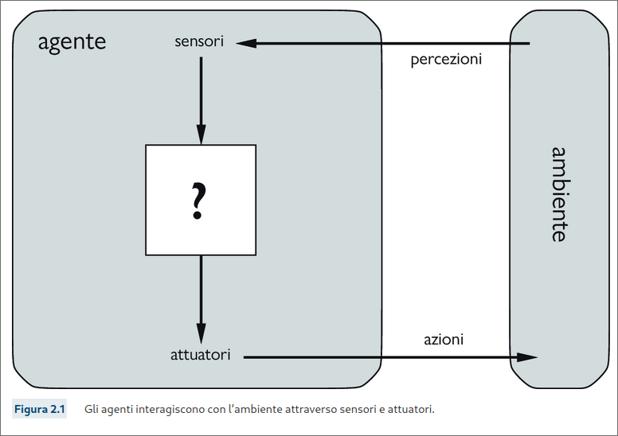

## Agenti e ambienti
Un **agente** è qualsiasi cosa che può essere vista come un sistema che percepisce il suo **ambiente** attraverso dei **sensori** e agiusce su di esso mediante **attuatori**.  

  

Con **Percezione**, indicheremo i dati che i sensori di un agente percepiscono.  
La **sequenza percettiva** di un agente è la storia completa di tutto ciò che esso ha percepito nella sua esistenza.  

> In generale, ***la scelta dell'azione di un agente in un qualsiasi istante può dipendere dalla conoscenza integrata in esso e dall'intera sequenza percettiva osservata fino a quel momento, ma non da qualcosa che l'agente non abbia percepito***.  

In termini matematici, diciamo che il comportamento di un agente è descritto dalla **funzione agente**, che descrive la corrispondenza tra una qualsiasi sequenza percettiva e una specifica azione.  
La funzione agente di un agente artificiale è implementata da un **programma agente**.  La funzione agente è una descrizione matematica astratta, mentre il programma agente è una sua implementazione concreta, in esecuzione all'interno di un mondo fisico.  
## Razionalità  
Un **agente razionale** è un agente che fa la cosa giusta, ma che significa?  
Quando un agente viene inserito in un ambiente, genera una sequenza di azioni in base alle percezioni che riceve. Questa sequenza di azioni porta l'ambiente ad attraversare una sequenza di stati: se tale sequenza è desiderabile, significa che l'agente si è comportato bene. Questa nozione di desiderabilità è catturata da una **misura di prestazione** che valuta una sequenza di stati dell'ambiente.  

Può risultare però assai difficile formulare una corretta misura di prestazione. In generale, ***È meglio progettare le misure di prestazione in base all'effetto che si desidera ottenere sull'ambiente, piuttosto che su come si pensa che debba comportarsi l'agente***.  

Comunque sia, specificare lo scopo da incorporare dalla macchina è molto difficile.

In un dato momento ciò che è razionale dipende da quattro fattori:  
+ la misura di prestazione, che definisce il concetto di successo;
+ la conoscenza pregressa dell'ambiente da parte dell'agente;  
+ le azioni che l'agente può effettuare;
+ la sequenza percettiva dell'agente fino all'istante corrente.

Questo porta alla seguente **definizione di agente razionale**:

*Per ogni possibile sequenza di percezioni, un agente razionale dovrebbe scegliere un'azione che massimizzi il valore atteso della sua misura di prestazione, date le informazioni fornite dalla sequenza percettiva e da ogni ulteriore conoscenza dell'agente*  

In caso la "geografia" dell'ambiente fosse sconosciuta all'ambiente questo dovrebbe **esplorarlo**.  

Razionalità e **onniscenza** sono due concetti differenti: un agente onniscente conosce il risultato **effettivo** delle sue azioni e può agire di conseguenza, ma nella realtà l'onniscenza è impossibile. La razionalità non è perfezione, essa massimizza il risultato **atteso**, mentre la perfezione massimizza quello **reale** (per quello avremmo bisogno della sfera di cristallo lol).  

Intraprendere azioni *mirate a modificare le percezioni future* (**information gathering**) è una parte importante della razionalità, come ad esempio l'**esplorazione**.  
Un agente razionale non si deve limitare alla sola raccolta di informazioni , ma deve essere anche in grado di **apprendere** il più possibile sulla base delle proprie percezioni.

Quando un agente si appoggia alla conoscenza pregressa fornita dal progettista invece che alle proprie percezioni e ai suoi processi di apprendimento, diciamo che manca di **autonomia**.  
Un agente razionale dovrebbe essere autonomo e apprendere il più possibile per compensare la presenza di conoscienza parziale o erronea.  

Come l'evoluzione ha fornito agli animali i riflessi innati per sopravvivere abbastanza a lungo da apprendere come comportarsi, è ragionevole fornire a un agente AI, oltre all'abilità di apprendere anche un po' di conoscienza inziale.  
Dopo aver accumulato abbastanza esperienza in un dato ambiente, il comportamento dell'agente può diventare *indipendente* dalla conoscenza pregressa.  

Dobbiamo ora considerare gli **ambienti operativi**, che sono essenzialmente i "problemi" di cui gli agenti razionali rappresentano le "soluzioni".  
Quando parliamo di agenti, dobbiamo specificare la misura di prestazione, l'ambiente esterno, gli attuatori e i sensori. Tutto ciò può essere racchiuso nel termine **ambiente operativo** o anche in descrizione **PEAS** (*Performance,Environment,Actuators,Sensors*).
