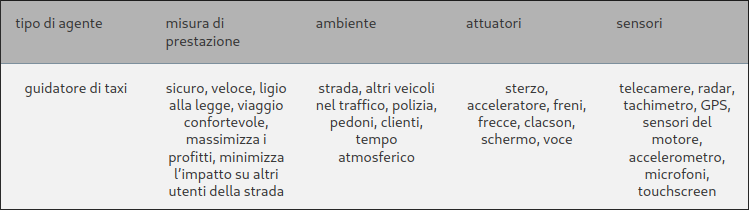
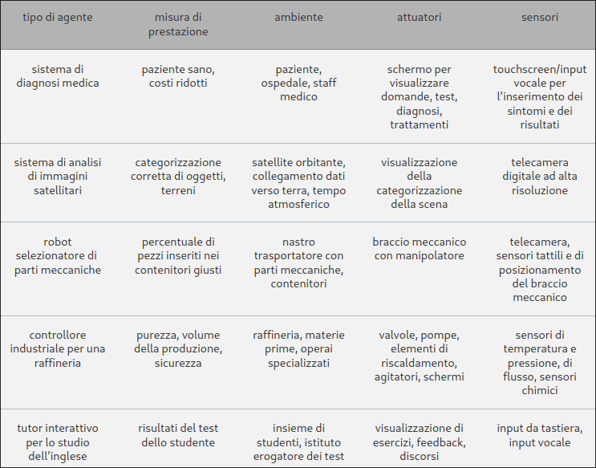
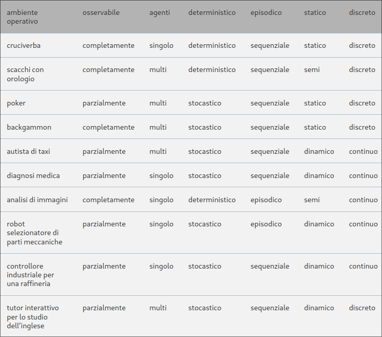

## Agenti e ambienti
Un **agente** è qualsiasi cosa che può essere vista come un sistema che percepisce il suo **ambiente** attraverso dei **sensori** e agiusce su di esso mediante **attuatori**.  

  

Con **Percezione**, indicheremo i dati che i sensori di un agente percepiscono.  
La **sequenza percettiva** di un agente è la storia completa di tutto ciò che esso ha percepito nella sua esistenza.  

> In generale, ***la scelta dell'azione di un agente in un qualsiasi istante può dipendere dalla conoscenza integrata in esso e dall'intera sequenza percettiva osservata fino a quel momento, ma non da qualcosa che l'agente non abbia percepito***.  

In termini matematici, diciamo che il comportamento di un agente è descritto dalla **funzione agente**, che descrive la corrispondenza tra una qualsiasi sequenza percettiva e una specifica azione.  
La funzione agente di un agente artificiale è implementata da un **programma agente**.  La funzione agente è una descrizione matematica astratta, mentre il programma agente è una sua implementazione concreta, in esecuzione all'interno di un mondo fisico.  
## Razionalità  
Un **agente razionale** è un agente che fa la cosa giusta, ma che significa?  
Quando un agente viene inserito in un ambiente, genera una sequenza di azioni in base alle percezioni che riceve. Questa sequenza di azioni porta l'ambiente ad attraversare una sequenza di stati: se tale sequenza è desiderabile, significa che l'agente si è comportato bene. Questa nozione di desiderabilità è catturata da una **misura di prestazione** che valuta una sequenza di stati dell'ambiente.  

Può risultare però assai difficile formulare una corretta misura di prestazione. In generale, ***È meglio progettare le misure di prestazione in base all'effetto che si desidera ottenere sull'ambiente, piuttosto che su come si pensa che debba comportarsi l'agente***.  

Comunque sia, specificare lo scopo da incorporare dalla macchina è molto difficile.

In un dato momento ciò che è razionale dipende da quattro fattori:  
+ la misura di prestazione, che definisce il concetto di successo;
+ la conoscenza pregressa dell'ambiente da parte dell'agente;  
+ le azioni che l'agente può effettuare;
+ la sequenza percettiva dell'agente fino all'istante corrente.

Questo porta alla seguente **definizione di agente razionale**:

*Per ogni possibile sequenza di percezioni, un agente razionale dovrebbe scegliere un'azione che massimizzi il valore atteso della sua misura di prestazione, date le informazioni fornite dalla sequenza percettiva e da ogni ulteriore conoscenza dell'agente*  

In caso la "geografia" dell'ambiente fosse sconosciuta all'ambiente questo dovrebbe **esplorarlo**.  

Razionalità e **onniscenza** sono due concetti differenti: un agente onniscente conosce il risultato **effettivo** delle sue azioni e può agire di conseguenza, ma nella realtà l'onniscenza è impossibile. La razionalità non è perfezione, essa massimizza il risultato **atteso**, mentre la perfezione massimizza quello **reale** (per quello avremmo bisogno della sfera di cristallo lol).  

Intraprendere azioni *mirate a modificare le percezioni future* (**information gathering**) è una parte importante della razionalità, come ad esempio l'**esplorazione**.  
Un agente razionale non si deve limitare alla sola raccolta di informazioni , ma deve essere anche in grado di **apprendere** il più possibile sulla base delle proprie percezioni.

Quando un agente si appoggia alla conoscenza pregressa fornita dal progettista invece che alle proprie percezioni e ai suoi processi di apprendimento, diciamo che manca di **autonomia**.  
Un agente razionale dovrebbe essere autonomo e apprendere il più possibile per compensare la presenza di conoscienza parziale o erronea.  

Come l'evoluzione ha fornito agli animali i riflessi innati per sopravvivere abbastanza a lungo da apprendere come comportarsi, è ragionevole fornire a un agente AI, oltre all'abilità di apprendere anche un po' di conoscienza inziale.  
Dopo aver accumulato abbastanza esperienza in un dato ambiente, il comportamento dell'agente può diventare *indipendente* dalla conoscenza pregressa.  

Dobbiamo ora considerare gli **ambienti operativi**, che sono essenzialmente i "problemi" di cui gli agenti razionali rappresentano le "soluzioni".  
Quando parliamo di agenti, dobbiamo specificare la misura di prestazione, l'ambiente esterno, gli attuatori e i sensori. Tutto ciò può essere racchiuso nel termine **ambiente operativo** o anche in descrizione **PEAS** (*Performance,Environment,Actuators,Sensors*).

Quando si progetta un agente, il primo passo deve essere sempre corrispondere alla specifica dell'ambiente operativo, la più ricca possibile.  

  

  

#### Proprietà degli ambienti lavorativi:  
+ **Completamente osservabile/parzialmente osservabile**: Se i sensori di un agente gli danno accesso allo stato completo dell'ambiente in ogni momento, allora diciamo che l'ambiente lavorativo è completamente osservabile. Un'ambiente è parzialmente osservabile a causa di sensori inaccurati o per la presenza di rumore o perché una parte dei dati non viene rilevata dai sensori (un'autista automatico per taxi non potrà in ogni caso sapere le intenzioni degli altri guidatori).  
Se l'agente non dispone di sensori, l'ambiente è **inosservabile**.  
+ **Agente singolo/multiagente**: la distinzione tra ambienti ad agente singolo e multiagente può sembrare piuttosto semplice (cruciverba agente singolo, scacchi due agenti). La distinzione chiave è se si può descrivere il comportamento di B come il tentativo di massimizzare una misura di prestazione il cui valore dipende dal comportamento dell’agente A. Per esempio, negli scacchi l’avversario B sta cercando di massimizzare una misura di prestazione che, per le regole degli scacchi, minimizza quella dell’agente A. Gli scacchi, quindi, sono un ambiente multiagente competitivo. Nell’ambiente dei taxi, al contrario, evitare gli incidenti massimizza la misura di prestazioni di tutti gli agenti, per cui possiamo dire che quello è un ambiente multiagente parzialmente cooperativo. È anche parzialmente competitivo perché, tra le altre cose, una sola macchina per volta può occupare un parcheggio libero. I problemi di progettazione che sorgono negli ambienti multiagente sono spesso molto differenti da quelli ad agente singolo.  
+ **Determinstico/ non determinstico**: se lo stato successivo dell’ambiente è completamente determinato dallo stato corrente e dall’azione eseguita dall’agente (o dagli agenti), allora si può dire che l’ambiente è deterministico; in caso contrario si dice che è non deterministico. Se l’ambiente è solo parzialmente osservabile potrebbe sembrare non deterministico e nella pratica è così. Un’ultima nota: alcuni utilizzano il termine **stocastico** come sinonimo di “non deterministico”, ma diciamo che un modello dell’ambiente è stocastico se è esplicitamente associato a probabilità (per esempio “c’è una probabilità del 25% che domani piova”) e “non deterministico” se le varie possibilità sono elencate senza essere quantificate (per esempio “c’è la possibilità che domani piova”).
+ **Episodico/sequenziale**: in un ambiente operativo episodico, l’esperienza dell’agente è divisa in episodi atomici. In ogni episodio l’agente riceve una percezione e poi esegue una singola azione. L’aspetto fondamentale è che un episodio non dipende dalle azioni intraprese in quelli precedenti. Negli ambienti sequenziali, al contrario, ogni decisione può influenzare tutte quelle successive. Gli ambienti episodici sono molto più semplici di quelli sequenziali, perché l’agente non deve “pensare avanti”.
+ **Statico/dinamico**:se l’ambiente può cambiare mentre un agente sta decidendo come agire, allora diciamo che è dinamico per quell’agente; in caso contrario diciamo che è statico. Gli ambienti statici sono più facili da trattare perché l’agente non deve continuamente osservare il mondo mentre decide l’azione successiva e non si deve preoccupare del passaggio del tempo. Gli ambienti dinamici, invece, chiedono continuamente all’agente quello che vuole fare; se questo non risponde in tempo, è come se avesse deciso di non fare nulla. Se l’ambiente stesso non cambia al passare del tempo, ma la valutazione della prestazione dell’agente sì, allora diciamo che l’ambiente è **semidinamico**. 
+ **Discreto/continuo**: la distinzione tra discreto e continuo si applica allo stato dell’ambiente, al modo in cui è gestito il tempo, alle percezioni e azioni dell’agente. Per esempio, la scacchiera ha un numero finito di stati distinti (se si esclude il tempo). Gli scacchi hanno anche un insieme discreto di percezioni e azioni. La guida di un taxi è un problema con stato e tempo continui: la velocità e la posizione del taxi e degli altri veicoli cambiano con continuità al passare del tempo. In questo caso sono continue anche le azioni (pensiamo per esempio all’angolo di sterzo delle ruote).  
+ **Noto/ignoto**: in termini rigorosi, questa distinzione non si riferisce all’ambiente in sé, ma allo stato di conoscenza dell’agente (o del progettista) circa le “leggi fisiche” dell’ambiente stesso. In un ambiente noto, sono conosciuti i risultati (o le corrispondenti probabilità, se l’ambiente è stocastico) per tutte le azioni. Ovviamente, se l’ambiente è ignoto, l’agente dovrà apprendere come funziona per poter prendere buone decisioni. La distinzione tra ambienti noti e ignoti non è identica a quella tra ambienti completamente osservabili e parzialmente osservabili: è infatti possibile che un ambiente noto sia parzialmente osservabile; per esempio, nei giochi a carte di solitario, il giocatore conosce le regola ma non può vedere le carte che non sono ancora state girate. Viceversa, un ambiente ignoto può essere completamente osservabile: in un nuovo videogioco, lo schermo potrebbe mostrare l’intero stato del gioco, ma il giocatore non conosce l’effetto dei pulsanti finché non li prova.  In altri casi, l’agente può apprendere di più sulla misura di prestazione basandosi su ulteriori interazioni con il progettista o l’utente. Questo, a sua volta, indica che l’ambiente operativo è necessariamente visto come ambiente multiagente.  

>Il caso più difficile è quello *parzialmente osservabile, multiagente, non deterministico, sequenziale, dinamico, continuo e ignoto*.  

