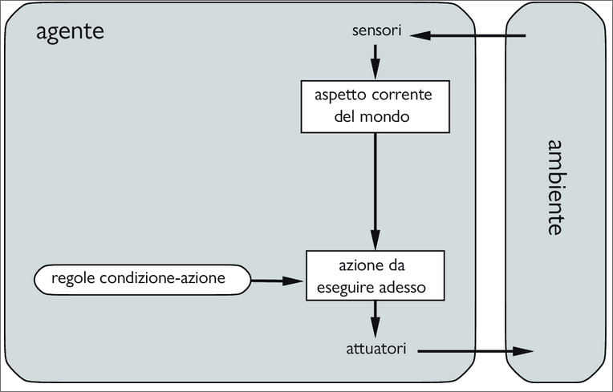

Il compito dell'IA è progettare il **programma agente** che implementa la funzione agente, che fa corrispondere le azioni le percezioni alle azioni. Il programma sarà eseguito da un dispositivo computazionale dotato di sensori e attuatori fisici. Questa prende il nome di **architettura agente**:  

*agente = architettura + programma*   

In generale, l'architettura si occupa di rendere le percezioni disponibili al programma, eseguire il programma stesso e passare le azioni da esso prescelte agli attuatori a mano a mano che vengono generate.  

Di seguito un programma agente abbastanza banale che tiene traccia della sequenza percettiva e poi la usa per selezionare l'azione da intraprendere in una tabella (funzione agente):  

``` 
function AGENTE-CON-TABELLA(percezione) returns un'azione:
    persistent: percezioni, una sequenza inizialmente vuota
    
    tabella, una tabella di azioni, 
    indicizzata per sequenze percettive, 
    completamente specificata dall'inizio
    
    aggiungi percezione alla fine di percezioni  
    azione <- LOOKUP (percezioni,tabella)
    return azione
```

Per costruire un agente razionale con questa tecnica, i progettisti devono costruire una tabella che contenga l'azione appropriata per ogni possibile sequenza percettiva.  
Questo approccio, basato su tabelle esplicite, è destinato al fallimento: sia $P$ l'insieme di possibili percezioni e $T$ la durata della vita dell'agente (ovvero il numero totale di percezioni che riceverà). La sua tabella dovrà contenere $\sum_{t=1}^T |P|^t$ righe.  
L'enorme dimensione di queste tabelle significa che:  
1. nessun agente fisico nell'universo avrà mai spazio necessario per memorizzarle  
2. il progettista non avrà mai tempo di crearle  
3. nessun agente avrà mai il tempo di apprendere le righe corrette in base all'esperienza  

Nonostante ciò AGENTE-CON-TABELLA, assumendo che la tabella sia riempita in modo corretto, implementa effettivamente la funzione agente desiderata.  

>*La sfida principale dell'IA sta nel trovare il modo di scrivere programmi che, nella massima misura possibile, producano un comportamento razionale con una piccola quantità di codice anziché con un'enorme tabella*  

#### Agenti reattivi semplici  
Questi agenti scelgono le azioni sulla base della percezione *corrente*, ignorando tutta la storia percettiva precedente.  

Di seguito uno dei possibili programmi agente per l'agente reattivo semplice aspirapolvere:  

```
function AGENTE-REATTIVO-ASPIRAPOLVERE([posizione,stato]) returns un'azione  

if stato = Sporco then return Aspira  
else if poisizone = A then return Destra  
else if posizione = B then return Sinistra  
```
Il programma agente è molto più piccolo della tabella corrispondente. La riduzione più importante deriva dall'aver ignorato la storia delle percezioni cosa che riduce il numero di sequenze percettive rilevanti da $4^T$ a $4$. Un'ulteriore , piccola riduzione deriva dal fatto che, quando il riquadro corrente è sporco, l'azione non dipende dalla posizione.  

La connessione **if** trovo-sporco **then** aspira, prende il nome di **regola condizione-azione**.

  

*Diagramma schematico di un agente reattivo semplice. I rettangoli denotano lo stato interno corrente del processo decisionale dell’agente, mentre gli ovali rappresentano le informazioni di base utilizzate nel processo.*  

Un programma agente per lo schema precedente è  

```
function Agente-Reattivo-Semplice(percezione) returns un’azione
 
	persistent: regole, un insieme di regole condizione-azione

	stato ← Interpreta-Input(percezione)
 
	regola ← Regola-Corrispondente(stato, regole)
 
	azione ← regola.Azione
 
	return ← azione
```  
La funzione Interpreta-Input genera una descrizione astratta dello stato corrente partendo dalla percezione, mentre la funzione Regola-Corrispondente restituisce la prima regola dell’insieme che corrisponde a tale descrizione.  


Gli agenti reattivi semplici hanno l’ammirevole proprietà di essere, appunto, semplici, ma la loro intelligenza è molto limitata. L’agente nella figura funzionerà solo se si può selezionare la decisione corretta in base alla sola percezione corrente, ovvero solo nel caso in cui l’ambiente sia completamente osservabile. Anche una minima parte di non-osservabilità può causare grandi problemi.
Spesso gli agenti reattivi semplici non sono in grado di evitare cicli infiniti quando operano in ambienti parzialmente osservabili.

Evitare i cicli infiniti è possibile quando l’agente è in grado di **randomizzare** le sue azioni, scegliendone una in modo casuale.  


