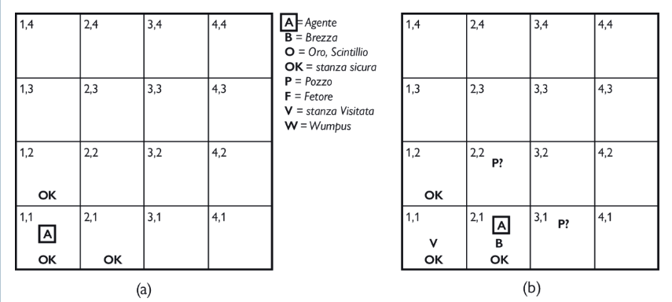

Gli **agenti basati sulla conoscenza** decidono quali azioni intraprendere utilizzando un processo di **ragionamento** che opera su una **rappresentazione** interna di conoscenza.  
Questi possono intraprendere nuove attività espresse sottoforma di obiettivi descritti esplicitamente, possono ottenere rapidamente nuove competenze ricevendo o apprendendo conoscenze aggiuntive e possono adattarsi ai cambiamenti dell'ambiente modificando e aggiornando la conoscenza rilevante.  

Il componente più importante degli agenti basati su conoscenza è la **base di conoscenza**, costituita da un insieme di **formule**, espresse mediante un **linguaggio di rappresentazione della conoscenza**. Ogni formula rappresenta un'asserzione sul mondo. Quando una formula è data per buona senza essere ricavata da altre formule, la chiamiamo **assioma**.  
La base di conoscenza deve prevedere dei meccanismi per aggiungere nuove formule e per le interrogazioni $( \text{TELL, asserisci, aggiungi nuovi fatti },  \text{ASK, chiedi })$: entrambe possono portare a un processo di **inferenza**, ovvero la derivazione di nuove formule a partire da quelle conosciute. L'inferenza deve soddisfare il requisito fondamentale che la risposta a ogni richiesta posta alla base di conoscenza sia una conseguenza di quello che le è stato detto in precedenza (il processo di inferenza non può inventarsi fatti).
L'agente mantiene in memoria una base di conoscenza che può contenere una **conoscenza iniziale**.

Ogni volta che viene invocato, il programma agente fa 3 cose:
+ Prima di tutto comunica le sue percezioni $(\text{TELL})$ alla BC
+ Chiede alla BC quali azioni eseguire $(\text{ASK})$
+ Una volta che è stata scelta l'azione la registra con $\text{TELL}$ nella BC e la restituisce in modo che possa essere eseguita.    

### Approccio dichiarativo vs approccio procedurale
La differenza principale è che la BC racchiude tutta la conoscenza necessaria a decidere l’azione da compiere in forma dichiarativa.
L’alternativa (approccio procedurale) è scrivere un programma in cui il processo decisionale è cablato, una volta per tutte.
L'approccio dichiarativo è più flessibile: più semplice acquisire conoscenza incrementalmente e modificare il comportamento con l’esperienza.

## LOGICA  
Le formule sono espresse secondo le regole della **sintassi** del linguaggio di rappresentazione, quali di esse sono "ben formate" (x+y=4 si, x4y+= no).
Una logica deve definire anche la **semantica**, o il significato delle formule. La semantica definisce la verità delle formule rispetto a ogni **mondo possibile** (x+y=4 vera in un mondo in cui x=2 e y=2 ma falsa in cui entrambe valgono 1) o vero o falso, non esistono possibilità intermedi. 
Al posto di ogni "mondo possibile" useremo il termine **modello**. Laddove i mondi possibili possono essere considerati ambienti reali in cui l'agente potrebbe o no trovarsi, i modelli sono astrazioni matematiche, ogniuna di esse ha un valore vero o falso.  
Se una formula $\alpha$ è vera in un modello $m$ diciamo che $m$ soddisfa $\alpha$. Con $M(\alpha)$ per indicare l'insieme di tutti i modelli di $\alpha$.  

Definisco ora la **conseguenza logica**, che si denota nel seguente modo:  

$\alpha \vDash \beta$  

Per indicare che da $\alpha$ consegue logicamente $\beta$.  

$\alpha \vDash \beta$  se e solo se, in ogni modello in cui $\alpha$ è vera , anche $\beta$ lo è, dunque:  

$\alpha \vDash \beta \iff M(\alpha) \subseteq M(\beta)$  

(Notate l’orientamento del simbolo $\subseteq$: se $\alpha \vDash \beta$, allora $\alpha$ è un’asserzione più forte di $\beta$, perché esclude un maggior numero di mondi possibili). 
Ad esempio sappiamo tutti che dalla formula x = 0 consegue la formula xy = 0. È infatti palese che in ogni modello in cui x è zero, anche xy è zero, indipendentemente dal valore di y.  

  

Nella figura (b) l'agente non ha percepito nulla in $[1,1]$ e un movimento d'aria in $[2,1]$. Queste percezioni, unite alla conoscenza da parte dell'agente da parte dell'agente delle regole del mondo del Wumpus, costituiscono la BC. L'agente vuole sapere se le 3 stanze adiacenti contengono pozzi. Ogniuno di queste potrebbe contenere un pozzo o no quindi $2^3$ modelli possibili.  

La KB può essere vista come un insieme di formule o come una singola formula che asserisce tutte le formule individuali. 
La KB è falsa nei modelli che contraddicono le conoscenze dell'agente: per esempio in un qualsiasi modello dove $[1,2]$ contiene un pozzo, dato che l'agente non ha percepito alcun movimento d'aria in $[1,1]$.  
Consideriamo le seguenti conclusioni:  
+ $\alpha_1:$ non c'è un pozzo in $[1,2]$
+ $\alpha_2:$ non c'è un pozzo in $[2,2]$

Si può verificare quanto segue:  
in ogni modello in cui KB è vera, lo è anche $\alpha_1$, dunque KB $\vDash \alpha_1$.  
in alcuni modelli in cui KB è vera, $\alpha_2$ è falso, dunque KB non consegue logicamente $\alpha_2$  
l'agente non può concludere che non ci sia un pozzo in $[2,2]$.  

Se un algoritmo di inferenza $i$ può derivare $\alpha$ da KB, scriviamo:  
$KB \vdash_i \alpha$, ovvero $i$ deriva $\alpha$ da KB.  

Un algoritmo di inferenza che deriva solo formule che sono conseguenze logiche si dice **corretto** o che **preserva la verità**.  
Una procedura di inferenza non corretta genera formule a suo piacimento.  

Un'altra proprietà è la **completezza**: un algoritmo è completo se può derivare ogni formula che è conseguenza logica.  

**ABBIAMO APPENA DESCRITTO UN PROCESSO DI RAGIONAMENTO LE CUI CONCLUSIONI SONO GARANTITE VERE IN UN QUALSIASI MONDO IN CUI SONO VERE LE PREMESSE**.  

L'ultimo aspetto da considerare è quello del grounding: il legame tra i processi di ragionamento logico e l'ambiente reale in cui si trova l'agente. *Come facciamo a sapere se KB è vera nel mondo reale?* , dopo tutto si tratta solo di "sintassi" nella testa dell'agente.  
Una risposta semplice è che il legame è creato dai sensori dell'agente: se nel mondo del wumpus vi è un rilevatore di odori, il programma agente crea una formula adeguata ogni volta che viene percepito un odore. Dunque se è nella KB, è vera nel mondo reale.  

Le regole generali sono prodotte da un processo di costruzione di formule chiamato **apprendimento**.  
