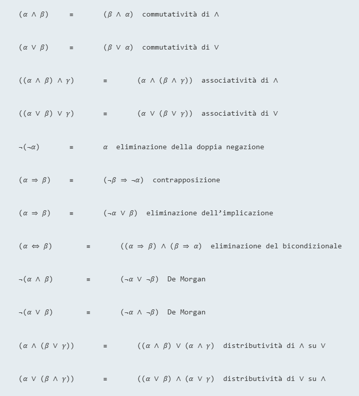

# Dimostrazione di teoremi nella logica proposizionale
La conseguenza logica può essere ottenuta tramite la **dimostrazione di teoremi**, applicando regole di inferenza direttamente alle formule della nostra base di conoscenza per costruire una dimostrazione della formula desiderata senza consultare modelli. 
### Equivalenza logica
Due formule $\alpha$ e $\beta$ sono **logicamente equivalenti** se sono vere nello stesso insieme di modelli $(\alpha \equiv \beta)$.
Per esempio, $P\land Q \ e \ Q \land P$ sono logicamente equivalenti.

### Validità
Una formula è **valida** se è vera in tutti i modelli.
Per esempio, la formula $P \lor \lnot P$ è valida. Le formule valide sono note come **tautologie** e sono *necessariamente vere*.  

### Teorema di deduzione
Date due formule qualsiasi $\alpha \ e \ \beta$, $\alpha \vDash \beta$ se e solo se la formula $(\alpha \implies \beta)$ è valida.  

Di conseguenza, possiamo decidere se $\alpha \vDash \beta$ controllando che $(\alpha \implies \beta)$ sia vera in ogni modello, oppure dimostrando che $(\alpha \implies \beta)$ è equivalente a *True*. 
Viceversa, il teorema di deduzione afferma che ogni formula di implicazione valida descrive un’inferenza legittima.

### Soddisfacibilità  
Una formula è soddisfacibile se è vera in, o soddisfatta da, *qualche* modello.
La soddisfacibilità può essere verificata enumerando i possibili modelli finché non se ne trova uno che soddisfa la formula. Il problema di determinare la soddisfacibilità delle formule della logica proposizionale, (**problema SAT**), è stato il primo problema di cui è stata dimostrata la NP-completezza.

Naturalmente, validità e soddisfacibilità sono strettamente connesse: $\alpha$ è valida se e solo se $\lnot \alpha$ è insoddisfacibile; di contro, $\alpha$ è soddisfacibile se e solo se $\lnot \alpha$ non è valida. Un altro risultato utile è il seguente:

$\alpha \vDash \beta$ se e solo se la formula $(\alpha \land \lnot \beta)$ è insoddisfacibile.

 
Dimostrare $\beta$ partendo da $\alpha$ verificando l’insoddisfacibilità di $(\alpha \land \lnot \beta)$ corrisponde esattamente alla dimostrazione per assurdo, detta anche dimostrazione per **refutazione** o per **contraddizione**. Si assume che la formula $\beta$ sia falsa e si dimostra che questo porta a una contraddizione con gli assiomi $\alpha$ (che sono noti). Questa contraddizione è esattamente ciò che si intende quando si dice che la formula $(\alpha \land \lnot \beta)$ è insoddisfacibile.

## Inferenza e dimostrazioni
Le **regole d'inferenza** possono essere applicate per derivare una **dimostrazione** o prova, ovvero una catena di conclusioni che portano all'obiettivo desiderato. La regola più nota è il **modus ponens:**
$$\frac{\alpha\implies \beta, \alpha}{\beta}$$

La notazione significa che, ogni volta che sono date le formule $\alpha \implies \beta \ e \ \alpha$, allora si può inferire la formula $\beta$.

Un'altra regola di inferenza è l'**eliminazione degli and** in base alla quale, data una congiunzione, si può inferire uno qualsiasi dei congiunti:

$$\frac{\alpha \land \beta}{\alpha}$$

> *Modus Ponens* ed *eliminazione degli and* sono corrette. 
> Queste regole possono quindi essere utilizzate in tutte le istanze a cui si applicano, producendo inferenze corrette senza bisogno di enumerare i modelli.

Tutte le equivalenze logiche della figura precedente possono essere usate come regole di inferenza. 
Per esempio, l’equivalenza per l’eliminazione del bicondizionale dà origine alle due regole di inferenza:
$$\frac{\alpha \iff \beta}{(\alpha \iff \beta)\land(\beta \iff \alpha)} \ \ e \ \ \frac{(\alpha \iff \beta)\land(\beta \iff \alpha)}{\alpha \iff \beta}$$

Non tutte le regole di inferenza funzionano, come questa, in entrambe le direzioni.  

Vediamo ora come si possono utilizzare queste regole di inferenza ed equivalenze nel mondo del wumpus. 
La base di conoscenza iniziale contiene le formule da $R_1$ a $R_5$, e vogliamo dimostrare $\lnot P_{1,2}$, ovvero che non c’è alcun pozzo in $[1,2]$.

Applichiamo l’eliminazione del bicondizionale a $R_2$ per ottenere:

$R_6$ :
$(B_{1,1} \implies (P_{1,2} \lor P_{2,1})) \land ((P_{1,2} \lor P_{2,1}) \implies B_{1,1})$ .

Applichiamo l’eliminazione degli and a R6 per ottenere:

$R_7$ :
$((P_{1,2} \lor P_{2,1}) \implies B_{1,1})$ .

L’equivalenza logica della contrapposizione fornisce:

$R_8$ :
$(\lnot B_{1,1} \implies \lnot (P_{1,2} \lor P_{2,1}))$ .

Applichiamo Modus Ponens con $R_8$ e la percezione $R_4$ (cioè $\lnot B_{1,1}$), ottenendo:

$R_9$ :
$\lnot (P_{1,2} \lor P_{2,1})$ .

Applichiamo la regola di De Morgan, arrivando alla conclusione:

$$R_{10} :\\
\lnot P_{1,2} \land \lnot P_{2,1}$$ 
Ovvero, non ci sono pozzi né in $[1,2]$ né in $[2,1]$.

Come è possibile decidere ad ogni passo qual'è la regola d'inferenza da applicare?
E' possibile definire il problema come un problema di esplorazione di uno spazio degli stati:
+ Stato iniziale: la base di conoscenza iniziale
+ Azioni: l'insieme delle azioni consiste di tutte le regole d'inferenza applicate a tutte le formule che corrispondo alla metà superiore della regola d'inferenza.  
+ Risultato: il risultato  di un'azione è l'aggiunta della formula nella metà inferiore della regola d'inferenza
+ Obiettivo: l'obiettivo è uno stato che contiene la formula che stiamo cercando di dimostrare.  

La ricerca di dimostrazioni, quindi, è un’alternativa all’enumerazione di modelli.

In molti casi pratici, trovare una dimostrazione può essere molto efficiente semplicemente perché si possono ignorare le proposizioni irrilevanti, indipendentemente dal loro numero. 
Il semplice algoritmo della tavola di verità, al contrario, sarebbe presto sopraffatto dalla crescita esponenziale del numero di modelli.

### Monotonicità
Un insieme di formule che sono conseguenze logiche può solo *aumentare* man mano che si aggiunge informazione alla base di conoscenza.

$\forall (\alpha, \beta) \text{ formule } \ [KB \vDash \alpha \implies KB \land \beta \vDash \alpha]$

La monotonicità significa che **le regole di inferenza possono essere applicate non appena si trovano nella base di conoscenza le premesse necessarie; le conclusioni di tali regole dovranno essere vere indipendentemente dal resto delle formule contenute nella base di conoscenza**.

## Dimostrazione per risoluzione

La **risoluzione** è una regola d'inferenza che, unita a qualsiasi algoritmo di ricerca completo da luogo a un algoritmo d'inferenza completi.  

Applichiamo la regola nel mondo del wumpus. L'agente passa in $[1,2]$ dove percepisce una forte puzza, ma nessuna brezza.  
Aggiungiamo alla base di conoscenza i seguenti fatti:  
$$R_{11}: \lnot B_{1,2}\\
R_{12}: B_{1,2}\iff (P_{11}\lor P{2,2},P_{1,3})$$

Con lo stesso processo che ci ha portato in $R_{10}$ possiamo derivare l'assenza di pozzi in $[2,2] , \ [1,3]$  
$$R_{13}:\lnot P_{2,2}\\
R_{14}: \lnot P_{1,3}$$

Possiamo anche applicare l'eliminazione del bicondizionale a $R_3$, seguita dal Modus Ponens con $R_5$ per dedurre il fatto che ci dev'essere un pozzo in $[1,1],\ [2,1] \ [3,1]$
$$R_{15}: P_{1,1} \lor P_{2,2} \lor P_{3,1}$$ Ora giungiamo alla prima applicazione della regola di risoluzione: la formula atomica $\lnot P_{2,2}$ in $R_{13}$ risolve con la formula atomica $P_{2,2}$ in $R_{15}$ per fornire il **risolvente**:
$$R_{16}: P_{1,1}\lor P_{3,1}$$ Stessa cosa si può fare con $R_{11} \ e \ R_{16}$ per creare:
$$R_{17}:P_{3,1}$$

Gli ultimi due passi inferenziali sono esempi della regola d'inferenza **risoluzione unitaria:**

$$\frac{l_1 \lor ... \lor l_k, \ \ m}{l_1 \lor ... \lor l_{i-1}\lor l_{i+1}\lor...\lor l_k}$$ Dove ogni $l$ è un letterale e $l_i$ e $m$ sono **letterali complementari**.
La regola di risoluzione prende dunque una **clausola** e un letterale e produce una nuova clausola.

La regola di risoluzione unitaria può essere generalizzata nella regola di risoluzione:
$$\frac{l_1 \lor ... \lor l_k, \ \ m_1 \lor ... \lor m_n}{l_1 \lor ... \lor l_{i-1}\lor l_{i+1}\lor...\lor l_k \lor m_1\lor...\lor m_{j-1}\lor m_{j+1}\lor...\lor m_n}$$ Dove $l_i$ e $m_j$ sono letterali complementari.

> Possiamo risolvere soltanto una coppia di letterali la volta.  

La clausola risultante dovrebbe contenere solo una copia di ogni letterale. La rimozione di eventuali copie di letterali è chiamata **fattorizzazione**:
$$(A \lor A) \text{ viene ridotto a } A$$ L'algoritmo è corretto.
> ATTENZIONE:
> $$\cancel{\frac{\set{P,Q}, \set{\lnot P, \lnot Q}}{\set{}}}$$ Non è contradittorio.
>  $$\frac{\set{P,Q}, \set{\lnot P, \lnot Q}}{\set{Q,\lnot Q}}, \frac{\set{P,Q}, \set{\lnot P, \lnot Q}}{\set{P,\lnot P}}$$

La regola di risoluzione si applica solo a clausole. Com'è possibile allora che possa portare a una procedura d'inferenza completa per l'intera logica proposizionale?
*Ogni formula della logica proposizionale è logicamente equivalente a una congiunzione di clausole*. Una formula così espressa viene detta **CNF**.

Le procedure d'inferenza basate sulla risoluzione sfruttano il principio di dimostrazione per assurdo. Per dimostrare che $KB \vDash \alpha$, dimostriamo chhe $(KB \land \lnot \alpha)$ è insoddisfacibile.  
Per far questo dobbiamo raggiungere una contraddizione.  
### Completezza risoluzione
Introduciamo la **chiusura della risoluzione** $RC(S)$ di un insieme di clausole $S$, che è l'insieme di tutte le clausole derivabili dall'applicazione ripetuta della regola di risoluzione delle clausole in $S$ o a quelle da loro derivate.
$RC(S)$ è finita.
#### Teorema di risoluzione ground
Se un insieme di clausole è insoddisfacibile, la sua chiusura della risoluzione contiene la clausola vuota.  
Se la chiusura $RC(S)$ **non** contiene la clausola vuota, $S$ è soddisfacibile.
In effetti è possibile costruire un modello $S$ assegnando adeguati valori di verità per $P_1,...,P_k$:
+ Se in RC(s) c'è una clausola che contieene il letterale $\lnot P_i$ e tutti i suoi altri letterali sono falsi nell'assegnamento sceleto per $P_1,...,P_{i-1}$, assegna falso a $P_i$
+ altrimenti assegna vero a $P_i$.

Ipotizziamo l'opposto ovvero che in qualche fase $i$ della sequenza, l'assegnazione di $P_i$ faccia diventare falsa una clausola in $C$. Perché accada ciò, deve essrsi verificato il fatto che tutti gli altri letterali in $C$ sono già diventati falsi per assegnamenti di $P_1,...,P_{i-1}$. Quindi $C$ ora deve apparire comme $(falso\lor falso \lor...\lor falso \lor P_i)$ o comee $(falso\lor falso \lor...\lor falso \lor \lnot P_i)$ 
Se una sola di queste due è in $RC(S)$, l'algoritmo assegnerà il valore di verità appropriato a $P_i$ per rendere vera $C$, perciò $C$ può essere falso solo se **entrambe** queste clausole sono in $RC(S)$. Poiché $RC(S)$ è chiusa rispetto la risoluzione, conterrà il risolvente di queste due clausole e tale risolventee avrà tutti i letterali già falsi per gli assegnamenti $P_1,...,P_{i-1}$. Questo contraddice la nostra ipotesi che la prima clausola falsa appaia nella fase $i$.

## Clausole di Horn  
Molte volte è possibile adottare restrizioni sulla forma delle formule che contengono le basi di conoscenza del mondo reale.
Una forma ristretta è la **clausola definita**, una disgiunzione di letterali di cui *esattamente uno è positivo*.
La **clausola di Horn**, una disgiunzione di letterali in cui *al massimo uno dei letterali è positivo*
Le clausole senza alcun letterale positivo sono dette **clausole obiettivo**.

1. Ogni clausola definita può essere scritta come un'implicazione la cui premessa è una congiunzione di letterali positivi e la cui conclusione è un letterale positivo. 
    Nella forma di Horn, la premessa si dice **corpo** e la conclusione **testa**. Una formula costituita da un singolo letterale positivo viene chiamata **fatto**.
2. L'inferenza sulle clausole di Horn può essere svolta mediante gli algoritmi di **concatenazione in avanti** e **concatenazione all'indietro**.
3. Con le clausole di Horn è possibile determinare la conseguenza logica in un tempo che cresce *linearmente* con la dimensione della base di conoscenza.

### Concatenazione in avanti e all'indietro
L'algoritmo di concatenazione in avanti determina se un singolo simbolo proposizionale $q$ è conseguenza logica di una base di conoscenza composta da clausole definite.  
L'algoritmo comincia dai fatti conosciuti (letterali positivi) nella base di conoscenza. Se tutte le premesse di un'implicazione sono verificate, la sua conclusione è aggiunta all'insieme dei fatti noti.  
Questo processo continua finché non viene aggiunta la stessa query $q$ o non è più possibile effettuare alcuna inferenza.  

L'algoritmo è corretto: ogni inferenza è un'applicazione del Modus Ponens.  
L'algoritmo è completo.

La concatenazione in avanti è un esempio del concetto generale di **ragionamento guidato dai dati**, un tipo di ragionamento in cui l'attenzione parte dai fatti conosciuti.
L'algoritmo di concatenazione all'indietro parte dalla query e lavora a ritroso. Se è già noto che la query è vera, non occorre far nulla. In caso contrario, l'algoritmo trova tutte le implicazioni nella base di conoscenza che hanno $q$ come conclusione (l'algoritmo percorre il grafo verso il basso finché non raggiunge un insieme di fatti noti che formano la base della dimostrazione).
La concatenazione all'indietro è una forma di **ragionamento basato sugli obiettivi**. Ed è anche più veloce di quella in avanti, perché coinvolge solo fatti rilevanti.  

## Model Checking efficiente  
### DPLL  
DPLL prende come input una formula in CNF, ovvero un insieme di clausole.  
Si tratta di un'enumerazione ricorsiva in profondità dei modelli possibili. Rispetto a TT-ENTAILS, apporta tre migliorie:
+ *Terminazione anticipata*: l'algoritmo è inn grado di determinare se la formula è vera o falsa anche con un modello parzialmente incompleto. Una clausola è vera, se qualsiasi suo letterale è vero, anche se agli altri non è ancora stato assegnato un valore di verità; di conseguenza l'intera formula può essere giudicata vera ancor prima di completare il modello.  
  In modo analogo, una formula è falsa se una qualsiasi delle sue clausole è falsa, il che accade quando sono falsi tutti i letterali che la compongono.
  Questo può accadere molto tempo prima chhe il modello sia completo.
+ *Euristica del simbolo puro*: un **simbolo puro** è un simbolo che compare sempre con lo stesso segno in tutte le clausole. Se una formula ha un modello, i valori di verità dei simboli puri saranno assegnati in modo che i corrispondenti letterali valgano *vero* (perché questo non potrà mai rendere falsa una clausola).
  Nel determinare simboli puri, l'algoritmo può ignorare le clausole che sono già note come vere nel modello costruito fino a quel momento.
+ *Euristica della clausola unitaria:* nel contesto DPLL il termine clausola unitaria indica anche clausole in cui è già stato assegnato dal modello il valore *falso* a tutti i letterali tranne uno.
  Per esempio, se il modello contiene $B =$ *vero*, allora $(\lnot B \lor \lnot C)$ si semplifica in $\lnot C$, che è una clausola unitaria.
  L'euristica della clausola unitaria esegue tutti questi assegnamenti relativi a clausole unitarie prima di considerare i restanti assegnamenti.

ES:

$$KB: \set{\lnot B_{1,1},P_{1,2},P_{2,1}}\set{\lnot P_{1,2},B_{1,1}},\set{\lnot P_{2,1},B_{1,1}}\set{\lnot B_{1,1}}\vDash \set{\lnot P_{1,2}}$$
Aggiungiamo $\set{P_{1,2}}$ e vediamo se insoddisfacibile.  
$$SAT(\set{\lnot B_{1,1},P_{1,2},P_{2,1}}\set{\lnot P_{1,2},B_{1,1}},\set{\lnot P_{2,1},B_{1,1}}\set{\lnot B_{1,1}} \set{P_{1,2}})$$
+ La 5° clausola è unitaria; $P_{1,2}=$*vero*; la prima clausola e la 5° sono soddisfatte.
+ La 2° diventa unitaria; $B_{1,1}=$*vero*; 2° e 3° sono soddisfatte, ma la 4° no!.  

Non esistono modelli quindi $ \set{\lnot P_{1,2}}$ è conseguenza logica in $KB$.

### Ricerca locale
Dato che l'obiettivo è trovare un assegnamento che soddisfa ogni clausola, sarà sufficiente una funzione di valutazione che conta il numero di clausole non soddisfatte. Tutti questi algoritmi si muovono nello spazio degli assegnamenti completi, invertendo il valore di verità di un simbolo per volta.
Uno dei più semplici algoritmi è WALKSAT. A ogni iterazione, l'algoritmo seleziona una clausola non soddisfatta e cambia il valore di verità di uno dei simboli. Ci sono due modi per scegliere tale simbolo:
1. un passo "a conflitti minimi" che minimizza il numero di clausole non soddisfatte nel nuovo stato.  
2. una "camminata casuale"  che sceglie il simbolo del tutto casualmente.

Quando l'algoritmo restituisce un modello, la formula deve essere per forza soddisfacibile, ma quando restituisce un fallimento allora le cause sono due:
+ La formula è insoddisfacibile
+ Si deve concedere all'algoritmo ulteriore tempo.  

Se poniamo *max_flips* (numero di inversioni massimo di valore prima di abbandonare) $=\infty$ e $p$ (la probabilità di effettuare una "camminata casuale") $>0$
WALKSAT prima o poi restituirà un modello (a patto che esista), perché i passi della "camminata casuale" porteranno a una soluzione. Ma se *max_flips* è infinito e la formula è insoddisfacibile, l'algoritmo non termina.
Non può essere usato per verificare l'insoddisfacibilità.  
Il problema è decidibile ma l'algoritmo non è completo.

Quando consideriamo i problemi SAT, diciamo che un problema è **sotto-vincolato** quando ci sono relativamente *poche* clausole che vincolano le variabili.  
ES:
$$(\lnot D \lor \lnot B \lor C) \land (B \lor \lnot A \lor \lnot C)\land (\lnot C \lor \lnot B \lor E) \land (E \lor \lnot D \lor B) \land (B \lor E \lor \lnot C)$$
16 dei 32 assegnamenti possibili sono modelli della formula per cui bastano, in media, bastano 2 tentativi casuali per trovare un modello.
Quello che conta è il rapporto $\frac{m}{n}$ dove $m$ è il numero di clausole e $n$ il numero di simboli.
Più grande è il rapporto, più vincolato è il problema.  

## Agenti basati sulla logica proposizionale
Il primo passo è consentire all'agente di dedurre lo stato del mondo date le sue percezioni pregresse.
Mostriamo poi come un agente possa usare l'inferenza logica nel mondo del Wumpus.  
Mostriamo come l'agente possa tenere traccia del mondo in modo efficiente senza ritornare alla storia delle percezioni per ogni inferenza. Infine mostriamo come l'agente possa utilizzare l'inferenza logica per costruire piani con garanzia di raggiungere gli obiettivi, purché la sua conoscenza sia vera nel mondo reale.
### Lo stato corrente del mondo
La base di conoscenza è composta da assiomi (conoscenza pregressa del mondo) e formule di percezione ottenute dall'esperienza dell'agente in un mondo particolare. 
Cominciamo raccogliendo assiomi. L'agente sa che la stanza di partenza non contiene pozzi $(\lnot P_{1,1})$ nè Wumpus $(\lnot W_{1,1})$. Inoltre, per ogni stanza, l'agente sa che in essa si sente uno spostamento d'aria se e solo se una stanza adiacente contiene un pozzo; e una stanza è puzzolente se e solo se una stanza adiacente contiene un Wumpus.  
Di conseguenza vengono inserite una raccolta di formule del tipo:  
$$B_{1,1}\iff (P_{1,2} \lor P_{2,1})\\ S_{1,1}\iff (W_{1,2}\lor W_{2,1})\\ ...$$

L'agente sa anche che esiste un Wumpus: almeno uno  
$$W_{1,1}\lor W_{1,2}\lor...\lor W_{4,3}\lor W_{4,4}$$ e al massimo uno  
$$\lnot W_{1,1}\lor \lnot W_{1,2}\\ \lnot W_{1,1}\lor \lnot W_{1,3}\\...\\ \lnot W_{4,3}\lor \lnot W_{4,4}$$

Ora consideriamo le percezioni dell'agente. Utilizziamo $S_{1,1}$ per indicare che vi è fetore in $[1,1]$ ma possiamo utilizzare una proposizione *Fetore* per indicare che l'agente rileva un fetore? No poiché se nel precedente passo temporale non vi era fetore, $\lnot$*fetore* sarebbe già asserito e la nuova asserzione porterebbe a una contraddizione. La soluzione si trova quando ci rendiamo conto che una percezione asserisce qualcosa **soltanto in relazione al tempo corrente**. Perciò al passo temporale 4, aggiungiamo *Fetore*$^4$ alla base di conoscenza, evitando così contraddizioni con ad esempio *Fetore*$^3$.
L'idea di associare proposizioni a passi temporali si estende a qualsiasi aspetto del mondo che cambia $(L^0_{1,1} \text{ o RivoltoEst}^0 )$ .
Utilizziamo il termine **fluente** per indicare un aspetto del mondo che cambia.
I simboli associati ad aspetti permanenti del mondo sono chiamati **variabili atemporali**.
Possiamo collegare direttamente le percezioni di fetore e brezza alle proprietà delle stanze in cui vengono ricevute nel modo seguente: per ogni passo temporale $t$ e ogni stanza $[x,y]$ asseriamo:
$$L^t_{x,y}\implies(\text{Brezza}^t \iff B_{x,y})\\L^t_{x,y}\implies(\text{Fetore}^t \iff S_{x,y})$$

Dobbiamo ora scrivere il **modello di transizione**.  
Ci servono, anzitutto, dei simboli proposizionali per le occorrenze di azioni. Come per le percezioni, questi simboli sono indicizzati in riferimento al tempo: *Avanti*$^0$.
Per convenzione, la percezione corrispondente a un dato passo temporale si verifica per prima, seguita poi dall'azione corrispondente allo stesso passo, seguita da una transizione al passo temporale successivo.
Per descrivere come cambia il mondo, possiamo provare a scrivere **assiomi di effetto** che specificano il risultato di un'azione al successivo passo temporale.
$$L^0_{1,1}\land \text{RivoltoEst}^0 \land \text{Avanti}^0 \implies (L^1_{2,1}\land \lnot L_{1,1}^1)$$  Serve una formula simile per ogni stanza, passo temporale, per gli orientamenti e azioni possibili.  
Supponiamo che l'agente al passo 0 si muova in avanti e asserisca questa cosa nella $KB$. Dato il precedente assioma di effetto e altre asserzioni iniziali relative al passo 0:  
$$ASK(KB,L_{2,1}^1)=\text{true}$$

Ma l'assioma di effetto non è in grado di stabilire che cosa rimane invariato a seguito di un'azione.
Una possibile soluzione di questo problema consisterebbe nell'aggiungere **assiomi di frame** che asseriscano esplicitamente tutte le proposizioni che rimangono invariate:
$$\text{Avanti}^t \implies (\text{ HaFreccia}^t \iff \text{HaFreccia}^t)\\
\text{Avanti}^t \implies (\text{ WumpusVivo}^t \iff \text{WumpusVivo}^t)\\
...$$ Dove menzioniamo esplicitamente ogni proposizione che rimane invariata dal tempo $t$ al tempo $t+1$ sotto l'azione *Avanti*.
Un'approccio per il **problema inferenziale del frame** richiede di concentrarsi non sulla scrittura di assiomi relativi alle azioni ma relativi ai fluenti.  
Quindi per ogni fluente $F$ avremo un'assioma che definisce il valore di $F^{t+1}$ in termini di fluenti al tempo $t$ e delle azioni che potrebbero essersi verificate al tempo $t$. Ora il valore di $F^{t+1}$ può essere impostato in due modi:  
+ o l'azione al tempo $t$ rende $F$ vero al tempo $t+1$ 
+ oppure $F$ era già vero al tempo $t$ e l'azione al tempo $t$ non lo rende falso. 

Un'assioma di questa forma è chiamato **assioma di stato successore**
$$F^{t+1}\iff \text{AzioneCausaF}^t \lor (F^t \land \text{AzioneCausaNotF}^t)$$ $$\text{HaFreccia}^{t+1}\iff (\text{HaFreccia}^t\land \text{Scocca}^t)$$
Per quanto riguarda la posizione dell'agente $L^{t+1}_{1,1}$ è vero se:
+ l'agente si è mosso in avanti da $[1,2]$ quando era rivolto a sud o da $[2,1]$ quando era rivolto a ovest
+ oppure $L^t_{1,1}$ era già vero e l'azione non ha causato movimento

$$\begin{matrix}
  L^{t+1}_{1,1}&\iff&(L^t_{1,1}\land(\lnot \text{Avanti}^t \lor \text{Urto}^{t+1}))\\
  &\lor&(L^t_{1,2}\land(\text{RivoltoSud}^t\land \text{Avanti}^t))\\
  &\lor&(L^t_{2,1}\land(\text{RivoltoOvest}^t\land \text{Avanti}^t))
\end{matrix}$$

Una casella $[i, j]$ è sicura se $KB \vDash \lnot P_{i,j} \land \lnot(W_{i,j} \land \text{WumpusVivo})$

Con tutti questi simboli di proposizione:
Con $n$ fluenti $\implies 2^n$ stati fisici al tempo $t$ e quindi $2^{2^n}$ credenze possibili 
Servono, dunque, procedure di inferenza efficienti (TTEntails e DPLL non
sono praticabili). Serve un linguaggio più espressivo!!

