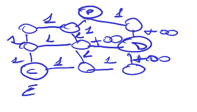

# Esercizio principessa  
**PEAS:**

- **P**: minimizzazione costo cammino  
- **E**: labirinto, principessa, drago, cavaliere  
- **A**: gambe, cavaliere  
- **S**: occhi  

**Descrizione Ambiente**

- **Completamente osservabile**: Siccome le luci sono accese, il cavaliere ha visione totale dell’area.
- **Singolo agente**: Abbiamo solo il cavaliere.
- **Deterministico**: Per ogni azione eseguita, alle condizioni in un certo stato ne consegue un unico stato dell’ambiente.
- **Episodico**: Perché ogni azione eseguita in uno stato non ha effetti sui successivi stati.
- **Statico**: Il drago dorme e non si muove.
- **Discreto**: Il numero di stati, di azioni possibili è finito.
- **Nota**: Ogni regola del mondo è conosciuta all’agente.

**Formulazione del Problema**

- **Stati**: Ogni stato rappresenta la posizione del cavaliere nel labirinto.  
- **Stato iniziale**: Lo stato dove il cavaliere si trova all’entrata (E).

- **Stati Obiettivo**: Lo stato dove il cavaliere raggiunge la principessa e lo stato dove il cavaliere insieme alla principessa raggiunge l'uscita.

- **Azioni Possibili**:

\[\{N, S, E, U, P\}\]

- **Modello di Transizione**:

Se in un determinato stato si esegue l'azione $N$, il cavaliere andrà avanti di una posizione:

\[ \text{RISULTATO}(s, N) = s_{0,1} \]

Se in un determinato stato si esegue l'azione $S$, il cavaliere andrà indietro di una posizione:

\[ \text{RISULTATO}(s, S) = s_{0,-1} \]

Se in un determinato stato
si esegue l'azione $W$, il cavaliere si sposta a sinistra di una posizione.

\[ \text{RISULTATO}(s, W) = s_{-1,0} \]

Se in un determinato stato
si esegue l'azione $E$, il cavaliere onde e sposta su una posizione.

\[ \text{RISULTATO}(s, E) = s_{0,1} \]

L'azione $P$ invece serve a prendere la principessa.  

- **Costo azione**: 

il costo per spostarsi verso un'altra cella sarà +1 altrimenti per spostarsi in una cella dove vi è il drago $+\infty$.

## Rapp. Stato

Indice del nodo in cui è posizionato il cavaliere (AGPOS).
Indice del nodo in cui è posizionata la principessa primo nodo goal (NG1).
Indice del nodo polo in cui vi è l'uscita (NG2).

Score dell'agente

CT: costo totale per raggiungere la principessa e poi arrivare all'uscita.

Stato iniziale primo problema

(Agpos = ExPos,  [NG1(P)], CT = 0)  

Stato iniziale secondo problema

(Agpos = PrPos,  [NG2(P)], CT = 0)

Funzione agente: 

Stato, Grafo, Funzione euristica (distanza di manatthan).

Una rappresentazione del grafo che rappresenta lo stato inziale è il seguente:  

## Ciclo di vita dell'ambiente  

**function** RUN_VAL_ENV(state,UPDATE-FN,agent,PERFORMANCE-FN) **returns** CT  

**local-variables**: CT=0
**repeat**
    (AG_POS,(NG1,NG2)) $\leftarrow$ **Percept** (agent,state) // siccome l'ambiente è completamente osservabile questa funzione restituirà direttamente lo stato.
    Action $\leftarrow$ **AGENT-PROGRAM**((AG_POS,(NG1,NG2)) ) 
    state $\leftarrow$ **UPDATE-FN**(Action,state)
    CT $\leftarrow$ **PERFORMANCE-FN**(CT,state)
**until** **TERMINATION**(state)  
**return** CT  

## Ciclo di vita dell'agente  

**function** agent(percept) **returns** action  
**persistent:**
seq1,seq2 // una sequenza di azioni, inizialmente vuota  
state // lo stato corrente del mondo 
goal = [NG1,NG2]  
problem // formulazione del problema  

if seq1 or seq2 is empty then  
NG1* $\leftarrow$ goal[1]  
problem $\leftarrow$ **FORMULATE-PROBLEM**(state,NG1*)
seq1 $\leftarrow$ A*(problem,f=g+h) // con $h$ che è euristica distanza di manatthan

NG2* $\leftarrow$ goal[2]  
problem $\leftarrow$ **FORMULATE-PROBLEM**(state,NG2*)
seq2 $\leftarrow$ A*(problem,f=g+h) con $h$ che è euristica distanza di manatthan    

if AGPOS=NG1* then  
    action=P
else if seq1 is not empty and AGPOS!=NG1* then  
    action=seq1[1]
    seq1=REST(seq1)  // REST restringe seq1 togliendo ogni volta la prima azione

else  
    action=seq2[1]  
    seq2=REST(seq2)

return action  

**function** A*(problema,$f$) **returns** path  
 
**persistent:**
  nodo ←Nodo(Stato=problema.StatoIniziale)
  frontiera;
  raggiunti;

 
  while not Vuota?(frontiera) do
    nodo ← Pop(frontiera)
    if problema.È-Obiettivo(nodo.Stato) then return nodo
    for each figlio in Espandi(problema, nodo) do
      s ← figlio.Stato
      if s non è in raggiunti or figlio.Costo-Cammino < raggiunti[s].Costo-Cammino 
        raggiunti[s] ← figlio
        aggiungi figlio a frontiera
  
return fallimento
