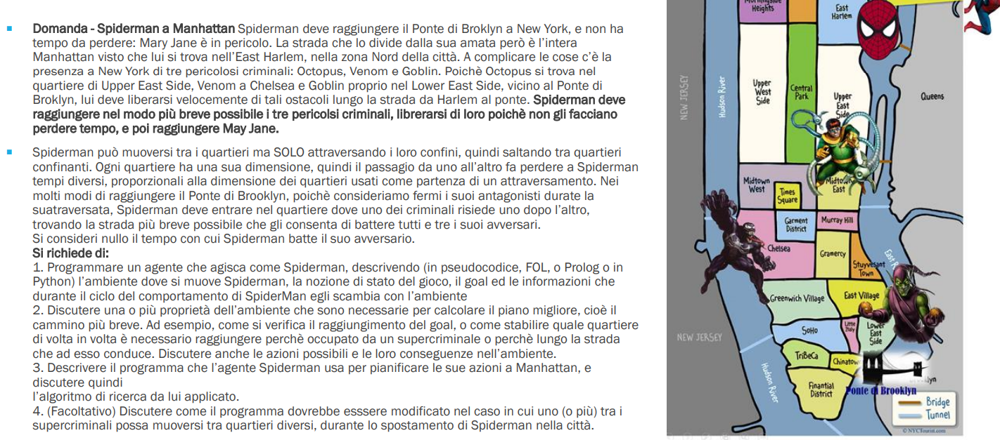

  

## PEAS  

+ **P:** Minimizzare il percorso intrapreso da SpiderMan per raggiungere i 3 cattivi e arrivare infine da MJ
+ **E:** Quartieri di Manatthan, Venom, Goblin, Octopus, Ponte, SpiderMan
    + *COMPLETAMENTE OSSERVABILE:* SpiderMan conosce esattamente il quartiere in cui si trova in ogni stato dell'ambiente.  
    + *DETERMINSTICO:* Ogni azione di spiderman lo porta in al massimo un quartiere e quindi ad ogni azione corrisponde un unico stato.
    + *SINGOLO AGENTE*.
    + *EPISODICO:* Ogni azione eseguita da spiderman in uno stato non influisce sui successivi.  
    + *DISCRETO*.
    + *STATICO*: L'ambiente non cambia nel tempo.
    + *NOTO:* Spiderman conosce ogni regola dell'ambiente e tutto ciò che comporta ogni sua singola azione.
+ **A:** Le gambe e le braccia di spiderman  
+ **S:** Gli occhi di spiderman

## FORMULAZIONE DEL PROBLEMA  
+ **STATI:** Ogni stato contiene informazioni sulla posizione dei nemici, della posizione attuale di spiderman, e della posizione del ponte.  
    $(NA,(V,G,O,P),CT)$ $NA \text{ è la posizione dell'agente}, (V,G,O,P) \text{ sono i nodi goal, ovvero la posizione dei nemici e infine del ponte }, CT \text{ è il costo totale seguito da spiderman fino allo stato corrente}$

+ **STATO-INIZIALE:** E' lo stato in cui SpiderMan si trova East Harlem. 
 $(NA=\text{ nodo East Harlem },(V,G,O,P),CT=0)$
+ **STATI-OBIETTIVO:** Abbiamo diversi stati obiettivo, il primo è quello in cui Spiderman raggiunge Octopus, il secondo Goblin e il terzo Venom e infine in cui Spiderman raggiunge il Ponte  
+ **AZIONI-POSSIBILI:** $\set{Muoversi \ in \ un \ quartiere \ vicino}$
+ **MODELLO DI TRANSIZIONE:** L'azione eseguita da spiderman lo porta a spostarsi un quartiere vicino  (ES: $RISULTATO(s,a)=s'$)    
+ **COSTO-AZIONE:** Dimensione quartiere di attraversamento.   

Per rappresentare l'ambiente usiamo una rappresentazione grafo  
Lo score dell'agente è rappresentato dal costo totale del cammino seguito da spiderman per raggiungere un certo quartiere: $CT$

## CICLO DI VITA DELL'AMBIENTE  

**function** RUN EVAL ENV (stato, $UPDATE$-$FN$, spiderman,$PERFORMANCE$-$FN$) returns CT
**local-variables:** CT=0
**repeat**

$(NA,(V,G,O,P),CT) \leftarrow GET$-$PERCEPT(spiderman,stato)$ // siccome l'ambiente è comp-oss , GET-PERCEPT restituirà direttamente lo stato

Action $\leftarrow$ $SPIDERMAN$-$AGENT((NA,(V,G,O,P),CT))$  
state $\leftarrow UPDATE$- $FN($Action,$(NA,(V,G,O,P),CT) )$
CT $\leftarrow PERFORMANCE$-$FN($CT,state$)$

**until**  $TERMINATION($state$)$

**return** CT  

## CICLO DI VITA DELL'AGENTE  

**function** $SPIDERMAN$-$AGENT$$((NA,(V,G,O,P),CT) )$ **returns** action:
**persistent**  
    seq; sequenza di azioni  
    state;
    goal=[G,V,O];
    final_goal=[P];  
    problem;

if  seq is empty() and goal is not_empty():

$NG^* \leftarrow$ FORMULATEGOAL$((NA,(V,G,O,P),CT),goal)$ // sceglie il nodo goal più vicino a spiderman in un certo stato, e lo toglie dalla lista goal.  
problem $\leftarrow$ FORMULATEPROBLEM$(state,NG^*)$
seq $\leftarrow A^*(problem)$ con $h$ distanza di linea d'aria.

else 

$NG^* \leftarrow$ FORMULATEGOAL$((NA,(V,G,O,P),CT))$ 
problem $\leftarrow$ FORMULATEPROBLEM$(state,NG^*)$
seq $\leftarrow A^*(problem)$ con $h$ distanza di linea d'aria.

if $NA=NG^*$ then 
     action=STOP  
else:
action=seq[1]
seq=REST(seq)

return action
