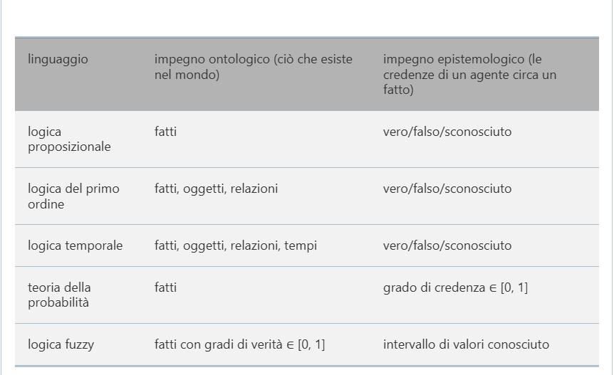

## Logica del primo ordine
Quando prendiamo in esame la sintassi di un linguaggio naturale, gli elementi che si distinguiono più facilmente sono i sostantivi e i sintagmi nominali che si riferiscono a **oggetti** (stanze,wumpus,pozzi) e i verbi e i sintagmi verbali, con aggettivi e avverbi, che si riferiscono a **relazioni** tra gli oggetti (è ventosa, è adiacente a, scocca). Alcune relazioni dette **funzioni**, hanno un solo "valore" per ogni "input":
+ Oggetti: cavalli, persone, colori, guerre, secoli,...
+ Relazioni: possono essere unarie, prendono il nome di **proprietà** (come quella di essere rossi, tondi, falsi, primi, alti). Le più generali sono $n$-arie e comprendono relazioni come fratello di, più grande di, all'interno di, parte di,...
+ Funzioni: padre di, migliore amico, uno più di, all'inizio di,...

ES:
+ Oggetti: Alice $(a)$, Bob $(b)$,Carlo $(c)$
+ Relazioni: $P(x,y)$ ($a$ è genitore di $b$)
+ Funzione: $\text{padre}(a)$ (il padre di $a$)

Le concettualizzazioni possibili sono infinite: un aspetto importante è il livello di astrazione giusto per gli scopi della rappresentazione.

La **logica del primo ordine** è costruito intorno agli oggetti e alle relazioni.  
La differenza tra logica proposizionale e di primo ordine è l'**impegno ontologico** assunto dai due linguaggi,ovvero le sue ipotesi circa la natura della realtà.
E' una proprietà molto potente in domini in cui ogni proposizione ha confini ben chiari (matematica, wumpus). Nel mondo reale molte relazioni hanno confini vaghi: "Vienna è una grande città? Quella persona è alta?" Le risposte dipendono dai destinatari delle domande. Una soluzione è estendere la rappresentazione come magari un simbolo di funzione Popolazione per Vienna.
O usare la **logica fuzzy** in cui vi è l'impegno ontologico che le proposizioni hanno **grado di verità** compreso tra 0 e 1 (Vienna 0,8 , Parigi 0,9). Questo meccanismo rende più difficile l'inferenza.
La **logica temporale** parte dal presupposto che i fatti siano verificati in un dato *momento* e che i tempi siano tutti ordinati.
Le **logiche di ordine superiore** considerano oggetti le stesse relazioni e funzioni a cui la logica di primo ordine fa riferimento.
Una logica è caratterizzata anche dagli **impegni epistemologici**, ovvero dai diversi stati di conoscenza che permette nei confronti di ciascun fatto.
La **teoria della probabilità** permette qualsiasi grado di credenza da 0 a 1.

## Sintassi e Semantica
I modelli della logica di primo ordine contengono oggetti.
Il **dominio** di un modello è l'insieme di oggetti che contiene, chiamati **elementi del dominio**. 
**Il dominio non deve essere vuoto**.
Formalmente una relazione non è altro che un insieme di **tuple** di oggetti collegati.
Alcuni tipi di relazioni si possono considerare meglio come funzioni, in quanto ogni dato oggetto, può essere collegato attraverso di esse a esattamente un altro oggetto.  
$$\text{<Riccardo Leone>}\rightarrow \text{gamba sinistra di Riccardo}$$ Se vogliamo essere formali, dobbiamo dire che i modelli nella logica di primo ordine richiedono **funzioni totali**, ovvero che ci dev'essere un valore per ogni tupla di input.
### Simboli e interpretazioni
I simboli per indicare oggetti sono i **simboli di costante**, le relazioni i **simboli di predicato**, per le funzioni i **simboli di funzione**.
Ogni modello include un'**interpretazione** che specifica esattamente a quali oggetti, relazioni e funzioni fanno riferimento i simboli di costante, predicato e funzione.
Un **termine** è un'espressione logica che si riferisce a un oggetto.
I simboli di costante sono termini. Nel caso generale, un termine complesso è formato da un simbolo di funzione seguito da una lista tra parentesi dei suoi argomenti, costituiti a loro volta da termini (un termine complesso è solo un modo per dare un nome complesso ad un oggetto, non una procedura di subroutine).
>+ In logica: GambaSinistra non "calcola" la gamba sinistra di qualcuno. È solo un simbolo che fa riferimento a una relazione nel modello.
>+ Nei linguaggi di programmazione: Una funzione come  GambaSinistra(persona) implicherebbe l’esecuzione di una subroutine che restituisce un valore.

La semantica formale dei termini si spiega senza difficoltà. Consideriamo un termine $f(t_1, ... , t_n)$. Il simbolo di funzione $f$ si riferisce a una qualche funzione del modello (che chiameremo $F$); i termini usati come argomento fanno riferimento a oggetti del dominio che indicheremo con $(d_1, ... , d_n)$.
Nella sua interezza il termine indica quindi l’oggetto che corrisponde al valore della funzione $F$ applicata a $d_1, ... , d_n$. Per esempio, supponiamo che il simbolo di funzione GambaSinistra si riferisca alla funzione  e che Giovanni sia Re Giovanni: allora GambaSinistra(Giovanni) sarà la gamba sinistra di Re Giovanni. In questo modo, l’interpretazione assegna l’oggetto corrispondente a ogni termine. Quindi assegno l'oggetto gamba sinistra a Giovanni.

### Formule atomiche
Una **formula atomica** è composta da un simbolo di predicato seguito da una lista di termini tra parentesi:
$$\text{Fratello(Riccardo,Giovanni)}$$Le formule atomiche possono avere termini complessi come argomenti:
$$\text{Sposato(Padre(Riccardo),Madre(Giovanni))}$$**Una formula atomica è vera in un dato modello se la relazione a cui fa riferimento il simbolo di predicato è verificata tra gli oggetti a cui fanno riferimento gli argomenti.**
### Formule complesse  
E' possibile usare connettivi logici per costruire formule complesse.
### Quantificatori
#### Quantificazione universale
$$\forall \text{ Re(x)} \implies \text{Persona(x)}$$
Il **quantificatore universale** $\forall$ "per ogni..."; la formula intende che per ogni x se x è un re allora x è una persona. Il simbolo x prende il nome di **varaiabile** (una variabile da sola è un termine e quindi può essere usata come argomento di una funzione). Un termine che non comprende variabili si chiama **termine ground**.
$$\forall  \text{x Ama(x,Gelato)}$$
#### Quantificazione esistenziale
$$\exist \text{x Corona(x) }\land\text{ SullaTesta(x,Giovanni)}$$
Il **quantificatore esistenziale** $\exist$ "esiste un x tale che" o "per qualche x...".
La formula $\exist x P$ afferma che $P$ è vera per almeno un oggetto $x$.
$$\exist \text{x Mela(x) }\land \text{ Rossa(x)}$$ 

#### Quantificatori annidati
Spesso vorremmo esprimere formule più complesse usando più quantificatori:
+ I quantificatori sono dello stesso tipo:   
  $$\text{"i fratelli sono consanguinei"}\\ 
  \forall x\ \forall y \ \text{ Fratello}(x,y)\implies \text{Consanguineo(x,y)}\\
  \lor \\
  \forall x\  y \ \text{ Fratello}(x,y)\implies \text{Consanguineo(x,y)}$$
+ I quantificatori sono di tipo diverso:
  $$\text{"ogniuno ama qualcuno"}\\ \forall x \ \exist y \ \text{Ama}(x,y)$$ Ma attenzione all'ordine perché:
  $$\text{c'è qualcuno che è amato da tutti}\\ \exist x \ \forall y \ \text{Ama}(x,y)$$

Quindi l'ordine è importantissimo.
Si possono inserire le parentesi: $\forall x (\exist y \text{Ama}(x,y))$ afferma che ogniuno ha una particolare proprietà, mentre $\exist x (\forall y \text{Ama}(x,y))$ che qualcuno ha una particolare caratteristica.  

$$\forall x \text{ Corona }(x)\lor (\exist x \text{ Fratello}(\text{Riccardo,}x))$$ Una variabile "appartiene" al quantificatore più interno che la menziona.  
Di solito le variabili sono usate nell’ambito di quantificatori. In tal caso
le occorrenze si dicono **legate**. Se non legate sono **libere**.
Formula **chiusa**: una formula che non contiene occorrenze di
variabili libere. Altrimenti è detta **aperta**.

#### Connessioni tra i due quantificatori
Dire 
$$\text{"tutti odiano i broccoli è come dire che non esiste nessuno a cui piacciono"}\\
\forall x  \ \lnot\text{Gradisce}(x, \text{ Broccoli})\iff \lnot \exist x \ \text{Gradisce}(x,\text{ Broccoli})$$ Dire 
$$\text{"a tutti piace il gelato è come dire che non c'è proprio nessuno a cui non piaccia"}\\
\forall x \text{ Gradisce}(x,\text{ Gelato})\iff \lnot \exist x \lnot\text{Gradisce}(x,\text{ Gelato})$$
### Uguaglianza
La logica del primo ordine comprende un altro metodo per costruire formule atomiche, senza usare predicati e termini. Possiamo utilizzare il **simbolo di uguaglianza** per affermare che due termini fanno riferimento allo stesso oggetto:  
$$\text{Padre(Giovanni)=Enrico}$$ Asserisce che l'oggetto a cui si riferisce $\text{Padre(Giovanni)}$ e quello a cui si riferisce $\text{Enrico}$ sono effettivamente lo stesso.
Dato che ogni interpretazione fissa il riferimento di ogni termine, determinare la verità di una formula di uguaglianza consiste semplicemente nel verificare se i due termini si riferiscono allo stesso oggetto.
Lo si può usare anche con la negazione per specificare che due termini non sono lo stesso oggetto.  
$$\exist x \ y \text{ Fratello}(x,\text{ Riccardo})\land \text{ Fratello}(y,\text{ Riccardo})\land \lnot (x=y)$$
### Semantica dei database

Supponiamo di credere che Riccardo abbia due fratelli, Giovanni e Goffredo. 

$$\text{Fratello(Giovanni, Riccardo) ∧ Fratello(Goffredo, Riccardo)} \ (\$)$$

ma così non rappresenteremmo in modo completo lo stato delle cose. 
Per prima cosa, questa asserzione è vera in un modello in cui Riccardo ha un solo fratello. In secondo luogo, la formula non esclude modelli in cui Riccardo ha molti altri fratelli oltre a Giovanni e Goffredo. Quindi:
$$\text{Fratello(Giovanni, Riccardo) ∧ Fratello(Goffredo, Riccardo)}\\ \land \\ \text{Giovanni} \neq \text{Goffredo ∧ ∀x  Fratello(x, Riccardo) ⇒ (x = Giovanni ∨ x = Goffredo)}$$

Siamo in grado di costruire una semantica che consenta un’espressione logica più diretta?
Una proposta molto popolare nei sistemi di database è la seguente: 
+ Imponiamo che ogni simbolo di costante faccia riferimento a un oggetto distinto – **l’ipotesi dei nomi unici** 
+ Facciamo **l’ipotesi del mondo chiuso**, cioè che le formule atomiche non conosciute come vere sono false. 
+ Invochiamo **la chiusura del dominio**, a indicare che ogni modello contiene un numero di elementi del dominio non superiore a quello degli elementi denominati dai simboli di costante. Sotto la semantica risultante, la formula $(\$)$ stabilisce che i due fratelli di Riccardo sono Giovanni e Goffredo. 