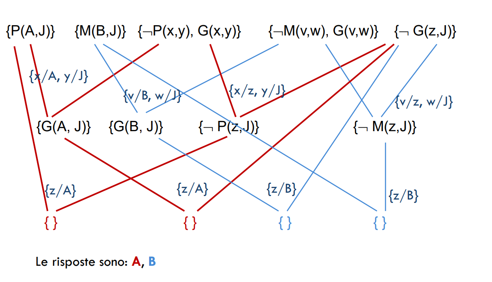

## Proposizionalizzazione
Un modo per fare inferenza del primo ordine è ridursi all'inferenza proposizionale.
Un primo passo è quello di eliminare i quantificatori:
$$\forall x \text{ Re}(x)\land \text{Avido}(x)\implies \text{Malvagio}(x)$$
Da cui è possibile inferire:
$$\text{ Re(Giovanni)}\land \text{Avido(Giovanni)}\implies \text{Malvagio(Giovanni)}\\\text{ Re(Riccardo)}\land \text{Avido(Riccardo)}\implies \text{Malvagio(Riccardo)}\\ \text{ Re(Padre(Giovanni))}\land \text{Avido(Padre(Giovanni))}\implies \text{Malvagio(Padre(Giovanni))}\\ \vdots$$

In generale la regola d'**istanziazione universale** afferma che possiamo inferire tutte le formule ottenute sostituendo un **termine ground** a una variabile quantificata universalmente.
Per scrivere formalmente la regola d'inferenza usiamo la nozione di **sostituzione**: $\text{SUBST}(\theta,\alpha)$
$$\frac{\forall v \ \alpha}{\text{SUBST}(\set{v/g},\alpha)}$$

Per ogni variabile $v$ e termine ground $g$. Le tre formule precedenti sono ottenute con le sostituzioni:
$$\set{x/\text{Giovanni}},\set{x/\text{Riccardo}},\set{x/\text{Padre(Giovanni)}}$$

La regola d'**istanziazione esistenziale** sostituisce una variabile quantificata esistenzialmente con un unico nuovo simbolo costante; Per ogni formula $\alpha$ e variabile $v$ e simbolo di costante $k$ che non appare in nessun'altra parte nella base di conoscenza:
$$\frac{\exist v \ \alpha}{\text{SUBST}(\set{v/g},\alpha)}$$

Per esempio:
$$\exist x \text{ Corona}(x)\land \text{SullaTesta}(x,\text{Giovanni})$$
Possiamo inferire:
$$\text{Corona}(C_1)\land \text{SullaTesta}(C_1,\text{Giovanni})$$

A patto che $C_1$ non appaiia in alcun altro punto della base di conoscenza.
In logica un nuovo nome per un oggetto viene detto **costante di Skolem**.

Come convertiamo la base di conoscenza del primo ordine in una proposizionale?
Innanzitutto, proprio come una formula quantificata esistenzialmente può essere rimpiazzata da una sua istanza, così una formula quantificata universalmente può essere sostituita dall'insieme di tutte le possibili istanze. Supponiamo che la BC contenga le seguenti formule:
$$\forall x \text{ Re}(x)\land \text{Avido}(x)\implies \text{Malvagio}(x)\\ \text{Re(Giovanni)}\\ \text{Avido(Giovanni)} \\ \text{Fratello(Riccardo,Giovanni)}$$

e che gli unici oggetti siano $\text{Giovanni,Riccardo}$. Applichiamo la istanziazione universale alla prima formula usando tutte le possibili sostituzioni:

$$\text{ Re(Giovanni)}\land \text{Avido(Giovanni)}\implies \text{Malvagio(Giovanni)}\\\text{ Re(Riccardo)}\land \text{Avido(Riccardo)}\implies \text{Malvagio(Riccardo)}$$

Ora sostituiamo le formule atomiche ground $(\text{ Re(Giovanni),Avido(Giovanni)})$ con simboli proposizionali come $\text{ReGiovanni}$.
Infine applichiamo gli algoritmi inferenziali della logica proposizonale per ottenere la proposizione $\text{GiovanniMalvagio}$.

Questa tecnica di **proposizionalizzazione** può essere applicata in modo generale.
Tuttavia c'è un problema: quando la base di conoscenza include un simbolo di funzione, l'insieme di possibili sostituzioni di termini ground diventa infinito:
$$\text{Padre(Padre(Padre(Giovanni)))}$$

Fortunatamente il teorema di Herbrand ci assicura che se una formula segue logicamente dalla base di conoscenza originale (1 ordine), allora ci sarà una dimostrazione che coinvolge solo un sottoinsieme  **finito** della base proposizonalizzata.
Dato che in qualsiasi sottoinsieme finito la profondità di annidamento dei termini deve essere limitata, possiamo generare prima tutte le istanziazioni con simboli di costante, poi tutti i termini in profondità 1, poi 2 e così via, finché non saremo in grado di costruire la dimostrazione proposizionale della formula che è conseguenza logica.
Il metodo è **completo**: ogni formula che segue logicamente può essere dimostrata.
Nel caso non fosse conseguenza logica, il processo non termina (il problema è **semidecidibile**).

## Unificazione
Operazione mediante la quale si determina se due espressioni possono essere rese identiche mediante una sostituzione di termini alle variabili.
Il risultato è la sostituzione che rende le due espressioni identiche, detta **unificatore**
$$\text{UNIFY(a,b)}=\theta \text{ dove SUBST}(\theta,\text{a})=\text{SUBST}(\theta,\text{b})$$

Supponiamo di avere una query 
$$\text{(Conosce(Giovanni,x))} \ (\$)$$ 

"Chi conosce giovanni?" Si possono trovare delle risposte a quet'interrogazione cercando tutte le formule nella base di conoscenza che si unificano con $(\$)$. Di seguito il risultato dell'unificazione con quattro formule diverse che potrebbero far parte  della base di conoscienza:
$$\text{UNIFY(Conosce(Giovanni,x),Conosce(Giovanni,Giacomina))}=\set{\text{x/Giacomina}}\\ 
\text{UNIFY(Conosce(Giovanni,x),Conosce(y,Guglielmo))}=\set{\text{x/Guglielmo, y/Giovanni}} \\ 
\text{UNIFY(Conosce(Giovanni,x),Conosce(y,Madre(y)))}=\set{\text{x/Madre(Giovanni), y/Giovanni}} \\ 
\text{UNIFY(Conosce(Giovanni,x),Conosce(x,Elisabetta))}=\text{FAIL}$$

L'ultimo problema si verifica perché le due formule usano lo stesso nome per la variabile x. Tutto ciò può essere evitato ridenominando le variabili di una delle formule per evitare collisioni (**standardizzazione separata**).

C'è un'altra complicazione: potrebbe esserci più di un'unificatore.
Diciamo che un'unificatore è più generale di un altro se impone meno restrizioni sul valore della variabili.
Per ogni coppia di espressioni unificabili, esiste un singolo **unificatore più generale**, distinto da tutti gli altri a meno di ridenominazioni e sostituzioni di variabili.
Un algortimo per il calcolo degli **MGU**: si esplorano simultaneamente le due espressioni in modo ricorsivo, costruendo contemporaneamente un unificatore, e restituendo un risultato di fallimento se si incontrano nella loro struttura due punti non corrispondenti.
L'algoritmo include un ulteriore passo computazionale costoso: Quando si cerca una corrispondenza tra variabile e termine complesso, è necessario controllare se la variabile è presente all'interno dello stesso termine:  
$$S(x)\  e\ S(S(x)) $$ 

non sono unificabili.
Questo **controllo di occorrenza** fa sì che la complessità dell'algoritmi diventi quadratica.

## Risoluzione
### CNF per la logica di 1° ordine
In CNF i letterali possono contenere variabili, che sono sempre considerate universalmente quantificate:
$$\forall  \text{x Americano(x) } \land \text{ Arma(y) }\land \text{ Vende(x,y,z) }\land\text{ Ostile(z) }\implies\text{Criminale(x)}$$

diventa
$$\lnot \text{ Americano(x) } \lor \lnot \text{ Arma(y) }\lor lnot \text{ Vende(x,y,z) }\lor \lnot \text{ Ostile(z) }\lor \text{Criminale(x)}$$

**Ogni formula della logica di primo ordine può essere convertita in una formula CNF inferenzialmente equivalente**.

Il problema sorge nell'eliminazione dei quantificatori esistenziali. Vediamo:
$$\forall x \ [\forall y \text{ Animale}(y)\implies \text{Ama}(x,y)]\implies [\exist y \text{ Ama}(y,x)]$$
I passi sono i seguenti:
+ Eliminazione delle implicazioni: 

$$\forall x \ \lnot [\forall y \text{ Animale}(y)\implies \text{Ama}(x,y)]\lor [\exist y \text{ Ama}(y,x)]$$

$$\forall x \ \lnot [\forall y \ \lnot \text{ Animale}(y)\lor \text{Ama}(x,y)]\lor [\exist y \text{ Ama}(y,x)]$$

+ Spostamento all'interno delle negazioni:
$$\lnot\forall x P \equiv \exist x \lnot P \\ \lnot\exist x P \equiv \forall x \lnot P$$

    La nostra formula diventa:
    $$\forall x[\exist y \text{ Animale(y) }\land \lnot\text{ Ama(x,y)}]\lor [\exist y \text{ Ama}(y,x)]$$

Il significato della formula precedente è stato preservato.

+ Standardizzazione delle variabili: in formule come:
  $$(\forall x P(x))\lor(\exist x P(x))$$
    
    Che usano due volte lo stesso nome di variabile, si deve cambiare il nome di una delle due
    $$\forall x[\exist y \text{ Animale(y) }\land \lnot\text{ Ama(x,y)}]\lor [\exist z \text{ Ama}(z,x)]$$
+ Skolemizzazione: è il processo di rimozione dei quantificatori esistenziali per eliminazione.
  Nel caso più semplice si riduce alla regola di istanziazione esistenziale dove la variabile viene sostituita con una nuova costante.
  Ma nel caso generale non è possibile perché si rischia di perdere il significato della frase originale.
  
  $$\forall x[\text{ Animale}(F(x))\land \lnot\text{ Ama}(x,F(x))]\lor [\text{ Ama}(G(x),x)]$$
  
  $F$ e $G$ sono dette **funzioni di Skolem**. In generale, gli argomenti di una funzione di Skolem sono tutte le variabili universalmente quantificate all'interno del cui campo d'azione appare un quantificatore esistenziale.  
  La formula di Skolemizzazione è soddisfacibile esattamente nei casi in cui lo è quella originale.

+ Omissione dei quantificatori universali: Possiamo ora omettere i quantificatori universali:
      
    $$[\text{ Animale}(F(x))\land \lnot\text{ Ama}(x,F(x))]\lor [\text{ Ama}(G(x),x)]$$
+ Distribuzione di $\lor$ su $\land$
    $$[\text{ Animale}(F(x))\lor \text{ Ama}(G(x),x)]\land [\lnot\text{ Ama}(x,F(x)) \lor \text{ Ama}(G(x),x)]$$

Ora la formula è in CNF, composta da due clausole.
 
### La risoluzione come regola d'inferenza  
Due clausole, che grazie alla  standardizzazione separata presumiamo sempre non avere alcune variabili in comune, possono essere risolte se contengono letterali complementari. Nella logica di primo ordine quelli di primo ordine sono complementari se uno unifica con la negazione dell'altro:  
$$\frac{l_1\lor...\lor l_k, \ m_1\lor...\lor m_n}{\text{SUBST}(\theta,l_1\lor...\lor l_{i-1}\lor l_{i+1})\lor...\lor l_k \lor m_1 \lor... \lor m_{j-1}\lor m_{j+1}\lor...\lor m_n}$$

dove $\text{UNIFY}(l_i,\lnot m_i)=\theta$, per esempio:  
    $$[\text{ Animale}(F(x))\lor \text{ Ama}(G(x),x)]\land [\lnot\text{ Ama}(u,v) \lor \lnot \text{ Uccide}(u,v)]$$

eliminando i letterali complementari $\text{Ama}(G(x),x)$ e $\lnot \text{Ama}(u,v)$, con unificatore 
$$\theta=\set{u/G(x), v/x}$$ 

e producendo la clausola **risolvente**
$$[\text{Animale}(F(x))\lor \lnot \text{ Uccide}(G(x),x)]$$

Questa regola si chiama **risoluzione binaria** perché risolve esattamente due letterali.
La regola di risoluzione di per sè non è completa: per questo si devono risolevere i sottoinsiemi unificabili di ogni clausola.  
Prendiamo come esempio:  
$$\set{P(u),P(v)}, \set{\lnot P(x),\lnot P(y)}$$

otterrei  

$$\set{P(v),\lnot P(y)}$$

qui si fermerebbe perché avrei un'unica clausola, e la clausola vuota non viene prodotta.
Un approccio alternativo è la **fattorizzazione** che nella logica di primo ordine , i letterali sono ridotti se sono unificabili. L'unificatore deve essere applicato all'intera clausola. La combinazione di risoluzione e fattorizzazione è completa.  

### Completezza della risoluzione  
La deduzione per risoluzione è corretta:
$$\text{Se } \Gamma \vdash_{RES} A \implies \Gamma\vDash A$$

La deduzione per risoluzione non è completa, infatti può essere:

$$\Gamma \vDash A \ \ \cancel{\implies} \ \ \Gamma \vdash_{RES} A$$

Infatti un semplice controesempio è:
$$\set{} \vDash \set{P(a), \lnot P(a)}$$ 

per cui non vale
$$\set \vdash_{RES} \set{P(a), \lnot P(a)}$$

La procedura è completa invece per refutazione, il che significa che se un insieme di formule è insoddisfacibile la risoluzione sarà sempre in grado di derivare una contraddizione.
L'algoritmo non può generare tutte le conseguenze logiche di un insieme di formule, ma può stabilire che una data formula è conseguenza logica di un insieme di formule.
Di conseguenza può essere usato per trovare tutte le risposte a una specifica domanda $Q(x)$ dimostrando che $\text{KB}\land \lnot Q(x)$ è insoddisfacibile.
Considereremo assodato che ogni formula in FOL può essere riscritta in CNF.

Abbiamo un metodo meccanizzabile, corretto e completo: basta aggiungere il negato della
formula da dimostrare e provare a generare la clausola vuota.

Esempio: 
“Chi sono i genitori di J?” Si cerca di dimostrare che:
$$\exist z G(z, J)$$

Clausola goal (negato):
$$FC( \lnot \exist z\ G(z, J)) \implies  { \lnot G(z, J)}$$

La risposta sono tutti i possibili legami per $z$ che consentono di ottenere la clausola vuota

> Ricorda è importante la restrizione che ogni clasusola usi variabili diverse.