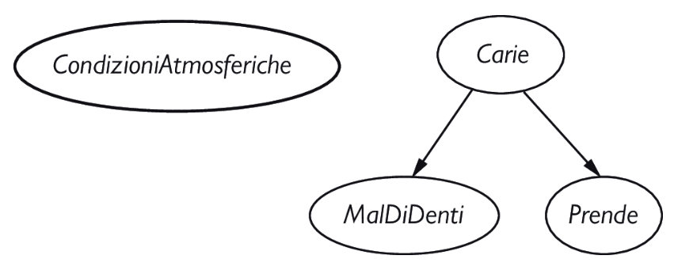
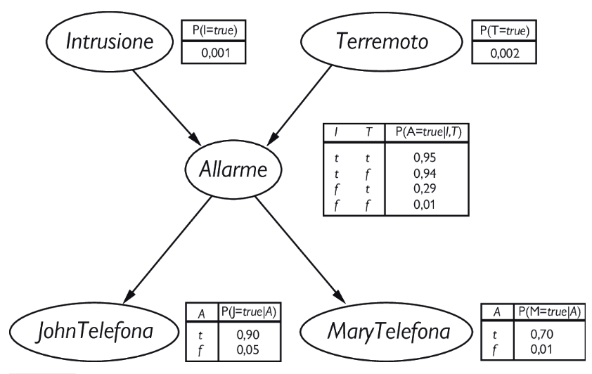

# Ragionamento probabilistico
## Rappresentazione della conoscenza in un dominio incerto
Abbiamo visto che la distribuzione di probabilità congiunta completa può rispondere a qualsiasi domanda riguardante il dominio, ma diventa intrattabilmente grande al crescere del numero di variabili. Inoltre, specificare le probabilità per i singoli mondi possibili procedendo uno per uno è innaturale e noioso.

Abbiamo anche visto che le relazioni di indipendenza assoluta e condizionale tra le variabili possono ridurre drasticamente il numero di probabilità che devono essere specificate esplicitamente per definire la distribuzione congiunta completa. Introduciamo una struttura dati chiamata **rete bayesiana** per rappresentare le dipendenze tra le variabili. Le reti bayesiane possono rappresentare in sostanza qualsiasi distribuzione di probabilità congiunta completa, e in molti casi possono farlo in maniera molto concisa.

Una rete bayesiana è un grafo orientato in cui ogni nodo è etichettato con informazione probabilistica quantitativa:

1. Ogni nodo della rete corrisponde a una variabile casuale, che può essere discreta o continua.

2. Archi orientati collegano coppie di nodi. Se c’è una freccia dal nodo $X$ al nodo $Y$, si dice che $X$ è **genitore** di $Y$. Il grafo non ha cicli diretti e quindi è un DAG.

3. Ogni nodo $X_i$ è associato a informazioni di probabilità $\theta(X_i|\text{Genitori}(X_i))$ che quantificano gli effetti dei genitori su un nodo usando un numero finito di **parametri**.

Il significato intuitivo di una freccia in una rete è generalmente che $X$ ha una influenza diretta su $Y$, il che suggerisce che le cause dovrebbero essere genitori degli effetti. In generale è abbastanza facile, per un esperto, decidere quali influenze dirette esistono nel dominio; molto più facile che indicare effettivamente le probabilità. 

Una volta delineata la topologia di una rete bayesiana, rimane da specificare solo l’informazione di probabilità locale di ogni variabile, nella forma di una distribuzione di probabilità condizionata dati i suoi genitori. 

La distribuzione congiunta completa di tutte le variabili è definita dalla topologia e dall’informazione di probabilità locale.

Prendiamo come esempio (figura) il semplice mondo descritto precedentemente che consisteva nelle sole variabili *MalDiDenti*, *Carie*, *Prende* e *CondizioniAtmosferiche*. Abbiamo affermato che *CondizioniAtmosferiche* è indipendente dalle altre variabili; inoltre *MalDiDenti* e *Prende* sono condizionalmente indipendenti, data *Carie*.

Formalmente, l’indipendenza condizionale di *MalDiDenti* e *Prende* data ­*Carie* è indicata dall’assenza di un collegamento tra *MalDiDenti* e *Prende*. Intuitivamente, la rete rappresenta il fatto che *Carie* è una causa diretta di *MalDiDenti* e *Prende*, mentre non c’è alcuna relazione causale diretta tra *MalDiDenti* e *Prende*.  

Ora considerate il seguente esempio, appena più complesso. Avete da poco installato in casa un nuovo antifurto. È abbastanza affidabile, ma occasionalmente scatta anche per piccoli terremoti. Avete anche due vicini, John e Mary, che hanno promesso di telefonarvi al lavoro quando sentono suonare l’allarme. John quando sente l’allarme chiama quasi sempre, ma qualche volta si confonde e scambia lo squillo del telefono in casa vostra per l’antifurto. Mary, d’altro canto, ama ascoltare musica ad alto volume e spesso non sente suonare l’allarme. Prendendo come evidenze le telefonate dei vicini, vorremmo stimare la probabilità di un’intrusione.

L’informazione di probabilità locale associata a ogni nodo nellafiggura assume la forma di una tabella delle probabilità ­condizionate, o **CPT** (questo tipo di tabella può essere usato solo per le variabili discrete).  Ogni riga di una CPT contiene la probabilità condizionata di ogni valore del nodo per caso ­condizionante. Un caso condizionante è semplicemente una possibile combinazione dei valori dei nodi genitori. Ogni riga deve avere somma 1, perché i suoi elementi rappresentano un insieme esaustivo di casi per la variabile. 

Per variabili booleane, una volta appurato che il valore è vero con probabilità $p$, la probabilità che sia falso dev’essere per forza $1 – p$. In generale, la tabella di una variabile booleana con $k$ genitori booleani contiene $2^k$ probabilità indipendentemente specificabili. 
Un nodo senza genitori ha una sola riga, che riporta le probabilità a priori di ogni suo possibile valore.

## Semantica delle reti Bayesiane  

La sintassi di una rete bayesiana è costituita da un grafo aciclico orientato con alcune informazioni di probabilità locale assegnate a ogni nodo. La semantica definisce il modo in cui la sintassi corrisponde a una distribuzione congiunta sulle variabili della rete.

Supponiamo che la rete contenga $n$ variabili, $X_1,... ,X_n$. Allora un elemento generico nella distribuzione congiunta è $P(X_1 = x_1 \land... \land X_n = x_n)$, o in forma abbreviata $P(x_1,... , x_n)$. 
La semantica della rete bayesiana definisce ogni elemento nella distribuzione congiunta come segue:

$$P(x_1,...,x_n)=\prod_{i=1}^n \theta(x_i|\text{genitori}(X_i)) \ \ (13.1)$$

dove $\text{genitori}(X_i)$ denota i valori di $\text{Genitori}(X_i)$ che appaiono in $x_1,... , x_n$. 
Così, ogni elemento della distribuzione congiunta è rappresentato dal prodotto degli elementi appropriati nelle distribuzioni condizionate locali della rete bayesiana.

Per illustrare questo, possiamo calcolare la probabilità che l’allarme scatti senza che si siano verificati né un’intrusione né un terremoto, e che in conseguenza a ciò sia John che Mary telefonino. Basta moltiplicare gli elementi rilevanti delle distribuzioni condizionate locali:

$$P(j, m, a,¬i,¬t) 	= P(j|a)P(m|a)P(a|¬i ∧ ¬t)P(¬i)P(¬t)\\
= 0,90 \times 0,70 \times 0,001 \times 0,999 \times 0,998 = 0,000628 $$