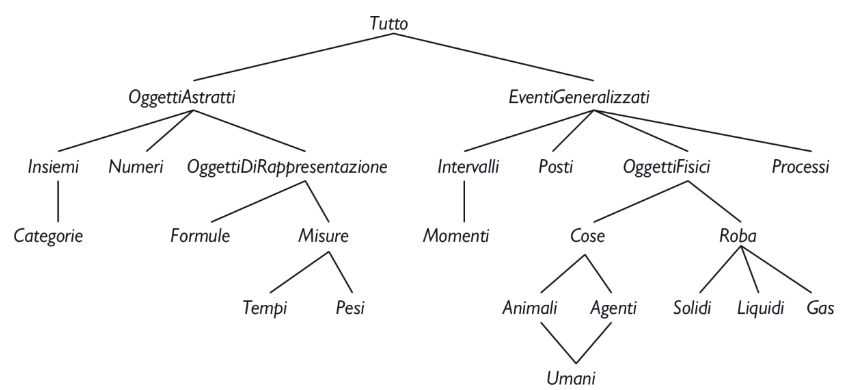

# Rappresentazione della conoscenza
Capiremo come rappresentare fatti che riguardano il mondo.  
## Ingegneria ontologica
Il lavoro di rappresentare i concetti di *Eventi, Tempo, Oggetti e Credenze*.

Non possiamo rappresentare l'intero mondo, sarebbe troppo: lasceremo invece dei "segnaposto" per indicare i punti in cui si potra aggiungere nuova conoscenza appartenente a qualsiasi dominio.
L'insieme generale dei concetti prende il nome di **ontologia superiore**, per la convenzione di disegnare grafi con i concetti più generali in alto e quelli più specifici sotto di essi.  

## Categorie e Oggetti  
L'organizzazione degli oggetti in **categorie** è una parte fondamentale della rappresentazione della conoscenza.  
Un cliente potrebbe avere come obiettivo l’acquisto di un pallone da basket, piuttosto che di un particolare pallone come il $\text{BB}_9$.

Le categorie sono anche utili per formulare predizioni sugli oggetti una volta che sono stati classificati. 
Si può inferire la presenza di un oggetto dagli input percettivi, dedurre dalle caratteristiche percepite la sua appartenenza a una categoria e quindi sfruttare l’informazione nota sulla categoria per formulare predizioni riguardo l’oggetto. 

Per rappresentare le categorie nella logica del primo ordine ci sono due possibilità: si possono usare predicati oppure oggetti.
Questo significa che possiamo usare il predicato $\text{PalloneDaBasket(b)}$, oppure possiamo "cosificare" la categoria e farla diventare un oggetto, $\text{PalloniDaBasket}$, in modo da poter scrivere $\text{Membro(b, PalloniDaBasket)}$, abbreviato in $b \in \text{PalloniDaBasket}$.
Possiamo anche scrivere $\text{Sottoinsieme(PalloniDaBasket, Palloni)}$, abbreviato in $\text{PalloniDaBasket} \subset \text{Palloni}$, per dire che $\text{PalloniDaBasket}$ è una sottocategoria di $\text{Palloni}$.

Le categorie organizzano la conoscenza attraverso il meccanismo dell'**ereditarietà**.
Se diciamo che tutte le istanze della categoria $\text{Cibo}$ sono commestibili, e affermiamo che $\text{Frutta}$ è una sottoclasse di $\text{Cibo}$ e $\text{Mele}$ è a sua volta una sottoclasse di $\text{Frutta}$, sappiamo che ogni mela è commestibile.

La logica del primo ordine rende facile esprimere fatti che riguardano intere categorie, mettendo gli oggetti in relazione con esse o quantificando tutti i membri:  
1. Un oggetto è membro di una categoria:
$$\text{BB}_9 \in \text{PalloniDaBasket}$$

1. Una categoria è una sottoclasse di un’altra categoria:
$$\text{PalloniDaBasket} \subset \text{Palloni}$$

1. Tutti i membri di una categoria hanno determinate caratteristiche:
   $$x \in \text{PalloniDaBasket} \implies \text{Sferico}(x)$$

1. I membri di una categoria possono essere riconosciuti dalle loro caratteristiche:
   $$\text{Arancione}(x) \land \text{Rotondo}(x) \land \text{Diametro}(x)=24cm \land x \in \text{Palloni} \implies x \in \text{PalloniDaBasket}$$

1. Una categoria può avere caratteristiche proprie:
   $$\text{Cani} \in \text{SpecieAddomesticate}$$

