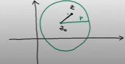
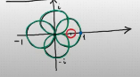

## Matrici irriducibili  

Un grafo è un diagramma formato da un certo numero di nodi e da un certo numero di archi.  

Un arco è una freccia che parte da un nodo e arriva a un altro nodo (che può coincidere con il nodo di partenza). Se il grafo possiede $n$ nodi, questi vengono tipicamente indicati con $1,2,...,n$ e l'arco dal nodo $i$ al nodo $j$ viene indicato con una freccia.  

 Un cammino all'interno del grafo è un percorso che parte dal nodo $i$ e arriva ad un altro nodo $j$, seguendo gli archi del grafo.  

Se un nodo di arrivo coincide con quello di partenza, il cammino si chiama ciclo.  

Un grafo si dice **fortemente connesso** se per ogni coppia di nodi $i,j$ esiste un cammino all'interno del grafo che va da $i$ a $j$.

Equivalentemente, un grafo è fortemente connesso se esiste un ciclo nel grafo che tocca tutti i nodi (dimostrare l'equivalenza).  

Data una matrice $A \in \Complex^{n\times n}$, il grafo associato ad  $A$ è il grafo così definito:  
+ i nodi sono $1,...,n$
+ gli archi sono le frecce $i\rightarrow j$ tali che $a_{ij}\neq 0$

***Def***
Una matrice $A \in \Complex^{n\times n}$ si dice irriducibile se il suo grafo è fortemente connesso.  

ES: Dire se le matrici:  

$$A=\begin{bmatrix}
0&i&0 \\
1&1&4 \\
0&i&0 \\
\end{bmatrix} \ , \ B=\begin{bmatrix}
0&-1&0 \\
i&2&-3 \\
0&0&0 \\
\end{bmatrix}$$

sono irriducibili oppure no.  

1. Il grafo associato ad $A$:
 questo è fortemente connesso, perché contiene il ciclo $1 \rightarrow 2 \rightarrow 3 \rightarrow 2 \rightarrow 1$ che tocca tutti i nodi $\implies A$ è irriducibile. 
1. Il grafo associato ad $B$:
 questo non è fortemente connesso, perché da $3$ non posso andare in $2\implies B$ non è irriducibile, ovvero è riducibile.  

EX: stabilire quali delle seguenti matrici sono irriducibili:  

$$A=\begin{bmatrix}
0&-1&0&0 \\
1&0&1&i \\
1+i&0&0&-1 \\
-2&7&10&3i \\
\end{bmatrix} \ , \ B=\begin{bmatrix}
1&0&3&4 \\
0&1&1&-1 \\
0&0&4&7 \\
0&-i&0&1 \\
\end{bmatrix}\ , \ C=\begin{bmatrix}
0&0&0&0&1 \\
1&0&0&0&0 \\
0&1&0&0&0 \\
0&0&1&0&0 \\
0&0&0&1&0 \\
\end{bmatrix}$$

## Localizzazione degli autovalori  
$\mathcal{C}(z_0,r)=$ cerchio nel piano complesso di centro $z_0$ e raggio $r=\set{z \in \Complex: |z-z_0|\leq r}$.   

Data $A \in \Complex^{n\times n}$, i cerchi di Gershgorin (G) di $A$ sono i cerchi $K_1,...,K_n$ definiti come segue:
$\forall i=1,...,n:\\
K_i=\mathcal{C}(a_{ii},|a_{i1}|+...+|a_{i\ i-1}|+|a_{i\ i+1}|+...+|a_{in}|)=\\
=\mathcal{C}(a_{ii},\sum^n_{j=1 ,\ i\neq j}|a_{ij}|)$  

I cerchi di G. $K_1,...,K_n$ si chiamano anche cerchi di G per riga di $A$. Questo serve a distinguerli dai cerchi di G per colonna di $A$ che sono i cerchi $H_1,...,H_n$ definiti come segue:  

$\forall j=1,...,n:\\
H_j=\mathcal{C}(a_{jj},\sum^n_{j=1 ,\ i\neq j}|a_{ij}|)$   

> Quando si parla di cerchi di G senza specificazioni, si intendono i cerchi di G per riga.  

**ES**: determinare i cerchi di G, della seguente matrice:  

$$A=\begin{bmatrix}
0&-1&0&0 \\
1&0&1&i \\
1+i&0&0&-1 \\
-2&7&10&3i \\
\end{bmatrix}$$  

**Sol**.  

$K_1=\mathcal{C}(0,1)$
$K_2=\mathcal{C}(0,3)$
$K_3=\mathcal{C}(0,|1+i|+1)=\mathcal{C}(0,\sqrt{2}+1)$
$K_4=\mathcal{C}(3i,19)$

> $|a+ib|=\sqrt{a^2+b^2}$
> 
> $|i|=\sqrt{0^2+1^2}=1$

#### Teorema (1° teorema di G)

Gli autovalori di una matrice $A \in \Complex^{n\times n}$ stanno tutti nell'unione dei cerchi di G di $A$.

##### dim  
Sia $\lambda$ un generico autovalore di $A$, mostriamo che $\lambda$ sta nell'unione dei cerchi di G di $A$. Prendiamo $u \neq 0$ autovettore di $A$ corrispondente a $\lambda$:

$$Au=\lambda u \iff (Au)_i=(\lambda u)_i \ \forall i=1,...,n \iff (\star)\sum_{j=1}^n a_{ij}u_j=\lambda u_i \ \forall i=1,...,n$$

Seleziono un indice $i_0\in \set{1,...,n}$ tale che $u_{i_0}$ abbia modulo massimo rispetto a tutte le altre componenti di $u$ $(u_{i_0}=\max_{i=1,...,n}|u_i| \neq 0)$.  

L'equazione $i_{o}$-esima in $(\star)$ dice:  

$$\sum_{j=1}^n a_{ij}u_j=\lambda u_i \ \forall i=1,...,n \iff a_{i_0i_0}u_{i_0}+\sum_{j=1, \ j\neq i_0}^n a_{i_0j}u_j=\lambda u_{i_0} \iff (\lambda-a_{i_0i_0})u_{i_0}=\sum_{j=1, \ j\neq i_0}^n a_{i_0j}u_j$$  

$$\implies \text{ (Applico il modulo a sx e a dx) } |(\lambda-a_{i_0i_0})| |u_{i_0}|
\\=|\sum_{j=1, \ j\neq i_0}^n a_{i_0j}u_j| 
\\ \ \underbrace{\leq}_{\text{ dis. triangolare }} \sum_{j=1, \ j\neq i_0}^n |a_{i_0j}||u_j| 
\\ \underbrace{\leq}_{u_{i_0}\text{ è il massimo di tutti gli } u_i} \sum_{j=1, \ j\neq i_0}^n |a_{i_0j}||u_{i_0}|
\\=|u_{i_0}|\sum_{j=1, \ j\neq i_0}^n |a_{i_0j}|$$

Dunque $|(\lambda-a_{i_0i_0})| \ \cancel{|u_{i_0}|} \leq \cancel{|u_{i_0}|} \ \sum_{j=1, \ j\neq i_0}^n |a_{i_0j}|$ dunque $\lambda$ dista da $a_{i_0i_0}$ che è il centro del cerchio di G $K_{i_0} \leq$ del raggio $\sum_{j=1, \ j\neq i_0}^n |a_{i_0j}|$ di $K_{i_0} \implies \lambda \in K_{i_0}\implies \lambda \in \bigcup^n_{i=1}K_i$    $\square$.  

#### Teorema (2° teorema di G)

Supponiamo che l'unione dei $K$ cerchi di G di $A \in \Complex^{n\times n}$ sia disgiunta dall'unione degli altri $n-K$ cerchi. Allora $k$ autovalori di $A$ stanno nella prima unione e i rimanenti $n-k$ sono nella seconda unione

#### Teorema (3° di G, forte)

Suppniamo che $A \in \Complex^{n\times n}$ sia irriducibile. Allora i punti che stanno sul bordo di quei cerchi di G a cui appartengono ma non stanno sul bordo di tutti i cerchi non sono autovalori di $A$.  

ES: Se $A \in \Complex^{5 \times 5}$ è irriducibile e ha i cerchi di G mostrati in figura:
1. 1 non è autovalore di $A$
2. 0 non è autovalore di $A$

#### Teorema (3° di G, debole)
Suppniamo che $A \in \Complex^{n\times n}$ sia irriducibile e sia $\mathcal{B}$ il bordo dell'unione dei cerchi di G
  
Allora i punti di $\mathcal{B}$ che non stanno sul bordo di tutti i cerchi non sono autovalori di $A$.  

##### Dim  

Sia $z\in \mathcal{B}$ punto che non sta sul bordo di tutti i cerchi.
+ Siccome $z \in \mathcal{B}, \ z$ non può stare all'interno di nessun cerchio e dunque per forza sta sul bordo di quei cerchi a cui appartiene 
+ $z$ non sta sul bordo di tutti i cerchi per ipotesi  

$\implies z$ non è un autovalore di $A$ per il 3° teorema di G forte.  

ES: Supponiamo di sapere che una matrice $A \in \Complex^{n \times n}$ è irriducibile e che i suoi cerchi di G sono i seguenti:  

$$K_1=\mathcal{C}(1,1),K_2=\mathcal{C}(-i,1),K_3=\mathcal{C}(4i,1),K_4=\mathcal{C}(1+i,1),K_5=\mathcal{C}(-1,1)$$.  

Avendo a disposizione solo queste informazioni, dire se le seguenti affermazioni sono vere o false , motivando la risposta.  

1. 0 non è un autovalore di $A$
2. $A$ è invertibile
3. 1 potrebbe essere un autovalore di $A$
4. -1 + 4i potrebbe essere un autovalore di $A$
5. $K_3$ privato del suo bordo contiene esattamente un autovalore di $A$
6. Vale la stima che $3\leq \rho(A)\leq 5$

Sol

1. Vera, infatti $A$ è irriducibile e 0 sta sul bordo $\mathcal{B}$ dei cerchi di $G$ ma non sul bordo di tutti i cerchi. Dunque 0 non può essere autovalore di $A$ per il 3° teorema di G debole  
2. Vera, infatti 0 non è autovalore di $A$ e dunque $A$ è invertibile.  
3. Vera, infatti non si può escludere che 1 sia un autovalore di $A$ usando il 3° teorema di G. debole perché 1 non sta su $\mathcal{B}$.
4. Falsa, 1+4i $\in \mathcal{B}$ ma non sta nel bordo di tutti i cerchi. Dunque per il 3° teorema di G, non può essere autovalore.  
5. Vera, infatti per il 2° teorema di G, $K_3$ contiene un autovalore di $A$ mentre gli altri 4 autovalori stanno in $K_1\cup K_2 \cup K_3 \cup K_4 \cup K_5$. Inoltre l'autovalore che sta in $K_3$ non può stare sul bordo di $K_3$ , perché nessun punto del bordo di $K_3$ può essere autovalore di $A$, per lo stesso motivo per cui il punto verde -1+4i non può essere autovalore di $A$.
6. 
