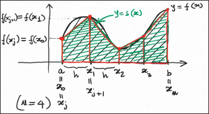
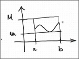
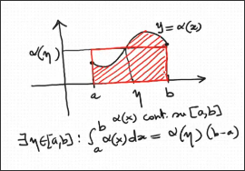
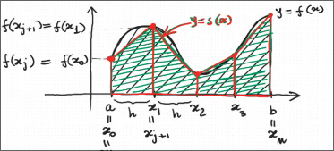

# Integrazione numerica - formula dei trapezi  
È data $f:[a,b]\rightarrow \R$ integrabile e si vuole calcolare un'approssimazione di  $\int_a^bf(x)dx$.  

  

Si suddivide l'intervallo $[a,b]$ in $n \geq 1$ sottointervalli tutti della stessa ampiezza $h=\frac{b-a}{n}$ e si pone $x_j=a+jh$ con $j=0,1,\dots,n$  
Il valore che si prende come approssimazione di $\int_a^bf(x)dx$ è  $\int_a^bs(x)dx$, dove $s:[a,b]\rightarrow \R$  

$s(x)=f(x_j)+\frac{f(x_{j+1}-f(x_j))}{x_{j+1}-x_j}(x-x_j)$  

per $x \in [x_j,x_{j+1}]$ per $j=0,\dots,n-1$  

Dunque il valore che prendiamo come approssimazione di $\int_a^bf(x)dx$ è  

$I_n=\int_a^bs(x)dx=\sum_{j=0}^{n-1} \int_{x_j}^{x_{j+1}}s(x)dx =^{(\star)}\sum_{j=0}^{n-1} \int_{x_j}^{x_{j+1}}[f(x_j)+\frac{f(x_{j+1})-f(x_j)}{x_{j+1}-x_j}(x-x_j)]dx =$

$\sum_{j=0}^{n-1} [f(x_j)(x-x_j)+\frac{f(x_{j+1})-f(x_j)}{x_{j+1}-x_j}\frac{(x-x_j)^2}{2}]^{x_{j+1}}_{x_j} = $  

$\sum_{j=0}^{n-1} [f(x_j)\underbrace{(x_{j+1}-x_j)}_h+\frac{f(x_{j+1})-f(x_j)}{2}(x_{j+1}-x_j)]=$    

$\sum_{j=0}^{n-1}h\frac{f_(x_{j+1})+f(x_j)}{2}=$  

$\frac{h}{2}\sum_{j=0}^{n-1}[f(x_j)+f(x_{j+1})]=$  

$\frac{h}{2}[f(x_0)+f(x_1)+f(x_1)+f(x_2)+f(x_2)+f(x_3)+\dots+f(x_{n-1})+f(x_n)]$  

$\frac{h}{2}[f(a)+f(b)+2\sum_{j=0}^{n-1}f(x_j)]=h[\frac{f(a)+f(b)}{2}+\sum_{j=0}^{n-1}f(x_j)]$  

$I_n=h[\frac{f(a)+f(b)}{2}+\sum_{j=0}^{n-1}f(x_j)] \ \text{( formula dei trapezi )}$  
 
$(\star): \text{ guess: } \sum_{j=0}^{n-1}\frac{f(x_j)+f(x_{j+1})}{2}h$   

## Errore (o resto) della formula dei trapezi   

Vogliamo capire qual'è l'errore $|\int_a^bf(x)dx-I_n|$ commesso approssimando $\int_a^bf(x)dx$ con $I_m$  

####  Lemma (generalizzazione del teorema sulla media integrale)  
Siano $\omega,\alpha,\beta:[a,b]\rightarrow \R$ funzioni tali che:  
+ $\omega(x) \text{ è continua } e \geq 0 \ \text{su} \ [a,b]$  
+ $\alpha(x) \ e \ \beta(x)\omega(x)\text{ sono continue su }[a,b]$
+ $m\leq\beta(x)\leq M \ \forall x \in [a,b]$ dove $m=min_{x\in[a,b]}\alpha(x) \text{ e } M=max_{x \in [a,b]}\alpha(x)$

  

Allora $\exist \eta \in [a,b] \ t.c \ \int_a^b \beta(x)\omega(x)dx=\alpha(\eta)\int_a^b\omega(x)dx$   

  (Teorema media integrale)  

<u> OSS </u>  

Applicando il lemma con $\beta(x)=\alpha(x)$ e $\omega(x)=1$ identicamente si ottiene il teo. della media integrale  

####  dim   

Poiché per ipotesi $\omega(x) \geq 0 \text{ su } [a,b]$ e $m \leq \beta(x) \leq M \ \forall x \in [a,b]$ si ha $m\omega(x)\leq \beta(x)\omega(x)\leq M\omega(x) \ \forall x \in [a,b]$  

$\implies$ per monotonia dell'integrale, si ha $\int_a^bm\omega(x)dx \leq \int_a^b\beta(x)\omega(x)dx\leq\int_a^bM\omega(x)dx$  

Consideriamo $z:[a,b]\rightarrow \R$ definita: $z(y)=\alpha(y)\int_a^b\omega(x)dx$  

$z(y)$ è continua su $[a,b]$ come $\alpha(y)$ e inoltre   

$min_{y \in [a,b]}z(y)=m\int_a^b\omega(x)dx$  

$max_{y\in[a,b]}z(y)=M\int_a^b\omega(x)dx$  

Per il teo. dei valori intermedi, $z(y)$ assume su $[a,b]$ tutti i valori tra il suo minimo e il suo massimo $\implies z(y)$ assume su $[a,b]$ anche il valore $\int_a^b\beta(x)\omega(x)dx$, cioè $\exist \eta \in [a,b], \ t.c \ z(\eta)=\int_a^b\beta(x)\omega(x)dx=\alpha(\eta)\int_a^b\omega(x)dx$  

####  Teorema   

Sia $f:[a,b]\rightarrow \R$ di classe $C^2[a,b]$ e sia $I_n$ la formula dei trapezi di ordine $m$ e passo $h=\frac{b-a}{n}$ per approssimare $\int_a^bf(x)dx$.  
Allora $\exist\eta\in[a,b]\ t.c \ \int_a^bf(x)dx-I_n=-\frac{(b-a)f''(\eta)}{12}h^2 \ \ (\star)$   

#####  Dim   

   

Siano $x_j=a+jh$ con $j=0,1,\dots,n$ e sia $s(x)$ la funzione lineare a tratti mostrata in figura.  
L'osservazione cruciale è che $f(x)$ coincide sull'intervallo $[x_j,x_{j+1}]$ con il polinomio (retta) d'interpolazione di $f(x)$ sui nodi $x_j,x_{j+1}$ (infatti il pol. d'interpolazione di $f(x)$ su $x_j,x_{j+1}$ è l'unico polinomio in $\R_1[x]$ tale che $p(x_j)=f(x_j)$ e $p(x_{j+1})=f(x_{j+1})$ e dunque è la retta tratteggiata in figura).

$\int_a^bf(x)dx-I_m=\int_b^af(x) dx -\int_a^bs(x)dx=\int_a^b[f(x)-s(x)]dx=\sum_{j=0}^{n-1}\int_{x_j}^{x_{j+1}}[f(x)-s(x)]dx$  

$=\sum_{j=0}^{n-1}\int_{x_j}^{x_{j+1}}[\frac{f''(\xi_j(x))}{2!}(x-x_j)(x_{j+1}-x)]dx \\ [ \text{  ho applicato il teorema sull'errore dell'interpolazione sull'intervallo } [x_j,x_{j+1}]:\xi_j(x)\in (x_j,x_{j+1})]$  

$=\sum_{j=0}^{n-1}\int_{x_j}^{x_{j+1}} f''(\xi_j(x))\cdot \frac{(x-x_j)(x_{j+1}-x)}{2}dx$  

$= - \sum_{j=0}^{n-1}f''(\eta_j)\int_{x_j}^{x_{j+1}}\frac{(x-x_j)(x_{j+1}-x)}{2} \ (\eta_j\text{ è un punto in }[x_j,x_{j+1}])$

$=^{t=x-x_j\ \ \ x=t+x_j \ \ \ dx=dt}=- \sum_{j=0}^{n-1}f''(\eta_j)\int_a^h\frac{t(h-t)}{2}dt= - \sum_{j=0}^{n-1}f''(\eta_j)[\frac{h}{4}t^2-\frac{t^3}{6}]_0^h=- \sum_{j=0}^{n-1}f''(\eta_j)\frac{h^3}{12}=\frac{h^3n}{12}\cdot $$\frac{1}{n}- \sum_{j=0}^{n-1}f''(\eta_j)$$=\frac{-(b-a)h^2}{12}f''(\eta)$, dove l'ultima eguaglianza vale perché essendo $f''(x)$ continua su $[a,b]$ per ipotesi e essendo la media aritmetica (blu) un valore compreso tra il minimo e il massimo di $f''(x)$ su $[a,b]$, per il teorema dei valori intermedi esiste sicuramente un $\eta \in[a,b] \ t.c \ f''(\eta)=\frac{1}{n}\sum_{j=0}^{n-1}f''(\eta_j)$

> Applico il lemma precedente,sull'intervallo $[x_j,x_{j+1}]$, con: 
> $\omega(x)=\frac{(x-x_j)(x-x_{j+1})}{2}$;
> $\beta(x)=f''(\xi_j(x)) \in (x_j,x_{j+1})$  
> $\alpha(x)=f''(x)$  
> $\omega(x)$ è $\geq 0$ su $[x_j,x_{j+1}]$ 
> $\alpha(x)$ è continua su $[x_j,x_{j+1}]$ perché $f \in C^2[a,b]$  
> $\beta(x)\omega(x)$ è continua su $[x_j,x_{j+1}]$ perché "guardando all'indietro" nella dim. vediamo che è $=-[f(x)-s(x)]$ che è continua su $[x_j,x_{j+1}]$
> $min_{y\in[x_j,x_{j+1}]}\alpha(y)\leq\beta(x)\leq max_{y\in[x_j,x_{j+1}]}\alpha(y) \ \forall x\in[x_j,x_{j+1}]$ perché $\beta(x)=\alpha(\xi_j(x))$ e $\xi_j(x) \in (x_j,x_{j+1}) \ \forall x\in[x_j,x_{j+1}]$  
> <u> Conclusione</u> $\exist \eta_j \in [x_j,x_{j+1}] \ t.c \ \int_b^a\beta(x)\omega(x)dx=\alpha(\eta_j)\int_{x_j}^{x_{j+1}}\omega(x)dx$