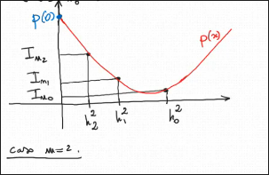

####  Teorema   

Sia $f:[a,b]\rightarrow \R$ di classe $C^2[a,b]$ e sia $I_n$ la formula dei trapezi di ordine $m$ e passo $h=\frac{b-a}{n}$ per approssimare $\int_a^bf(x)dx$.  
Allora $\exist\eta\in[a,b]\ t.c \ \int_a^bf(x)dx-I_n=-\frac{(b-a)f''(\eta)}{12}h^2 \ \ (\star)$   

##### Esempio:  
1. Calcolare l'approssimazione di $\int_0^1\sqrt{cos(x)}dx$ con $I_{10}$ $($la formula dei trapezi di ordine $10)$  
2. Stimare l'errore che si commette approssimando $\int_0^1\sqrt{cos(x)}dx$ con $I_{10}$.  

<u>Sol.</u>  

$(1.)$  

Applichiamo $I_n=h[\frac{f(a)+f(b)}{2}+\sum_{j=0}^{n-1}f(x_j)] \ \ (\tau)$ con $f(x)=\sqrt{cos(x)}$ e $[a,b]=[0,1], n=10$

$h=\frac{1-0}{10}=\frac{1}{10},x_j=\frac{j}{10},j=0,1,\dots,10$.  

$I_{10}=\frac{1}{10}[\frac{\sqrt{cos(0)}+\sqrt{cos(1)}}{2}+\sum_{j=1}^9\sqrt{cos(\frac{j}{10})}]$

$=\frac{1}{10}[\frac{1+\sqrt{cos(1)}}{2}+\sqrt{cos(\frac{1}{10})}+\sqrt{cos(\frac{2}{10})}+\dots+\sqrt{cos(\frac{9}{10})}]=0.9135078...$  

$(2.)$  

$f(x)$ è $C^{\infty}[0,1]$. Infatti $cos(x)$ non ha zeri su $[0,1]$ perché è decrescente su $[0,1]$ dunque $cos(x)\in[cos(1),1]=[0.54...,1] \ \forall x \in [0,1]$, quindi $f(x)$ è $C^{\infty}[0,1]$ come composizione di $cos(x):[0,1]\rightarrow[0.54...,1]$ e $\sqrt{y}:[0.54...,1]\rightarrow\R$ entrambe $C^{\infty}$ sui domini  indicati. Applichiamo il teorema con $f(x)=\sqrt{cos(x)},n=10, h=\frac{1}{10}:$

$|\int_0^1\sqrt{cos(x)}dx-I_{10}|=|-\frac{1\cdot f''(\eta)}{12}(\frac{1}{10})^2|=\frac{|f''(\eta)|}{1200}\ \ \eta\in[0,1]$  

$f'(x)=-\frac{sin(x)}{2\sqrt{cos(x)}}$  

$f''(x)=\frac{-cos(x)\cdot 2\sqrt{cos(x)}-(-sin(x))2\cdot \frac{-sin(x)}{2\sqrt{cos(x)}}}{4cos(x)}=-\frac{\sqrt{cos(x)}}{2}-\frac{sin^2(x)}{4cos^{\frac{3}{2}}(x)}$

$\forall x\in[0,1] \ \ |f''(x)|=|-\frac{\sqrt{cos(x)}}{2}-\frac{sin^2(x)}{4cos^{\frac{3}{2}}(x)}| \leq |\frac{\sqrt{cos(x)}}{2}| +|\frac{sin^2(x)}{4cos^{\frac{3}{2}}(x)}| \leq \frac{1}{2}+\frac{sin^2(1)}{4cos^{\frac{3}{2}}(1)}\leq0.9458$  

Dunque   

$|\int_0^1\sqrt{cos(x)}dx-I_{10}| \leq \frac{0.9458}{1200}=0.000788...$

> $|\alpha+\beta|\leq|\alpha|+|\beta|$  

##### Esempio   
Fissato $\epsilon=10^{-8}$, determinare un $n$ t.c la formula dei trapezi $I_n$ fornisca un'approssimazione di $\int_0^1\sqrt{cos(x)}dx$ con errore $|\int_0^1\sqrt{cos(x)}dx-I_{10}|\leq \epsilon$  

<u> Sol. </u>  

Posto $f(x)=\sqrt{cos(x)}$, per il teo. vale che   

$|\int_0^1\sqrt{cos(x)}dx-I_{10}|=-\frac{1\cdot f''(\eta)}{12}(\frac{1-0}{n})^2=\frac{|f''(\eta)|}{12n^2} \ \ \eta \in[0,1]\leq \frac{0.9458}{12n^2}\leq \frac{1}{12n^2}$   

Imponiamo $\frac{1}{12n^2}\leq \epsilon \iff n^2\geq \frac{1}{12\epsilon}\iff n \geq \sqrt{\frac{1}{12\epsilon}}=n(\epsilon)$

<u> Conclusione </u>  
Se prendo $n \geq n(\epsilon)$ allora sono sicuro che $|\int_0^1\sqrt{cos(x)}dx-I_{10}| \leq \epsilon$. Per $\epsilon=10^{-8}, \ n(10^{-8})=\sqrt{\frac{1}{12\cdot10^{-8}}}=2886.75...$ prenderò $2887$  

##### Esempio  
Fissato $\epsilon > 0$. Determinare un $n$ t.c la formula dei trapesi $I_n$ fornisca un'approssimazione di $\int_0^1\frac{x+2}{log(x+2)}dx$ con errore $|\int_0^2\frac{x+2}{log(x+2)}dx-I_{n}|\leq \epsilon$  

<u>sol.</u>  

$f(x)=\frac{x+2}{log(x+2)}\in C^{\infty}[0,1]$. Applico il teorema e scopro che il mio errore $\int_0^2\frac{x+2}{log(x+2)}dx-I_{n}|=|-\frac{1\cdot f''(\eta)}{12}(\frac{1}{n})^2|=\frac{|f''(\eta)|}{12n^2} \ \ \eta \in [0,1]$    

Calcoliamo 
$f'(x)=\frac{log(x+2)-(x+2)(\frac{1}{x+2})}{log^2(x+2)}=\frac{log(x+2)-1}{log^2(x+2)}$  

$f''(x)=\frac{\frac{1}{x+2}\cdot \ log^2(x+2)-(log(x+2)-1)(2log(x+2)\cdot \frac{1}{x+2})}{log^4(x+2)}=\frac{\frac{1}{x+2}\cdot \ log(x+2)-(log(x+2)-1)(2\ \cdot \frac{1}{x+2})}{log^3(x+2)}=\frac{2-log(x+2)}{(x+2)log^3(x+2)}$  

$\forall x \in [0,1]$  

$|f''(x)|=|\frac{2-log(x+2)}{(x+2)log^3(x+2)}|=\frac{2-log(x+2)}{(x+2)log^3(x+2)}\leq \frac{2-log2}{2log^3(2)}\leq 1.97$  

<u> Conclusione </u>  

$|\int_0^2\frac{x+2}{log(x+2)}dx-I_{n}|\leq \frac{1.97}{12n^2}$

Impongo $\frac{1.97}{12n^2} \leq \epsilon \iff n \geq \sqrt{\frac{1.97}{12\epsilon}}=n(\epsilon)=\frac{C}{\sqrt{\epsilon}}$

Per esempio se $\epsilon=10^{-8}$ allora per garantire che  $|\int_0^2\frac{x+2}{log(x+2)}dx-I_{n}|\leq \epsilon$ prenderò $n\geq n(\epsilon)=n(10^{-8})=\sqrt{\frac{1.97}{12 \cdot 10^{-8}}}=4051.74$  prenderò $4052$  

<u> OSS </u> 
Negli esempi precedenti,$n(\epsilon)$ (quello che garantisce un errore $\leq \epsilon$ se prendiamo $n\geq n(\epsilon)$) è della forma $\frac{C}{\sqrt{\epsilon}}$ con $C$ costante. Questo è un fatto generale, infatti in base a $(\star)$, detta $K$ una costante tale che $|f''(x)|\leq K \ \forall x\in[a,b]$, allora si ha  

$|\int_0^2\frac{x+2}{log(x+2)}dx-I_{n}|=|(b-a) \frac{f''(\eta)}{12}(\frac{b-a}{n})^2| \ \ \eta \in [a,b]=\frac{(b-a)^3\overbrace{|f''(\eta)|}^K}{12n^2}\leq\frac{(b-a)^3K}{12n^2}$   

Impongo $\frac{(b-a)^3K}{12n^2}\leq \epsilon \iff n \geq \sqrt{\frac{(b-a)^3K}{12n^2}}=n(\epsilon)=\frac{C}{\sqrt{\epsilon}} \ \ (C=\sqrt{\frac{(b-a)^3K}{12}})$

<u> Conclusione </u>  
Risulta garantito che $|\int_a^bf(x)-I_n|\leq \epsilon$ se prendo $n\geq n(\epsilon)$  

### Estrapolazione  
Sia $f:[a,b]\rightarrow \R$ integrabile e siano $I_{n_0},\dots,I_{n_m}$ le formule dei trapezi di ordini (distinti) $n_0,n_1,\dots,n_m$ e passi $h_0=\frac{b-a}{n_0},\dots,h_m=\frac{b-a}{n_m}$ per approssimare $\int_a^b f(x)dx$.  

Sia $p(x)$ il pol. inter. dei dati  
$(h_0^2,I_{n_0}),(h_1^2,I_{n_1}),\dots,(h_m^2,I_{n_m}) \ \ [\text{ Quindi } p(x) \text{ è quell'unico polinomio in } \R_m[x] \ t.c \ p(h_i^2)=I_{n_i} \forall i =0,1,\dots,m]$

  

<u> Risultato </u>  
$p(0)$ è un'approssimazione di $\int_a^bf(x)dx$ molto più accurata delle singole formule dei trapezi $I_{n_0},\dots,I_{n_m}$.  

Il procedimento di valutare in $0$ il polinomio di interpolazione $p(x)$, si chiama **estrapolazione**, perché $p(x)$ viene valutato in un punto $(x=0)$ che sta fuori dal punto piccolo intervallo che contiene i nodi $h_0^2,h_1^2,\dots,h_m^2$.  
Il valore "magico" $p(0)$ si chiama **valore estrapolato**.  

##### Esempio

Sia $f(x)=xe^x$  
$\forall n \geq 1$ sia $I_n$ la formula dei trapezi di ordine $n$ per calcolare $\int_0^2 f(x) dx=I$  

1. Calcolare $I$
2. Calcolare $I_{12},I_{24},I_{30}$ e confrontarli con il valore esatto $I$
3. Calcolare $p(0)$ dove $p(x)$ è il pol. inter. dei dati $(h_0^2,I_{12}),(h_1^2,I_{24}),(h_2^2,I_{30})$, dove $h_0,h_1,h_2$ sono i passi di discretizzazione delle formule $I_{12},I_{24},I_{30}$. Confrontate $p(0)$ con $I$
4. Posto $\epsilon=|p(0)-I|$, determinare un $n$ in modo che $I_n$ fornisca un'approssimazione di $I$ con errore $|I_n-I|\leq \epsilon$  

<u> Sol. </u>  

$(1.)$  

$\int xe^x=xe^x-\int 1 \cdot e^x=xe^x-e^x$  

$\int_0^2xe^x=[xe^x-e^x]^2_0=e^2+1=8.3890560989...$  

$(2.)$  

I passi di $I_{12},I_{24},I_{30}$ sono:  

$h_0=\frac{1}{6}, h_1=\frac{1}{12},h_2=\frac{1}{15}$  

Usando la formula dei trapezi otteniamo   

$I_{12}=\frac{1}{6}[\frac{0+2e^2}{2}+\sum_{j=1}^{11}\frac{j}{6}e^{\frac{j}{6}}]=8.4384380178285...$

$I_{24}=\frac{1}{12}[\frac{0+2e^2}{2}+\sum_{j=1}^{23}\frac{j}{12}e^{\frac{j}{12}}]=8.4013033444...$  

$I_{30}=\frac{1}{15}[\frac{0+2e^2}{2}+\sum_{j=1}^{29}\frac{j}{15}e^{\frac{j}{15}}]=8.3968948597...$

$|I_{12}-I|\approx4.9 \ \cdot \ 10^{-2}$

$I_{24}-I|\approx 1.2 \ \cdot \ 10^{-2}$

$I_{30}-I|\approx 7.8 \ \cdot \ 10^{-3}$

$(3.)$  

$p(0)=I_{12} \cdot \ \frac{(-h_1^2)(-h_2^2)}{(h_0^2-h_1^2)(h_0^2-h_2^2)}+I_{24}\cdot \ \frac{(-h_0^2)(-h_2^2)}{(h_1^2-h_0^2)(h_1^2-h_2^2)}+I_{30}\cdot \ \frac{(-h_0^2)(-h_1^2)}{(h_2^2-h_0^2)(h_2^2-h_1^2)}=I_{12}\cdot \ \frac{4}{63}+ \frac{64}{27}\cdot \ I_{24}+\frac{625}{189} \cdot \ I_{30}=8.3890561002...$  

$|p(0)-I|\approx 1.3\cdot \ 10^{-9}$  

$(4.)$

$\epsilon \approxeq 1.3 \cdot \ 10^{-9}$ per il teorema sull'errore della formula dei trapezi,  

$|\int_0^2xe^xdx-I_n|=|-\frac{2f''(\eta)}{12}\cdot \ (\frac{2-0}{n})^2|\\\eta \in[0,2]=\frac{2f''(\eta)}{3n^2}$  

Si ha 
$f'(x)=e^x+xe^x=(x+1)e^x$  
$f''(x)=e^x+(x+1)e^x=(x+2)e^x$  

$\forall x\in[0,2]$  

$|f''(x)|=|(x+2)e^x|=(x+2)e^x\leq 4e^2$  

$|\int_0^2xe^xdx-I_n|\leq \frac{8e^2}{3n^2}$

Impongo $\frac{8e^2}{3n^2} \leq \epsilon \iff n \geq \sqrt{\frac{8e^2}{3\epsilon}}=n(\epsilon)$  

<u> Concl </u> per ottenere un errore $|I-I_n|\leq 1.3 \cdot 10^{-9}$ devo prendere $n\geq n(1.3\cdot \ 10^{-3})=123113.92..$ quindi prenderò $123114$