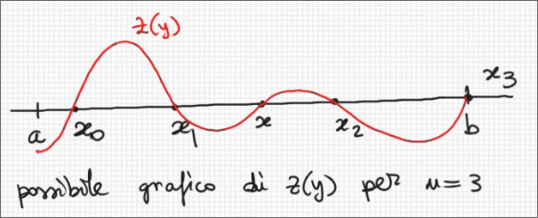
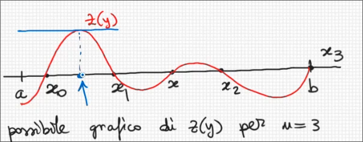
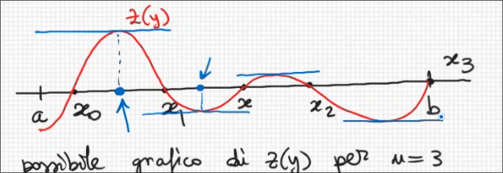

## Errore (Resto) dell'interpolazione polinomiale  
###  Teorema 

Sia $f:[a,b] \rightarrow \R$ una funzione di classe $C^{n+1}[a,b] \\ (\set{f:[a,b]\rightarrow \R : f \text{ è derivabile 2 volte su }[a,b]\ e \ f,f',\dots,f^{n+1} \ \text{sono continue su }[a,b]})$ e sia $p(x)$ il polinomio d'interpolazione di $f(x)$ sugli $n+1$ nodi distinti $x_0,\dots,x_n \in [a,b]$.  
Allora $\forall x \in [a,b] \ \exist \xi = \xi(x)\in(a,b)\ t.c \\ f(x)-p(x)=\frac{f^{n+1}(\xi)}{(n+1)!}$ $(x-x_0)(x-x_1)\dots(x-x_n)$  $(€)$  

####  dim   
Sia $x \in [a,b]$ fissato.  
- ***Caso 1***: $x$ coincide con uno dei nodi $x_0,x_1,\dots,x_n$  
  In tal caso posso scegliere un qualsiasi $\xi \in (a,b)$ e sono sicuro che $€$ vale perché ottengo $0=0$ (perché il primo membro è 0 perché $p(x_i)=f(x_i)\forall i=0,\dots,n$ per definizione, mentre il 2 membro è $0$ perché la parte rossa si annulla)
- ***Caso 2***: $x$ non coincide con uno dei nodi $x_0,x_1,\dots,x_n$  
  Definiamo   
  $\pi(y)=(y-y_0)(y-y_1)\dots(y-y_n)$  

  $r(y)=f(y)-p(y)$

  $z:[a,b]\rightarrow \R, \ z(y)=r(y)-\frac{r(x)}{\pi(x)}\pi(y)$
    - i. proprietà: $z(y)$ è una funzione di classe $C^{n+1}$ "ereditata" da $f(y)$  
    - ii. proprietà: $z(y)$ si annulla in almeno $n+2$ punti di $[a,b]$ perché:
      -  si annulla in tutti i nodi $x_0,\dots,x_n$ ( esempio $z(x_0)=r(x_0)-\frac{r((x))}{\pi(x)}\pi(x_0)=f(x_0)-p(x_0)-\frac{r((x))}{\pi(x)}\pi(x_0)$ e $\pi(x_0)=0$ per def di $\pi(y)$)
      -  si annulla in $x$: $z(x)=r(x)-\frac{r((x))}{\pi(x)}\pi(x)=0$  
        
        
          
        Per il teorema di Rolle, 
        $z'(y)$ si annulla in almeno $n+1$ punti di $(a,b)$,   
        $z''(y)$ si annulla in almeno $n$ punti,   
        $z'''(y)$ si annulla in almeno $n-1$ punti  
        $\vdots$  
        $z^{(n+1)}(y)$ si annulla in almeno $1$ punto di $(a,b)$ che chiamo $\xi$  

Dimostriamo che questo punto $\xi$ fa valere la formula $(€)$  
$z(y)=r(y)-\frac{r(x)}{\pi(x)}\pi(y)=f(y)-p(y)-\frac{r(x)}{\pi(x)}(y-x_0)(y-x_1)\dots(y-x_n)$  

$z^{(n+1)}(y)=f^{(n+1)}(y)-p^{(n+1)}(y)-\frac{r(x)}{\pi(x)}\pi^{(n+1)}(y)=\\
= f^{(n+1)}(y)-\frac{r(x)}{\pi(x)}(n+1)!=\\
=0=z^{(n+1)}(\xi)=f^{(n+1)}(\xi)-\frac{r(x)}{\pi(x)}(n+1)! \\
\implies f(x)-p(x)=\frac{f^{(n+1)}}{(n+1)!}\pi(x)$

>Per capire cos'è $\pi^{(n+1)}(y)$ guardiamo il caso $n=2$:
$\pi'=(y-x_0)(y-x_1)(y-x_2)=(y^2-(x_0+x_1)y+x_0x_1)(y-x_2)=\\
= y^3-(x_0+x_1+x_2)y^2+(x_0x_1+x_0x_2+x_1x_2)y-x_0x_1x_2$  
Dunque $\pi^{(3)}(y)=\frac{d^3}{dy^3}y^3$.  
In generale , $\pi(y)$ è **monico** e $\pi^{(n+1)}(y)=\frac{d^{n+1}}{dy^{n+1}}=(n+1)!$  

$\square$  

####  Esempio   

Fissiamo un punto $t \in [0,1]$. Stimare l'errore che si commette approssimando $sin(t)$ con $p(t)$, dove $p(x)$ è il polinomio d'interpolazione di $sin(x)$ sui nodi $x_0=0,x_1=\frac{\pi}{6},x_2=\frac{\pi}{4}$  

$f(x)-p(x)=\frac{f^{(n+1)}(\xi)}{(n+1)!}(x-x_0)(x-x_1)\dots(x-x_n)$

#### Sol.

Applichiamo il teorema precedente  
con $f(x)=sin(x), \ n=2$

> $sin(x) \in C^{\infty}(\R)$ e con $[a,b]=[0,1]= \text{ il più piccolo intervallo che contiene i nodi } x_0,x_1,x_2 \text{ e il punto } t$  

$\begin{vmatrix} sin(t)-p(t) \end{vmatrix} = \begin{vmatrix} \frac{-cos(\xi)}{6}(t-x_0)(t-x_1)(t-x_2) \end{vmatrix} \ (\xi \in (0,1))= \\  
\begin{vmatrix} \frac{-cos(\xi)}{6}(t)(t-\frac{\pi}{6})(t-\frac{\pi}{4}) \end{vmatrix}=$    

> $\begin{vmatrix} \alpha\beta \end{vmatrix}=\begin{vmatrix} \alpha \end{vmatrix} \begin{vmatrix} \beta \end{vmatrix}$  

$=\frac{\begin{vmatrix}-cos(\xi)\end{vmatrix}}{6}\begin{vmatrix}(t)\end{vmatrix}\begin{vmatrix}(t-\frac{\pi}{6})\end{vmatrix}\begin{vmatrix}(t-\frac{\pi}{4}) \end{vmatrix}=\\$  

$= \frac{cos(\xi)}{6}\begin{vmatrix}(t)\end{vmatrix}\begin{vmatrix}(t-\frac{\pi}{6})\end{vmatrix}\begin{vmatrix}(t-\frac{\pi}{4}) \end{vmatrix} \\$   

$\leq \frac{1}{6}\cdot 1 \cdot \frac{\pi}{6} \frac{\pi}{4}\approx 0.0685$

Volendo ottenere una stima più precisa, si può procedere nel modo seguente:   
$\begin{vmatrix} sin(t)-p(t)\end{vmatrix}=\begin{vmatrix}\frac{-cos(\xi)}{6}t(t-\frac{\pi}{6})(t-\frac{\pi}{4})\end{vmatrix}= \ \ \ (\xi \in (0,1))\\$ 

$=\begin{vmatrix}\frac{cos(\xi)}{6}t(t-\frac{\pi}{6})(t-\frac{\pi}{4})\end{vmatrix} \\$

$\leq \frac{1}{6} \ max_{y \in [0,1]}\begin{vmatrix} y(y-\frac{\pi}{6})(y-\frac{\pi}{4})\end{vmatrix} \ \ \ (T)$  

Calcoliamo il massimo $\begin{vmatrix} y(y-\frac{\pi}{6})(y-\frac{\pi}{4})\end{vmatrix} (\omega(y))$ su $[0,1]$. Per farlo, dobbiamo cercare tutti i massimi e i minimi relativi di $\omega(y)$ su $[0,1]$ e scegliere il più grande di essi in modulo.  
Per un teorema dell'analisi, i massimi e i minimi relativi di $\omega(y)$ su $[0,1]$ si trovano o nei punti di bordo $[0,1]$ oppure nei punti stazionari di $\omega(y)$ in $[0,1]$, cioè quei punti di $[0,1]$ in cui $\omega'(y)$ si annulla.  

$\omega(y)=y(y-\frac{\pi}{6})(y-\frac{\pi}{4})=y^3-\frac{5}{12}y^2+\frac{\pi^2}{24}y=\\
\omega'(y)=3y^2-\frac{5\pi}{6}y+\frac{\pi^2}{24}$  

$\omega'(y)=0 \iff y=y_{1,2}=\frac{\frac{5\pi}{6} \plusmn\sqrt{(\frac{5\pi}{6})^2-\frac{\pi^2}{2}}}{6}=\frac{5\pi}{36}\plusmn\frac{\pi\sqrt{7}}{36}$  

Notiamo che $y_{1,2}\in[0,1] \implies$ sono punti stazionari di $\omega(y) \in [0,1]$  

$max_{y \in [0,1]}\begin{vmatrix} \omega(y) \end{vmatrix}=max_{y \in [0,1]}\begin{vmatrix} \omega(0),\omega(1),\omega(\frac{5\pi}{36}+\frac{\pi\sqrt{7}}{36}), \omega(\frac{5\pi}{36}-\frac{\pi\sqrt{7}}{36})\end{vmatrix} \leq 0,103$  

sostituiamo in $(T)$, otteniamo   

$\begin{vmatrix}sin(t)-p(t)  \end{vmatrix}\leq \frac{1}{6}\cdot 0,103 \approx 0,0172$  

####  Esempio   
Sia $f(x)=e^{x^2}$ e sia $p(x)$ il suo polinomio d'interpolazione sui nodi $x_0=0,x_1=\frac{1}{2},x_2=1$.  
+ Fornire una stima dell'errore d'interpolazione $\begin{vmatrix} f(x)-p(x) \end{vmatrix}$, cioè determinare una costante $C \ t.c \ \begin{vmatrix}f(x)-p(x) \end{vmatrix} \leq C \forall x \in [0,1]$  
+ Stimare l'errore che si commette  approssimando $\sqrt[9]{e}$ con $p(\frac{1}{3})$ senza calcolare ne $\sqrt[9]{e}$ ne $p(\frac{1}{3})$.  

#### Sol.  
+ Applicando il teorema precedente con $f(x)=e^{x^2} , [a,b]=[0,1], n=2. \ \forall x \in [0,1]$   
  $(\$)$   $\begin{vmatrix}f(x)-p(x)\end{vmatrix}=\begin{vmatrix}\frac{f'''(\xi)}{3!} x(x-\frac{1}{2})(x-1) \end{vmatrix} \ \ \ (\xi \in (0,1))$  
  Calcoliamo le derivate  
  $f'(x)=2xe^{x^2}\\
  f''(x)=2xe^{x^2}+2x\cdot 2xe^{x^2}=(2+4x^2)e^{x^2}\\
  f'''(x)=8xe^{x^2}+(2+4x^2)2xe^{x^2}=(8x^3+12x)e^{x^2}$  

  $\forall x \in [0,1]$  
  $\begin{vmatrix} f'''(x)\end{vmatrix}=\begin{vmatrix}(8x^3+12x)e^{x^2}\end{vmatrix}=(8x^3+12x)e^{x^2}\leq 20e$ 

  torando a $\$ \ \forall x \in [0,1]$  abbiamo:  
   $|f(x)-p(x)|=\frac{|f'''(\xi)|}{6} |x| |(x-\frac{1}{2})||(x-1)|\leq \frac{20e}{6}\cdot 1 \cdot \frac{1}{2}\cdot 1 \approx 4.530$  

   Stima più precisa : $\forall x \in [0,1]$ vale:  
   $|f(x)-p(x)|=\frac{|f'''(\xi)|}{6} |x(x-\frac{1}{2})(x-1)|$