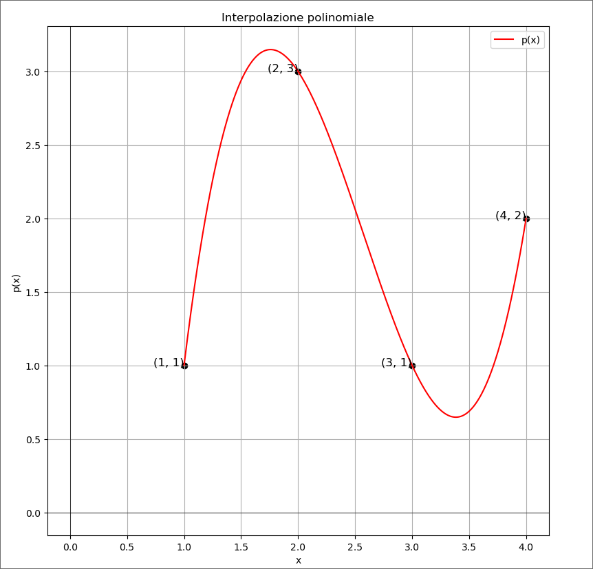

# Interpolazione polinomiale  
Esistenza e unicità del polinomio d'interpolazione ( forma canonica polin. d'interpolazione, forma di Lagrange ).  

Data una funzione $f: [a,b] \rightarrow \R$ di cui sono noti i valori $f(x_0),f(x_1),...,f(x_n)$ in $n+1$ punti distinti $x_0,x_1,...,x_n \in [a,b]$.  

Si sceglie una classe $C$ di funzioni definite su $[a,b]$ e valori in $\R$ e si vuole approssimare la funzione $f(x)$ con una funzione $g(x)$ della classe $C$ tale che $g(x_0)=f(x_0), g(x_1)=f(x_1),..., g(x_n)=f(x_n) \ ( \ g(x_i)=f(x_i) \ \forall i=0,...,n \ )$.
 
La scelta più comune per la sua semplicità è quella di prendere:  

$C=\R_n[x]= \text{spazio vettoriale dei polinomi di grado} \leq n= \set{a_0+a_1x+a_2+x^2,...,a_n+x^n: a_0,a_1,a_2,...,a_n \in \R}$  

Con questa scelta, siamo sicuri che $\exist! \ g\in \R_n[x] \ t.c\ g(x_i)=f(x_i) \ \forall i=0,...,n$  

### Teorema  
$\text{Siano } (x_0,y_0),(x_1,y_1),...,(x_n,y_n) \in \R^2 \ t.c \ x_0,x_1,...,x_n \text{ sono tutti distinti}.\newline \text{Allora } \exist! \ \text{polinomio } p(x) \in \R_n[x] \ t.c$  $\ p(x_i)=y_i \ \forall i=0,...,n$  

  

>[!NOTE]  
>$\text{Per} \ n=3: \exist! \ p(x) \in \R_3[x] \ \  t.c \\ p(x_0)=y_0, \ p(x_1)=y_1, \ p(x_2)=y_2, \ p(x_3)=y_3$  

>[!NOTE] 
> Il teorema implica che , data $f:[a,b] \rightarrow \R$ e $x_0,x_1,...,x_n \in [a,b]$ punti distinti, $\exist! \ g(x) \in \R_n[x] \ t.c \ g(x_i)=f(x_i) \ \forall i=0,...,n$ , infatti applicando il teorema con $y_i=f(x_i) \ \forall i=0,...,n$ , si ottiene che $\exist ! p(x) \in R_n[x] \ t.c \ p(x_i)=f(x_i) \ \forall i=0,...,n$

####  Dim (1)   
Sia $p(x)=a_0+a_1x+a_2x^2+...+a_nx^n$ un polinomio in $R_n[x]$.  
$p(x)$ soddisfa la proprietà sopra indicata in blu se e solo se:  

$\begin{cases}
a{_0}+a_1 x{_0} + a_2 x{_0}^2 +...+a_nx{_0}^n = y_0 \\
a_0+a_1 x{_1} + a_2 x{_1}^2 +...+a_nx{_1}^n = y_1 \\
\vdots  \\
a_0+a_1{x_n} + a_2 {x_n}^2 +...+a_n{x_n}^n = y_n \\
\end{cases}$  

cioè se e solo se il suo vettore dei coefficienti $(a_0,a_1,a_2,...,a_n)^T$ soddisfa il sistema lineare precedente  

$
\begin{bmatrix}
1 & x_0 & x{_0}^2 & \dots  & x{_0}^n \\
1 & x_1 & x{_1}^2 & \dots  & x{_1}^n \\
1 & x_2 & x{_2}^2 & \dots  & x{_2}^n \\
\vdots & \vdots & \vdots & \vdots & \vdots \\
1 & x_n & x{_n}^2 & \dots  & x{_n}^n
\end{bmatrix}
\
\begin{bmatrix}
a_0 \\
a_1 \\
a_2 \\
\vdots \\
a_n
\end{bmatrix}
\ = \
\begin{bmatrix}
y_0 \\
y_1 \\
y_2 \\
\vdots \\
y_n
\end{bmatrix}  
\ \ (S)
$

>[!NOTE]
> La prima matrice si denota con $V(x_0,x_1,x_2,...,x_n)$, matrice di Vandermonde sui nodi $x_0,x_1,x_2,...,x_n$  

Adesso dimostriamo che $V(x_0,x_1,x_2,...,x_n)$ è invertibile perché dimostreremo che:    

$$det[V(x_0,x_1,x_2,...,x_n)] = 
\begin{cases}
1, se \ n=0 \\
\prod^n_{i,j=0 \ , \ j<i} \ (x_i-x_j)=(x_1-x_0)\cdot(x_2-x_1)(x_2-x_0)\cdot(x_3-x_2)(x_3-x_1)(x_3-x_0)  ,  se \ n \geq 1 
\end{cases}  (\star)$$

e quindi $det[V(x_0,x_1,x_2,...,x_n)]\neq 0$ poiché per ipotesi i nodi $x_0,x_1,...,x_n$ sono tutti distinti.  
Questo permette di concludere che $(S)$ ha un'unica soluzione, data da:  

$
\begin{bmatrix}
1 & x_0 & x{_0}^2 & \dots  & x{_0}^n \\
1 & x_1 & x{_1}^2 & \dots  & x{_1}^n \\
1 & x_2 & x{_2}^2 & \dots  & x{_2}^n \\
\vdots & \vdots & \vdots & \vdots & \vdots \\
1 & x_n & x{_n}^2 & \dots  & x{_n}^n
\end{bmatrix}^{-1}
\
\begin{bmatrix}
y_0 \\
y_1 \\
y_2 \\
\vdots \\
y_n
\end{bmatrix}
\ = \
\begin{bmatrix}
a_0 \\
a_1 \\
a_2 \\
\vdots \\
a_n
\end{bmatrix}  
\ \ (\alpha)
$  

e dunque $\exist! \ p(x) \in \R_n[x]$ che soddisfa la proprietà in blu e tale $p(x)$ è precisamente il polinomio di $\R_n[x]$ che ha come vettore dei coefficienti quello dato dalla $(\alpha)$.  
Per concluedere la dimostrazione, resta solo da dimostrare $(\star)$ e lo facciamo per $n=3$, tanto la dimostrazione è la stessa per $n$ generico.  

Dim di $(\star)$ per $n=3. \ \forall i =1,...,3$ definisco   
$d_i=det[V(x_0,...,x_i)]$. Il nostro obiettivo è calcolare $d_3$.  
$$d_3=  \begin{bmatrix}
1 & x_0 & x{_0}^2 & x{_0}^3 \\
1 & x_1 & x{_1}^2 & x{_1}^3 \\
1 & x_2 & x{_2}^2 & x{_2}^3 \\
1 & x_3 & x{_3}^2 & x{_3}^3
\end{bmatrix}
\ =^{C[4]\rightarrow C[4]-x_3C[3]}=  
\begin{bmatrix}
1 & x_0 & x{_0}^2 & x{_0}^3-x_0^2x_3 \\
1 & x_1 & x{_1}^2 & x{_1}^3-x_1^2x_3\\
1 & x_2 & x{_2}^2 & x{_2}^3-x_2^2x_3 \\
1 & x_3 & x{_3}^2 & 0
\end{bmatrix}  
\ =^{C[3]\rightarrow C[3]-x_3C[2]}=  
\begin{bmatrix}
1 & x_0 & x{_0}^2-x_0x_3 & x{_0}^2(x_0-x_3) \\
1 & x_1 & x{_1}^2-x_1x_3 & x{_1}^2(x_1-x_3)\\
1 & x_2 & x{_2}^2-x_2x_3 & x{_2}^2(x_2-x_3) \\
1 & x_3 & 0 & 0
\end{bmatrix}  
\ =^{C[2]\rightarrow C[2]-x_3C[1]}=  
\begin{bmatrix}
1 & x_0-x_3 & x_0(x_0-x_3) & x{_0}^2(x_0-x_3) \\
1 & x_1-x_3 & x_1(x_1-x_3) & x{_1}^2(x_1-x_3)\\
1 & x_2-x_3 & x_2(x_2-x_3) & x{_2}^2(x_2-x_3) \\
1 & 0 & 0 & 0
\end{bmatrix}  
$$
>[!NOTE]  
> Se in un determinante si sostituisce una riga (o colonna) con se stessa più un multiplo scalare di un'altra riga (o colonna), allora il determinante non cambia  

Sviluppiamo con La Place sull'ultima riga  

$$(-1)^{n=3} \cdot \begin{vmatrix}
x_0-x_3 & x_0(x_0-x_3) & x{_0}^2(x_0-x_3) \\
x_1-x_3 & x_1(x_1-x_3) & x{_1}^2(x_1-x_3)\\
x_2-x_3 & x_2(x_2-x_3) & x{_2}^2(x_2-x_3) \\
\end{vmatrix}   
\ = (\text{linearità del determinante rispetto la prima riga (o colonna)})
(-1)^{n=3}(x_0-x_3)(x_1-x_3)(x_2-x_3) \cdot \begin{vmatrix}
x_0-x_3 & x_0 & x{_0}^2 \\
x_1-x_3 & x_1 & x{_1}^2\\
x_2-x_3 & x_2 & x{_2}^2 \\
\end{vmatrix} \dots \\  
$$  

$= (x_3-x_0)(x_3-x_1)(x_3-x_2) d_2\\
= (x_3-x_0)(x_3-x_1)(x_3-x_2) \cdot (x_2-x_0)(x_2-x_1) d_1 \\
= (x_3-x_0)(x_3-x_1)(x_3-x_2) \cdot (x_2-x_0)(x_2-x_1) \cdot (x_1-x_0)$

Abbiamo dimostrato $(\star) \ \  _\square$