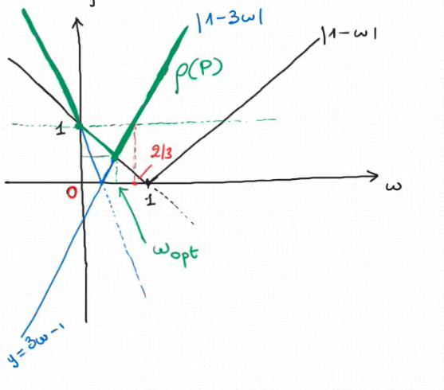

ES: Consideriamo il sistema lineare:  
$$A\vec{x}=\vec{b}, A=\begin{bmatrix}
2&1\\
1&2\\
\end{bmatrix}, \ \vec{b}= \begin{bmatrix}
    1\\
    1\\
\end{bmatrix}$$  

e il metodo iterativo.  

$$\vec{x}^{(0)}\in \Complex^2 \ \text{dato}\\
\vec{x}^{(k+1)}=(I-\omega A)\vec{x}^{(k)}+\omega \vec{b}, \ \ k=0,1,2,...$$  

dove $\omega \in \R$ fissato.  

1. Stabilire per quali valori di $\omega$ il metodo è consistente col sistema dato.
2. Stabilire per quali valori di $omega$ il metodo è convergente.

SOL:  
1. Il metodo assegnato è della forma $(m)$ con matrice d'iterazione $P=I-\omega A \ e \ \vec{q}=\omega\vec{b}$.
   Sostituisco $\vec{x}=$ soluzione di $A\vec{x}=\vec{b}$ nell'equazione del metodo al posto di $\vec{x}^{(k)} \ e \ \vec{x}^{(k+1)}$ e ottengo:  
   $$x=(I-\omega A)\vec{x}+\omega \vec{b}\iff \cancel{\vec{x}}=\cancel{\vec{x}}-\omega A \vec{x}+\omega \vec{b}\iff \omega A \vec{x}=\omega \vec{b}$$ che è un'equazione verificata $\forall \omega \in R$. Quindi il metodo è consistente con il sistema dato qualunque sia $\omega$ scelto.  
2. La matrice d'iterazione:  
    $$I-\omega A=\begin{bmatrix}
        1-2\omega & -\omega \\
        -\omega   & 1-2\omega\\
    \end{bmatrix}$$ Per capire quali sono i valori di $\omega$ per i quali il metodo è convergente, dobbiamo capire quando è soddisfatta la CNS $\rho(P)<1$ (usare solo condizioni necessari o sufficienti non basta, in questo caso).  

    $$C_P(\lambda)=det(\lambda I-P)=\begin{vmatrix}
        \lambda-1+2\omega & \omega \\
        \omega & \lambda-1+2\omega \\
    \end{vmatrix}=(\lambda-1+2\omega)^2-\omega^2=\lambda^2+2(-1+2\omega)\lambda+(-1+2\omega)^2-\omega^2$$  $$\lambda_{1,2}=1-2\omega\plusmn\sqrt{\cancel{(1-2\omega)^2}\cancel{-(-1+2\omega)^2}+\omega^2}=1-2\omega\plusmn \sqrt{\omega^2}=1-2\omega\plusmn|\omega|=1-2\omega\plusmn\omega=1-\omega,1-3\omega$$

    >$\alpha \in \R \ \sqrt{\alpha^2}=|\alpha|$  

    $$\rho(P)=\max(|1-\omega|,|1-3\omega|)$$

    $$\rho(P)<1 \iff \begin{cases}
        |1-\omega|<1\\
        |1-3\omega|<1 \\
    \end{cases} \iff \begin{cases}
        -1 < 1-\omega < 1\\
        -1 < 1-3\omega < 1\\
    \end{cases} \iff \begin{cases}
        0 < \omega < 2 \\
        0 < \omega <\frac{2}{3}
    \end{cases}$$  

    Il metodo converge per $0<\omega<\frac{2}{3}$ non per tutti gli altri valori di $\omega$

OSS:  
Prendiamo $\omega=\frac{3}{4}$, allora:  
$$P=\begin{bmatrix}
    -\frac{1}{2}&-\frac{3}{4}\\
    -\frac{3}{4}&-\frac{1}{2}\\
\end{bmatrix}$$  $$|\text{traccia}(P)|=|-1|=1<2 \ \ (ok) \\ |\det(P)|=\frac{13}{16}<1 \ \ (ok)$$ Sono soddisfatte le due CN di convergenza con il metodo non convergente perché $\frac{3}{4}\notin (0,\frac{2}{3})$ dunque le due condizioni necessarie di convergenza non sono sufficienti a garantire la convergenza.  

OSS:
**Domanda:** Qual'è il miglior valore di $\omega \in (0,\frac{2}{3})$ che posso scegliere?
**Risposta:** E' il valore di $\omega$ che rende minimo il raggio spettrale $\rho(P)$ perché questo valore di $\omega$ è quello che assicura la maggiore **velocità di convergenza**.  Nel nostro caso il miglior valore di $\omega$ è quello che rende minimo:  
$$\rho(P)=\max(|1-\omega|,|1-3\omega|).$$   

 

$w_{opt}$ è l'ascissa del punto d'intersezione tra le rette $y=1-\omega \ e \ y=3\omega-1:$  

$$\begin{cases}
    y=1-\omega\\  
    y=3\omega-1\\
\end{cases}\iff \begin{cases}
    y=1-\omega\\  
    1-\omega=3\omega-1\\
\end{cases}\iff \begin{cases}
    y=\frac{1}{2}=\rho(P)\vert_{w=\frac{1}{2}} \\
    \omega=\frac{1}{2}=\omega_{opt}
\end{cases}$$ **Velocità di convergenza**
Consideriamo il metodo $(m)$ per risolvere il famoso sistema $(\star)$ e supponiamo che $(m)$ sia convergente $(\vec{x}=P\vec{x}+\vec{q} \ e \ \rho(P)<1)$  

$\vec{e^{(k)}}=\vec{x^{(k)}}-\vec{x}$  

**Da ricordare**: fissiamo una qualsiasi norma vettoriale $||\cdot||$. Per qualsi tutti i vettori $\vec{x_0}\in \Complex^n$, l'errore $\vec{e^{(k)}}$ commesso al passo $k$ dal metodo $(m)$ soddisfa:  
$$||\vec{e^{(k)}}||\approx Ck^m \rho(P)^k$$ per ogni $k$ abbastanza grande (ma nella pratica anche per $k$ piccolo), dove $0\leq m\leq n-1$ è un intero che dipende solo da $P$ e $C$ è una costante indip. da $k$.  

>$m=0$ quando $P$ è diagonalizzabile  

Conclusione: la convergenza delle successioni $\vec{x}^{(0)},\vec{x}^{(1)},\vec{x}^{(2)},...$ generata da un metodo della forma $m$ è tanto più veloce quanto più $\rho(P)$ è piccolo.  

***DEF*** 
Dati due metodi $\alpha \ e \ \beta$ della forma $(m)$ per risolvere il sistema $(\star)$, entrambi convergenti, diremo che $\alpha$ converge più velocemente di $\beta$ se $\rho(P_\alpha)<\rho(P_\beta)$, dove $P_\alpha,P_\beta$ sono le matrici d'iterazione associate ad $\alpha$ e $\beta$ rispettivamente.

## Criterio di arresto del residuo
Consideriamo il metodo d'iterazione $(m)$ per risolvere il sistema $(\star)$.
Sia $\vec{x}^{(0)},\vec{x}^{(1)},\vec{x}^{(2)},...$ una successione generata dal metodo $(m)$. Anche quando tale successione risulta convergente, occorre arrestarla prima o poi. Il criterio d'arresto più usato è il criterio del residuo: si sceglie una norma vettoriale $||\cdot||$ e si arresta la successione al primo $\vec{x}^{(K)}$ t.c:  
$$(r) \ \ \frac{||\vec{r}^{(K)}||}{||\vec{b}||}\leq\epsilon \ \ (\ \vec{r}^{(K)}=\vec{b}-A\vec{x}^{(K)}, \epsilon>0 \text{ è una soglia prefissata })$$  

La condizione $(r)$ impone che l'errore relativo $\frac{||A\vec{x}^{(K)}-\vec{b}||}{||\vec{b}||}$commesso approssimando $\vec{b}$ con $A\vec{x}^{(K)}$ sia $\leq \epsilon$  

$$\frac{||\vec{x}^{(K)}-\vec{x}||}{||\vec{x}||}=\frac{||\vec{x^{(K)}}-A^{-1}\vec{b}||}{||A^{-1}\vec{b}||}=\frac{||A^{-1}\overbrace{(A\vec{x}^{(K)}-\vec{b})}^{-r^{(K)}}||}{||A^{-1}\vec{b}||} \leq^2 \frac{||A^{-1}||\cdot ||\vec{r}^{(K)}|| (\text{ omogeneità della norma vettoriale })}{||A^{-1}\vec{b}||}=$$
$$=\frac{||A||\cdot||A^{-1}||\cdot||\vec{r}^{(K)}||}{||A||\cdot||A^{-1}\vec{b}|| \textcolor{green}{\geq ||AA^{-1}\vec{b}||=||b||}}\leq^2  \frac{||A||\cdot||A^{-1}||\cdot||\vec{r}^{(K)}||}{||\vec{b}||} \leq \underbrace{||A||\cdot||A^{-1}||}_{\mu(A)}\cdot \epsilon$$  

dove $\mu(A)$ è il numero di condizionamento di $A$ rispetto alla norma $||\cdot||$