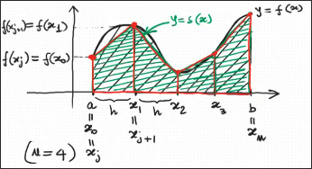

## Integrazione numerica  

#### Formula dei trapezi
E' data una funzione integrabile $f:[a,b]\rightarrow \R$ e si vuole calcolare un'approssimazione di $\int_a^b f(x) dx$. A tal fine si suddivide l'intervallo $[a,b]$ in $n \geq 1$ sottointervalli tutti della stessa ampiezza $h=\frac{b-a}{n}$ e si pone $x_j=a+jh$ per ogni $j=0,...,n$. Il valore che si prende come approssimazione di $\int_a^b f(x) dx$ è $\int_a^b s(x) dx$, dove  

$$s:[a,b]\leftarrow \R, \ \begin{cases}
s(x)=f(x_j)+\frac{f(x_{j+1}-f(x_j))}{x_{j+1}-x_j}(x-x_j), \\ \text{per } x \in [x_j,x_{j+1}], j=0,...,n-1
\end{cases}$$

$$I_n=\int_a^b s(x) dx=\sum^{n-1}_{j=0} \int_{x_j}^{x_{j+1}} s(x) dx=\sum^{n-1}_{j=0} \int_{x_j}^{x_{j+1}} f(x_j)+\frac{f(x_{j+1}-f(x_j))}{x_{j+1}-x_j}(x-x_j) dx=$$

$$=\sum^{n-1}_{j=0}\left[ f(x_j)(x-x_j)+\frac{f(x_{j+1})-f(x_j)}{x_{j+1}-x_j}\frac{(x-x_j)^2}{2} \right]^{x_{j+1}}_{x_j}$$

> Quello che vienne fatto qui è integrare prima il primo termine:  
> $$\int_{x_j}^{x_{j+1}}f(x_j) dx= f(x_j)\int_{x_j}^{x_{j+1}}1 dx=\left[f(x_j)+(x-x_j)\right]^{x_{j+1}}_{x_j}$$ 
> 
> Ciò viene fatto perche $f(x_j)$ è una costante.
> Infine integro il secondo termine
> $$\int_{x_j}^{x_{j+1}}\frac{f(x_{j+1}-f(x_j))}{x_{j+1}-x_j}(x-x_j) dx= \frac{f(x_{j+1}-f(x_j))}{x_{j+1}-x_j} dx \int_{x_j}^{x_{j+1}}(x-x_j)= \\ =\left[\frac{f(x_{j+1}-f(x_j))}{x_{j+1}-x_j}\frac{(x-x_j)^2}{2}\right]^{x_{j+1}}_{x_j}$$
>
> Analogo a prima

$$=\sum^{n-1}_{j=0}\left[ f(x_j)(x_{j+1}-x_j)+\frac{f(x_{j+1})-f(x_j)}{2}(x_{j+1}-x_j) \right]$$

> Qua vabbe sostituisco...
>

$$=\sum^{n-1}_{j=0}\frac{f(x_j)+f(x_{j+1})}{2}h=\frac{h}{2}\sum^{n-1}_{j=0}\left[f(x_j)+f(x_{j+1})\right]$$

> Senza che faccio tutti i calcoli spiego a parole come è uscita fuori quest' $h$.
> Sopra raccolgo $(x_{j+1},x_j)$ destra e sinistra. Noto alla fine che $(x_{j+1},x_j)$ è l'ampiezza degli intervalli ovvero proprio $h$!!. 

$$=h/2\left[f(a)+f(b)+2\sum^{n-1}_{j=1}f(x_j)\right]=h \left[\frac{f(a)+f(b)}{2}+\sum^{n-1}_{j=1}f(x_j)\right]$$

#### Lemma
Siano $\omega,\alpha,\beta: [a,b]\rightarrow \R$ funzioni tali che:  
+ $\omega(x)$ è continua e $\geq 0$ su $[a,b]$
+ $\alpha(x)$ e $\beta(x)\omega(x)$ sono continue su $[a,b]$
+ $m \leq \beta(x)\leq M$ per ogni $x\in [a,b]$, dove $m$ e $M$ sono rispettivamente il minimo e il massimo di $\alpha(x)$ su $[a,b]$

Allora esiste un punto $\eta \in [a,b]$ tale che:
$$\int_a^b \beta(x)\omega(x) dx=\alpha(\eta)\int_a^b \omega(x)dx$$

#### Dim 
Poiché $\omega(x)\geq 0$ su $[a,b]$ e $m \leq \beta(x)\leq M$ per ogni $x\in[a,b]$, si ha $m\omega(x)\leq \beta(x)\omega(x)\leq M\omega(x)$ per ogni $x\in [a,b]$ e si ha:  
$$m \int_a^b \omega(x)dx\leq \int_a^b \beta(x)\omega(x)dx\leq M\int_a^b\omega(x)dx$$

Consideriamo la funzione $z:[a,b]\rightarrow \R$.
$$z(y)=\alpha(y)\int_a^b \omega(x)dx$$

Questa funzione è continua su $[a,b]$ perché $\alpha(y)$ è continua su $[a,b]$.

Abbiamo che il massimo di $z(y)$ è $M\int_a^b \omega(x)dx$ essendo $M$ il massimo di $\alpha(y)$. Analogo per il minimo con $m\int_a^b \omega(x)dx$.

Quindi, per il teorema dei valori intermedi, $z(y)$ assume su $[a, b]$ tutti i valori compresi tra il suo minimo $m \int_a^b \omega(x)dx$ e il suo massimo  $M \int_a^b \omega(x)dx$. 
In particolare $z(y)$ assume il valore $ \int_a^b \beta(x)\omega(x)dx$ ovvero esiste $\eta \in [a, b]$ tale che:
$$z(\eta)=\int_a^b \beta(x)\omega(x)dx$$

$\square$

#### Teorema
Sia $f : [a, b] \rightarrow \R$ di classe $C^2[a, b]$ e sia $I_n$ la formula dei trapezi di ordine $n$ e passo $h = \frac{b-a}{n}$ per approssimare $\int_a^b f(x)dx$.
Allora esiste un punto $\eta \in [a, b]$ tale che:
$$\int_a^b f(x)dx-I_n=-\frac{(b-a)f''(\eta)}{12}h^2$$

#### Dim 

Poniamo $x_j=a+jh \ \forall j=0,...,n$ e indichiamo con $s(x)$ la funzione lineare usata precedentemente. Risulta:
$$\int_a^b f(x)-I_n=\int_a^b f(x)dx-\int_a^b s(x)dx=\int_a^b[f(x)-s(x)]dx$$

$$\sum_{j=0}^{n-1} \int_{x_j}^{x_{j+1}} f''(\xi_j(x)) \frac{(x - x_j)(x - x_{j+1})}{2} \,dx \quad$$

per il Teorema 1.2 sull’intervallo  $[x_j , x_{j+1}]$

$$= -\sum_{j=0}^{n-1} \int_{x_j}^{x_{j+1}} f''(\xi_j(x)) \frac{(x - x_j)(x_{j+1} - x)}{2} \,dx$$

$$= -\sum_{j=0}^{n-1} f''(\eta_j) \int_{x_j}^{x_{j+1}} \frac{(x - x_j)(x_{j+1} - x)}{2} \,dx$$

(Per il Lemma 2.1 applicato sull’intervallo \([x_j , x_{j+1}])\) con:
- \(\alpha(x) = f''(x)\)
- \(\beta(x) = f''(\xi_j(x))\)
- \(\omega(x) = \frac{(x - x_j)(x_{j+1} - x)}{2}\)

Dove \(\eta_j\) è un punto in \([x_j , x_{j+1}])\).

\[= -\sum_{j=0}^{n-1} f''(\eta_j) \int_{0}^{h} \frac{t(h - t)}{2} \,dt\]

>Cambio di variabile: \(t = x - x_j \Rightarrow x = t + x_j\), quindi \(dt = dx\):
Dunque siccome $x=t+x_j$ avrei :
$$\frac{(t)(x_{j+1} - (t + x_j))}{2} = \frac{t (x_{j+1} - x_j - t)}{2} = \frac{t (h - t)}{2}$$

Risolvendo l’integrale:

$$= -\sum_{j=0}^{n-1} f''(\eta_j) \frac{1}{2} \left[ \frac{ht^2}{2} - \frac{ t^3}{3} \right]_{0}^{h} = -\sum_{j=0}^{n-1} f''(\eta_j) \frac{h^3}{12} =$$ 

$$-\frac{h^3 n}{12} \cdot \textcolor{blue}{\frac{1}{n} \sum_{j=0}^{n-1} f''(\eta_j)} = -\frac{h^2 (b - a)}{12} f''(\eta)$$

> Abbiamo che la parte in blu è una media aritmetica di $n$ valutazioni di $f''$, dunque essendo una media sarà sicuramente compresa tra il minimo e il massimo di $f''$. Dunque per il teorema dei valori intermedi esiste un $\eta$ per cui $f''(\eta)=\frac{1}{n} \sum_{j=0}^{n-1} f''(\eta_j)$.